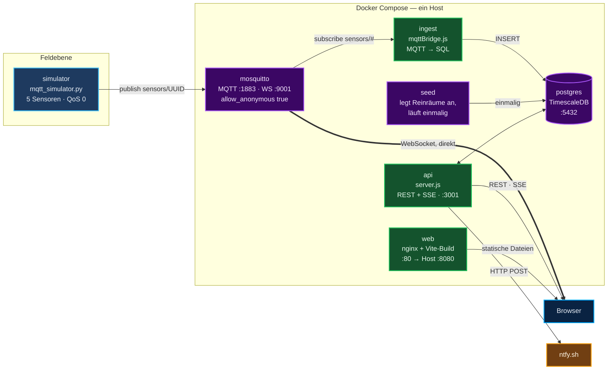
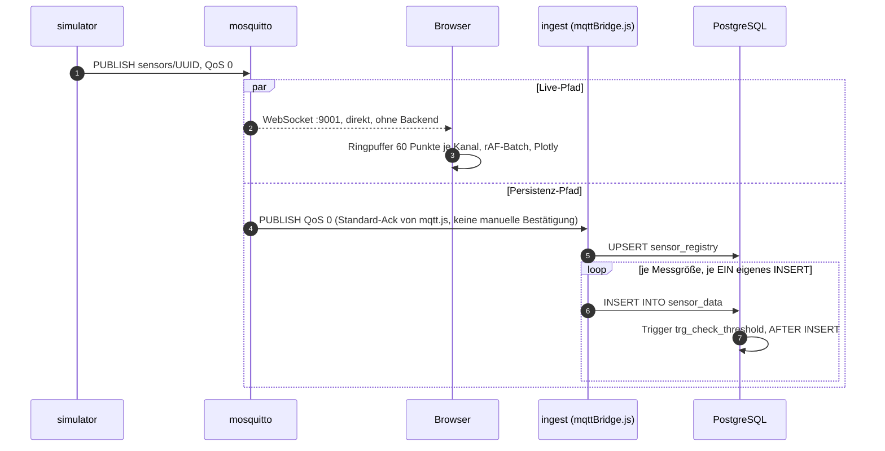
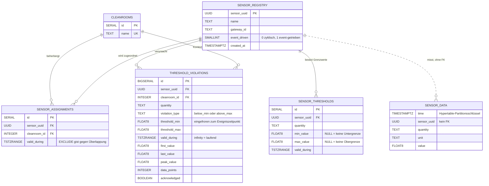
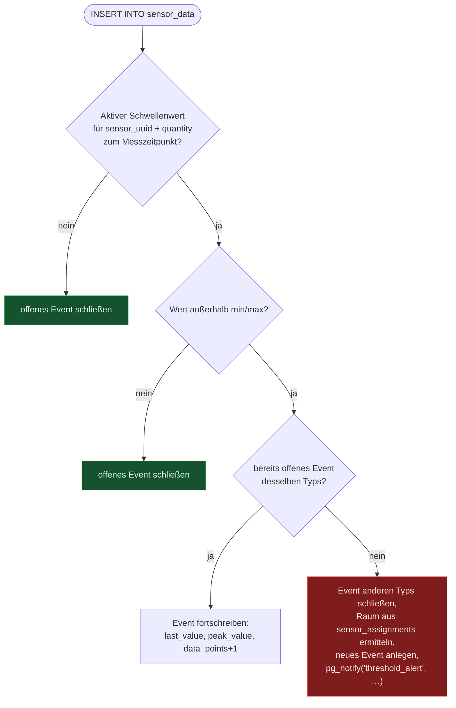
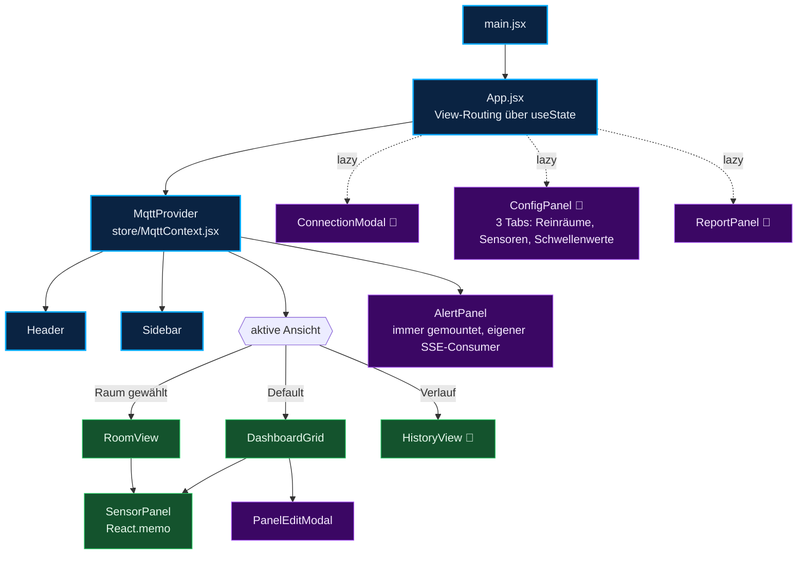

# OHB Reinraum Sensor Dashboard — Architektur

> Beschreibt den **tatsächlich laufenden Stand** des Systems: das, was
> `docker-compose.yml` tatsächlich startet und was im Browser tatsächlich läuft —
> nicht, was an Code im Repository zusätzlich vorbereitet, aber nicht angeschlossen
> ist. Diese zweite Kategorie ist real und nicht zu unterschätzen; sie steht separat
> in [Technische-Schulden.md](Technische-Schulden.md), Abschnitt „Unbenutzter Code“.
>
> **Stand:** 23.09.2026, ermittelt durch Lesen von `docker-compose.yml`,
> `.github/workflows/ci.yml` und dem tatsächlich referenzierten Quellcode
> (nicht durch Übernahme älterer Dokumentation).
>
> Verwandt: [Betriebshandbuch.md](Betriebshandbuch.md) ·
> [Technische-Schulden.md](Technische-Schulden.md) ·
> [Neue-Codebase.md](Neue-Codebase.md) · [Integration-Neue-Codebase.md](Integration-Neue-Codebase.md) ·
> [CI-Pipeline.md](CI-Pipeline.md) ·
> [Technologieentscheidungen.md](Technologieentscheidungen.md) ·
> [schema-mapping.md](schema-mapping.md)

---

## Inhaltsverzeichnis

1. [Zweck](#1-zweck)
2. [Technologie-Stack](#2-technologie-stack)
3. [Systemarchitektur](#3-systemarchitektur)
4. [Dienste und Ports](#4-dienste-und-ports)
5. [Datenfluss](#5-datenfluss)
6. [MQTT-Vertrag](#6-mqtt-vertrag)
7. [Datenmodell](#7-datenmodell)
8. [Schwellenwert-Trigger](#8-schwellenwert-trigger)
9. [REST-API](#9-rest-api)
10. [Alarmkette](#10-alarmkette)
11. [Frontend-Architektur](#11-frontend-architektur)
12. [PDF-Report](#12-pdf-report)
13. [Feldebene](#13-feldebene)

---

## 1. Zweck

Das System erfasst Reinraum-Umgebungswerte (Temperatur, Druck, eCO₂, TVOC,
Luftströmung, Feinstaub) per MQTT, zeigt sie live im Browser, schreibt sie nach
PostgreSQL/TimescaleDB und schlägt Alarm, wenn ein Wert außerhalb eines gesetzten
Schwellenwerts liegt. Auswertungen (Historie, Reports) beziehen sich auf die
zeitraum-versionierten Stammdaten (`tstzrange`), sodass ein Report für einen
vergangenen Zeitraum den damals gültigen Grenzwert und die damalige Raumzuordnung
verwendet, auch wenn sich beides inzwischen geändert hat.

## 2. Technologie-Stack

| Schicht | Technologie | Ort |
|---|---|---|
| Feldebene / Testdaten | Python 3 + `paho-mqtt` | `MQTT_Publish_Test/mqtt_simulator.py` (Container `simulator`) |
| Messaging | Eclipse Mosquitto 2 | Container `mosquitto` |
| Datenhaltung | PostgreSQL 17 + TimescaleDB (Image `timescale/timescaledb:latest-pg17`) | Container `postgres` |
| Backend | Node.js 22, Express 4, `pg`, `mqtt`, `pdfkit`, `cors` | Container `api` (REST + SSE) und `ingest` (MQTT → SQL), beide aus demselben Image, `node-backend/` |
| Frontend | React 19, Vite 7, Plotly.js, MQTT.js | statisch gebaut, ausgeliefert von nginx, Container `web` |
| Push-Benachrichtigung | ntfy.sh (HTTP-POST) | extern, aus `api` heraus angesprochen |

Kein ORM (reines parametrisiertes SQL), kein State-Management-Framework im Frontend
(React Context genügt), keine TypeScript-Kompilierung (reines JavaScript).

## 3. Systemarchitektur

Sieben Dienste, wie in `docker-compose.yml` definiert:



**Wichtig, weil es vom naheliegenden Bild abweicht:** `web` liefert nginx zwar mit
Proxy-Regeln für `/api/` und `/mqtt` aus (siehe `ohb-dashboard/nginx.conf`), das
Frontend nutzt diese Regeln aber **nicht**. `api.js` und `MqttContext.jsx` sprechen
API und Broker direkt über die auf dem Host veröffentlichten Ports 3001 und 9001 an
(`http://<hostname>:3001/api`, `ws://localhost:9001`). Das funktioniert nur, weil
`docker-compose.yml` diese Ports zusätzlich zu Port 8080 auf den Host mappt. Die
nginx-Proxy-Pfade sind vorbereitet, aber nicht der tatsächlich genutzte Weg.

## 4. Dienste und Ports

| Dienst | Build/Image | Host-Port | Healthcheck | Startbefehl |
|---|---|---|---|---|
| `postgres` | `timescale/timescaledb:latest-pg17` | `5432` | `pg_isready` | Standard-Entrypoint des Images |
| `mosquitto` | `eclipse-mosquitto:2` | `1883` (MQTT), `9001` (WebSocket) | `mosquitto_sub` gegen `$SYS/#` | Standard-Entrypoint |
| `seed` | `./node-backend` | — | — | `node src/seed.js`, `restart: "no"` |
| `api` | `./node-backend` | `3001` | `wget` gegen `/api/health` | `node src/server.js` |
| `ingest` | `./node-backend` | — | keiner | `node src/mqttBridge.js` |
| `web` | `./ohb-dashboard` | `8080` (→ Container-Port 80) | — | nginx, Standard-Entrypoint |
| `simulator` | `./MQTT_Publish_Test` | — | keiner | Python-Skript, Dauerbetrieb |

`api` und `ingest` teilen sich ein Docker-Image (`node-backend/Dockerfile`) und
unterscheiden sich nur im übergebenen Startbefehl. Startreihenfolge: `postgres` muss
`healthy` sein, bevor `seed`, `api` und `ingest` starten; `mosquitto` muss `healthy`
sein, bevor `ingest` und `simulator` starten. `web` startet, sobald `api` gestartet
ist (nicht `healthy`).

Alle sechs Dauerdienste haben `restart: unless-stopped`.

## 5. Datenfluss

Ein Messwert nimmt zwei unabhängige Wege ab dem Broker:



**Was das bedeutet, in aller Deutlichkeit:** `mqttBridge.js` verwendet keine
manuelle MQTT-Bestätigung, keine Wiederholungsversuche bei Datenbankfehlern und
keine Transaktion über die Messgrößen einer Nachricht hinweg — jede Messgröße ist
ein eigenes, unabhängiges `INSERT` ohne `ON CONFLICT`-Klausel. Schlägt ein Insert
fehl (Datenbank kurz nicht erreichbar, ungültiger Wert), wird der Fehler nur auf der
Konsole protokolliert; die Nachricht ist verloren, es gibt keine Wiederholung. Der
Broker selbst quittiert die Zustellung an `ingest` sofort (QoS 0 vom Simulator, und
`mqttBridge.js` ruft keine manuelle Bestätigungslogik auf). Es gibt **keinen**
Unique-Index auf `sensor_data`, der eine doppelte Zustellung erkennen würde — siehe
[Datenmodell](#7-datenmodell).

Fällt `api` aus, laufen die Live-Charts unverändert weiter (sie kommen direkt vom
Broker); Historie, Alarme im Dashboard und PDF-Report fallen aus. Fällt `ingest`
aus, laufen Live-Charts ebenfalls weiter, aber es wird nichts mehr in die Datenbank
geschrieben — ohne Wiederanlauf-Nachlieferung, weil der Broker anonyme QoS-0-
Nachrichten nicht dauerhaft puffert.

## 6. MQTT-Vertrag

Topic: `sensors/<sensor-uuid>`. `ingest` und der Browser abonnieren beide `sensors/#`.

```jsonc
{
  "id":           "a1b2c3d4-0001-0001-0001-000000000001",
  "gateway_id":   "gw-reinraum-221",
  "timestamp":    "2026-09-23T10:15:00.000Z",
  "measurements": [
    { "quantity": "temperature", "unit": "°C",  "value": 22.4 },
    { "quantity": "pressure",    "unit": "hPa", "value": 1013.2 }
  ]
}
```

`name` (Anzeigename) wird vom Bridge-Code zwar ausgelesen, vom mitgelieferten
Simulator (`MQTT_Publish_Test/mqtt_simulator.py`) aber gar nicht gesendet — dort
dient bei fehlendem Namen die UUID als Platzhalter, bis sie im Dashboard manuell
umbenannt wird. Es gibt **keine Schemaprüfung** der eingehenden Nachricht; ein
unerwartetes Format führt zu einem stillen `catch` in `mqttBridge.js` (siehe
`insertSensorData()`), nicht zu einem abgelegten, nachvollziehbaren Fehleintrag.

Bekannte `quantity`-Werte und ihre Einheiten stehen in
[schema-mapping.md](schema-mapping.md) und [quantity-verification.md](quantity-verification.md).
Die Spalte ist in der Datenbank reiner Freitext ohne Kontrolle — ein Tippfehler im
`quantity`-String erzeugt einen neuen, unbemerkten Kanal ohne Schwellenwert und
ohne Alarmierung.

## 7. Datenmodell

Maßgebliche Quelle: [`db-init/001_schema.sql`](../db-init/001_schema.sql) — läuft
automatisch, wenn `postgres` mit einem leeren Datenvolume startet. Ergänzt um eine
Spalte aus `ensureSchema()` in `node-backend/src/db.js`, die bei jedem Start von
`api` und `ingest` erneut ausgeführt wird (`ADD COLUMN IF NOT EXISTS event_driven`).

> Im Repository liegt zusätzlich `node-backend/migrations/` mit einem
> weitergehenden, node-pg-migrate-basierten Schema (u. a. mit Unique-Index für
> Idempotenz, `ingest_rejects`-Tabelle, Domänenfunktionen). Diese Migrationen laufen
> **nicht** gegen die von `docker-compose.yml` gestartete Datenbank — es gibt dafür
> keinen Compose-Dienst. Sie werden ausschließlich von der Testsuite gegen einen
> eigens gestarteten Testcontainer angewendet. Einzelheiten in
> [Technische-Schulden.md](Technische-Schulden.md).



| Index | Typ | Zweck |
|---|---|---|
| `idx_sensor_data_lookup (sensor_uuid, quantity, time DESC)` | B-Tree | trägt Zeitreihen-Abfragen — **nicht eindeutig**, verhindert also keine Duplikate |
| `idx_violations_range` | GiST | Range-Overlap für Zeitraum-Filter |
| `idx_violations_active` | Partial | laufende Alarme (`upper(valid_during) = 'infinity'`) ohne Full Scan |
| `idx_violations_ack` | Partial | unquittierte Alarme |
| `EXCLUDE USING gist` auf `sensor_assignments`, `sensor_thresholds` | GiST-Constraint | verhindert überlappende Gültigkeitszeiträume für denselben Sensor bzw. Sensor+Quantity |

Drei Tabellen sind zeitraum-versioniert (`tstzrange`): `sensor_assignments`,
`sensor_thresholds`, `threshold_violations`. Nichts wird überschrieben — ein
„Update“ schließt den alten Gültigkeitszeitraum (`valid_during` erhält eine
Obergrenze = jetzt) und öffnet einen neuen. Das geschieht in den REST-Routen selbst
per expliziter `BEGIN…COMMIT`-Transaktion, nicht in einer Datenbankfunktion.

## 8. Schwellenwert-Trigger

`AFTER INSERT FOR EACH ROW` auf `sensor_data`, Funktion `check_threshold_violation()`
(vollständig in `db-init/001_schema.sql`):



`pg_notify` feuert nur beim **Öffnen** eines Ereignisses, nicht bei jedem einzelnen
Verstoß — eine zehnminütige Überschreitung im Zwei-Sekunden-Takt erzeugt viele
Messwerte, aber genau einen Alarm.

## 9. REST-API

Basis-URL wie vom Frontend verwendet: `http://<hostname>:3001/api`. Kein
Authentifizierungslayer, CORS offen für alle Origins (`app.use(cors())` ohne
Optionen in `server.js`). Implementiert in `node-backend/src/routes/*.js`.

| Methode | Pfad | Zweck |
|---|---|---|
| `GET` | `/api/health` | `{status: 'ok'}`, keine Tiefenprüfung |
| `GET` | `/api/alerts/stream` | Server-Sent Events für Live-Alarme |
| `GET` | `/api/cleanrooms` | alle Reinräume |
| `POST` | `/api/cleanrooms` | Reinraum anlegen, `409` bei Namenskonflikt |
| `DELETE` | `/api/cleanrooms/:id` | löschen, Zuordnungen schließen, Violations entkoppeln |
| `GET` | `/api/sensors` | Registry + aktueller Raum + gemessene Größen (JOIN + Subquery) |
| `PATCH` | `/api/sensors/:sensor_uuid` | umbenennen |
| `DELETE` | `/api/sensors/:sensor_uuid` | kaskadiert über Violations → Thresholds → Assignments → Registry |
| `GET` | `/api/assignments` | aktuell gültige Zuordnungen |
| `GET` | `/api/assignments/history?sensor_uuid=` | vollständige Raum-Historie eines Sensors |
| `POST` | `/api/assignments` | Sensor umziehen, schließt alte Zuordnung in derselben Transaktion |
| `GET` | `/api/thresholds?sensor_uuid=` | aktuell gültige Grenzwerte |
| `POST` | `/api/thresholds` | neue Version setzen, schließt vorherige |
| `DELETE` | `/api/thresholds/:id` | Soft-Delete über Zeitraum-Schließung |
| `GET` | `/api/sensordata?sensor_uuid=&quantity=&from=&to=&limit=` | Zeitreihe, Default 24 h / 500 Punkte, Deckel 5000 |
| `GET` | `/api/sensordata/metrics?sensor_uuid=` | vorhandene `quantity`-Werte eines Sensors |
| `GET` | `/api/violations` | Alarm-Liste, Filter über `cleanroom_id`, `sensor_uuid`, `quantity`, `from`/`to`, `active`, `acknowledged` |
| `GET` | `/api/violations/summary?from=&to=` | Aggregat je Raum × Größe × Typ |
| `PATCH` | `/api/violations/:id/acknowledge` | quittieren, ohne Angabe **wer** |
| `POST` | `/api/report` | PDF-Binary, Body `{cleanroom_id, from, to}` |

> `docs/openapi.yaml` beschreibt eine **andere**, erweiterte API (u. a. `/api/panels`,
> `/healthz`, `/readyz`, `/api/health/deep`) — das ist die Schnittstelle des
> unbenutzten neuen Backends (`src/app.js` + `src/http/routes/`), nicht die oben
> aufgeführte, tatsächlich laufende. Siehe
> [Technische-Schulden.md](Technische-Schulden.md).

Fehlerbehandlung ist uneinheitlich: `violations.js` und `report.js` fangen Fehler
selbst ab und antworten mit `500`; die übrigen Routen tun das größtenteils nicht.
Ein unbehandelter Fehler in einem `async`-Handler wird von Express 4 nicht
abgefangen und führt zu einer unhandled rejection — der Node-Prozess beendet sich,
Docker startet den Container neu (`restart: unless-stopped`).

## 10. Alarmkette

`node-backend/src/alertListener.js` hält eine eigene, dauerhafte
`pg.Client`-Verbindung (nicht den Pool) und lauscht per `LISTEN threshold_alert`.
Bei einer Notification:

1. Konsolen-Log mit den Ereignisdetails.
2. Push an ntfy.sh (`fetch` mit `Title`/`Priority`/`Tags`-Headern). **Bekannter
   Fehler:** Der Titel wird aus `data.metric` und `data.sensor_id` gebildet, der
   Trigger sendet aber `quantity` und `sensor_uuid` im Payload — der Push-Titel
   zeigt deshalb `undefined - ...`.
3. Broadcast an alle offenen SSE-Verbindungen (`/api/alerts/stream`), die das
   `AlertPanel` im Frontend konsumiert.

Bei Verbindungsverlust versucht `alertListener.js` nach 5 Sekunden erneut zu
verbinden — sowohl im `error`- als auch im `end`-Handler, wodurch nach mehreren
aufeinanderfolgenden Störungen mehrere parallele Listener und entsprechend
vervielfachte Push-Nachrichten entstehen können.

## 11. Frontend-Architektur



> Eine Fehlergrenze je Panel (`PanelBoundary.jsx`) ist im Repository vorhanden, aber
> von keiner Komponente eingebunden — ein Fehler in einem einzelnen Chart reißt
> aktuell weiterhin die ganze Ansicht mit. Siehe [Technische-Schulden.md](Technische-Schulden.md).

> 🔸 = per `React.lazy()` nachgeladen.

**Datenquellen:**

| Quelle | Was | Genutzt von |
|---|---|---|
| MQTT über WebSocket, direkt `ws://localhost:9001` | Live-Messwerte (`useMqtt.js`) | `MqttContext`, darüber `SensorPanel` |
| REST, direkt `http://<hostname>:3001/api` | Stammdaten, Historie, Alarme | fast jede Komponente einzeln, siehe unten |
| SSE, eigener `EventSource` in `AlertPanel.jsx` | Live-Alarme | nur `AlertPanel` |
| `localStorage` | Sensor-Namen-Cache (`ohb-sensor-names`), Panel-Layout (`ohb-dashboard-layout`) | `MqttContext`, `useDashboardLayout` |

**Kein gemeinsamer Datenladepunkt:** `DashboardGrid`, `Sidebar`, `ConfigPanel` und
`HistoryView` rufen `getSensors()`/`getCleanrooms()` jeweils **unabhängig
voneinander** auf, zusätzlich lädt `MqttContext` alle 30 Sekunden erneut
`getSensors()` zum Namensabgleich. Bei mehreren gleichzeitig geöffneten Ansichten
entstehen entsprechend mehrfache, redundante Anfragen. `DashboardGrid` fragt für
jeden zugeordneten Sensor zusätzlich `getSensorMetrics()` und `getThresholds()`
einzeln ab (`1 + 2N`-Anfragen).

`api.js` und `AlertPanel.jsx` definieren `API_BASE` jeweils **eigenständig** —
identischer Wert, zwei Stellen, die bei einer Änderung beide angepasst werden
müssen.

Sichtbare Zeichenketten sind größtenteils direkt in den `.jsx`-Dateien hart codiert
(Deutsch, mit stellenweisen Inkonsistenzen wie „Reinraeume“ neben „Übersicht“ in
derselben Ansicht). Eine zentrale Übersetzungsdatei existiert (`src/i18n/de.js`),
wird aber von keiner Komponente importiert.

## 12. PDF-Report

`POST /api/report` (`node-backend/src/routes/report.js`) erzeugt serverseitig mit
PDFKit ein PDF: Titelblatt mit Logo, Sensor-Zuordnungen im gewählten Zeitraum, pro
Sensor × Messgröße eine Statistik (Min/Max/Ø), Schwellenwert-Verlauf, eine Tabelle
der letzten 50 Messpunkte mit Status `OK`/`VERLETZUNG` sowie eine Liste der
Verletzungs-Ereignisse. Die Sensorliste wird aus den **historischen** Zuordnungen im
gewählten Zeitraum gebildet (`valid_during && tstzrange(from, to)`), nicht aus dem
aktuellen Zustand — ein inzwischen umgezogener Sensor erscheint trotzdem korrekt mit
dem damals gültigen Grenzwert.

## 13. Feldebene

Ausgeliefert wird aktuell nur der Simulator
(`MQTT_Publish_Test/mqtt_simulator.py`, Container `simulator`): fünf feste,
simulierte Sensor-UUIDs, Sinuskurven mit Rauschen, Versand alle `MQTT_INTERVAL`
Sekunden (Default 2 s) mit **QoS 0** und **ohne** persistente Session — eine
Nachricht, die während einer Unterbrechung entsteht, ist unwiderruflich verloren.

Zusätzlich existiert im Repository ein vollständiges, eigenständiges Python-Paket
für den Einsatz auf echten Raspberry Pis: [`edge-agent/`](../edge-agent/README.md).
Es sichert genau die Eigenschaften, die dem Simulator fehlen — lokaler SQLite-Puffer
vor dem Versand, QoS 1, Zeitstempel-Absicherung ohne batteriegepufferte Uhr. Es ist
**kein** Teil von `docker-compose.yml`, läuft nicht mit, und keine reale Hardware im
Projekt spricht damit — es ist vorbereiteter, aber unbenutzter Code, siehe
[Technische-Schulden.md](Technische-Schulden.md).
