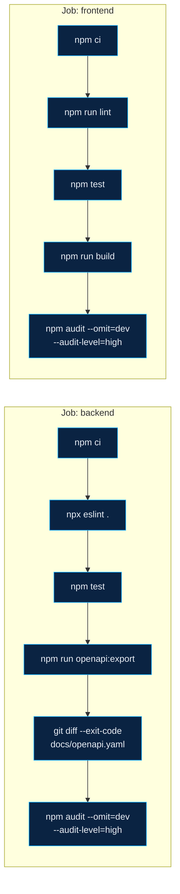

# CI-Pipeline

> Beschreibt `.github/workflows/ci.yml`, wie er tatsächlich im Repository steht.
>
> **Stand:** 23.09.2026.
>
> Verwandt: [Architektur.md](Architektur.md) · [Technische-Schulden.md](Technische-Schulden.md)

---

## Auslöser

```yaml
on:
  push:
    branches: [main]
  pull_request:
```

Läuft bei jedem Push auf `main` und bei jedem Pull Request. Ein `concurrency`-Block
bricht einen älteren, noch laufenden Durchlauf desselben Branches ab, sobald ein
neuer startet.

## Zwei unabhängige Jobs



Beide Jobs laufen auf `ubuntu-latest`, unabhängig voneinander, mit gecachten
`node_modules` über `actions/setup-node@v4` (Node 22).

### Job `backend` (working-directory `node-backend`)

| Schritt | Befehl | Zweck |
|---|---|---|
| Lint | `npx eslint .` | Stilprüfung |
| Tests | `npm test` | startet `vitest`, das wiederum über Testcontainers einen eigenen TimescaleDB-Container hochfährt und die Migrationen aus `node-backend/migrations/` darauf anwendet |
| OpenAPI aktuell? | `npm run openapi:export` gefolgt von `git diff --exit-code -- docs/openapi.yaml` | bricht ab, wenn das exportierte OpenAPI-Dokument vom eingecheckten `docs/openapi.yaml` abweicht |
| Sicherheitsprüfung | `npm audit --omit=dev --audit-level=high` | nur Produktionsabhängigkeiten, keine Entwicklungswerkzeuge |

**Wichtig für die Einordnung dieses Jobs — zwei unabhängige Probleme:**

1. **Selbst wenn er grün liefe, prüft er den falschen Pfad.** `npm test` und der
   OpenAPI-Export laufen ausschließlich gegen `src/app.js` und
   `node-backend/migrations/` — den in
   [Technische-Schulden.md](Technische-Schulden.md#1-der-wichtigste-befund-zwei-parallele-implementierungen)
   beschriebenen, **nicht** in `docker-compose.yml` gestarteten Backend-Pfad. Es gibt
   keinen CI-Schritt, der `db-init/001_schema.sql` (das tatsächlich verwendete
   Schema) oder die tatsächlich laufenden Einstiegspunkte `src/server.js`/
   `src/mqttBridge.js` prüft.
2. **Er kann nach aktuellem Stand des Repositorys gar nicht grün laufen.**
   `node-backend/package.json` definiert **weder** `"test"` **noch**
   `"openapi:export"` als Skript — nur `dev`, `start`, `lint`. Die CI-Schritte
   „Tests“ und „OpenAPI-Dokument ist aktuell“ rufen beide `npm run <Skriptname>`
   auf einen nicht existierenden Skriptnamen auf. Zusätzlich fehlen die von
   `src/app.js`, `src/ingest.js`, `scripts/exportOpenApi.js` sowie der Testsuite
   benötigten Pakete (`zod`, `express-async-errors`, `helmet`, `pino`,
   `pino-http`, `pino-pretty`, `@asteasolutions/zod-to-openapi`,
   `swagger-ui-express`, `node-pg-migrate`, `yaml`, `vitest`,
   `@testcontainers/postgresql`, `supertest`) — sie stehen weder in
   `package.json` noch in `package-lock.json`. `npm ci` installiert nur die sechs
   ursprünglichen Laufzeitabhängigkeiten; die Schritte „Tests“ und „OpenAPI-Dokument
   ist aktuell“ müssten daran scheitern. Dieser Widerspruch zu etwaig zuvor grün
   angezeigten Durchläufen konnte im Rahmen dieser Dokumentation nicht über die
   GitHub-Oberfläche nachvollzogen werden (kein `gh`-Zugriff in dieser Umgebung) —
   er ergibt sich rein aus dem Zusammenspiel der eingecheckten Dateien. Nachtragen
   ist der erste Schritt in
   [Integration-Neue-Codebase.md](Integration-Neue-Codebase.md#schritt-1-abhängigkeiten-und-skripte-nachtragen).

### Job `frontend` (working-directory `ohb-dashboard`)

| Schritt | Befehl | Zweck |
|---|---|---|
| Lint | `npm run lint` | ESLint |
| Tests | `npm test` | `vitest run` gegen `test/dashboardLayout.test.js`, `test/modal.test.jsx`, `test/plot.test.js` |
| Build | `npm run build` | Vite-Produktionsbuild, derselbe Schritt wie im `web`-Dockerfile |
| Sicherheitsprüfung | `npm audit --omit=dev --audit-level=high` | nur Produktionsabhängigkeiten |

Die Frontend-Tests prüfen reine Logik (Layout-Persistenz, ein Modal, die
Plot-Hilfsfunktionen) — nicht die tatsächlichen Datenabruf-Pfade der Komponenten.

## Was die Pipeline nicht prüft

- Keinen Aufbau des tatsächlichen `docker-compose.yml`-Stacks (kein `docker compose
  up` in der Pipeline).
- Keine Migration gegen `db-init/001_schema.sql`, das tatsächlich verwendete Schema.
- Keinen Start von `src/server.js` oder `src/mqttBridge.js`.
- Kein Deployment-Schritt — die Pipeline endet nach Lint/Test/Build/Audit.
