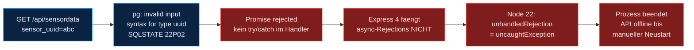
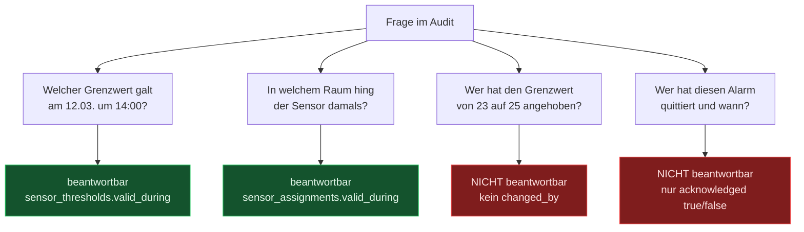
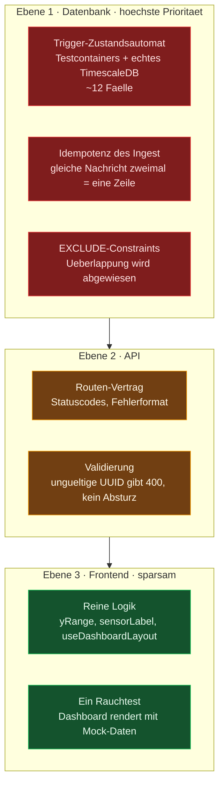
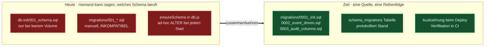

# Engineering-Bewertung & Standards

> Technische Begutachtung der Codebasis aus Sicht des professionellen Betriebs:
> Was trägt, was trägt nicht, und in welcher Reihenfolge man es angeht.
>
> **Stand:** 27.07.2026 · **Commit:** `4fbcd06` · Alle Befunde sind am Code verifiziert
>
> Verwandte Dokumente: [Projektübersicht.md](Projekt%C3%BCbersicht.md) (Ist-Architektur) ·
> [Zielarchitektur.md](Zielarchitektur.md) (Betrieb & Resilienz)

---

## Inhaltsverzeichnis

1. [Bewertungsmaßstab und Gesamtbild](#1-bewertungsmaßstab-und-gesamtbild)
2. [Befundregister](#2-befundregister)
3. [Kategorie A — Akut](#3-kategorie-a--akut)
4. [Kategorie B — Reifegrad](#4-kategorie-b--reifegrad)
5. [Kategorie C — Datenmodell](#5-kategorie-c--datenmodell)
6. [Kategorie D — Frontend](#6-kategorie-d--frontend)
7. [Kategorie E — Prozess und Handwerk](#7-kategorie-e--prozess-und-handwerk)
8. [Qualitätsschranken: Definition of Done](#8-qualitätsschranken-definition-of-done)
9. [Umsetzungsreihenfolge](#9-umsetzungsreihenfolge)
10. [Offene Fragen an den Fachbereich](#10-offene-fragen-an-den-fachbereich)

---

## 1. Bewertungsmaßstab und Gesamtbild

### Was bereits professionelles Niveau hat

Damit die Kritik einen Maßstab hat — diese Entscheidungen sind überdurchschnittlich und
sollen ausdrücklich erhalten bleiben:

| Stärke | Warum das zählt |
|---|---|
| **`tstzrange`-Historisierung** mit `EXCLUDE USING gist` | Erwachsene zeitliche Datenmodellierung. Integrität wird von der Datenbank erzwungen, nicht von der Anwendung gehofft |
| **Schwellenwert-Logik als DB-Trigger** | Kann von keinem Client umgangen werden. Die richtige Ebene für eine Invariante |
| **Entkoppelter Live- und Persistenzpfad** | Ein Ausfall des Backends kostet keine Live-Sicht, ein Ausfall des Browsers keine Daten |
| **Event-Aggregation statt Einzelalarmen** | 300 Verstöße erzeugen einen Alarm mit `peak_value` und `data_points` — die fachlich korrekte Modellierung |
| **rAF-Batching + `React.memo` im Frontend** | Zeigt Verständnis dafür, wo Rendering-Kosten tatsächlich entstehen |

**Die Architektur ist nicht das Problem. Die Disziplin drumherum ist es.** Genau darin liegt
der Hebel: Es muss nichts neu entworfen werden.

### Reifegrad nach Dimension

| Dimension | Heute | Ziel | Abstand |
|---|---|---|---|
| Architektur & Datenmodell | ●●●●○ | ●●●●● | gering |
| Betrieb & Resilienz | ●●○○○ | ●●●●○ | siehe [Zielarchitektur.md](Zielarchitektur.md) |
| **Testabdeckung** | ○○○○○ | ●●●●○ | **maximal** |
| **Fehlerbehandlung** | ●○○○○ | ●●●●● | **hoch** |
| **Sicherheit & Zugriff** | ○○○○○ | ●●●●○ | **hoch** |
| Automatisierung (CI/CD) | ○○○○○ | ●●●●○ | hoch |
| Frontend-Qualität | ●●●○○ | ●●●●○ | mittel |
| Dokumentation | ●●●●○ | ●●●●● | gering |

---

## 2. Befundregister

Alle Befunde sind am Code nachgeprüft; die Fundstellen sind verlinkt.

> **Stand 28.07.2026:** Mit Version 2.0.0 sind SEC-01 (teilweise), REL-01, TEST-01,
> OPS-01, DB-01, FE-01 bis FE-06 behoben — siehe [CHANGELOG.md](../CHANGELOG.md).
> Neu hinzugekommen sind **FELD-01** und **FELD-02**: Sie entstanden nicht durch den
> Umbau, sondern wurden erst sichtbar, als die Feldebene genauer betrachtet wurde.
> Beide liegen außerhalb dieses Repositorys, auf den Raspberry Pis.

| ID | Schwere | Befund | Fundstelle | Aufwand |
|---|---|---|---|---|
| **SEC-01** | 🔴 kritisch | Datenbank-Passwort liegt in der Git-Historie | `node-backend/.env` (getrackt) | 30 min |
| **REL-01** | 🔴 kritisch | 12 von 18 API-Routen beenden bei DB-Fehler den Prozess | [routes/](../node-backend/src/routes/) | 3 h |
| **AUD-01** | 🔴 kritisch | Audit-Trail ohne Identität — kein „wer" | Schema, gesamtes System | 1–2 Tage |
| **TEST-01** | 🟠 hoch | Keine Tests für die Trigger-Zustandslogik | [001_schema.sql:78](../db-init/001_schema.sql#L78) | 1,5 Tage |
| **OPS-01** | 🟠 hoch | Keine CI — nichts wird automatisch verifiziert | — | 3 h |
| **DB-01** | 🟠 hoch | Drei konkurrierende Schema-Mechanismen | `db-init/`, `migrations/`, `ensureSchema()` | 1 Tag |
| **DATA-01** | 🟠 hoch | `quantity` ist unkontrollierter Freitext → stille Alarm-Lücke | [001_schema.sql:47](../db-init/001_schema.sql#L47) | 4 h |
| **DATA-02** | 🟡 mittel | `unit` pro Messzeile statt pro Kanal → Einheitenmix möglich | [001_schema.sql:48](../db-init/001_schema.sql#L48) | 4 h |
| **DATA-03** | 🟡 mittel | Kein Lebenszyklus: keine Kompression, keine Aufbewahrungsregel | Hypertable | 2 h |
| **FE-01** | 🟠 hoch | Kein Error Boundary — ein Chart-Fehler leert die ganze Seite | [App.jsx](../ohb-dashboard/src/App.jsx) | 30 min |
| **FE-02** | 🟡 mittel | N+1-Requests und fünffach redundantes Laden derselben Daten | [DashboardGrid.jsx:40](../ohb-dashboard/src/components/DashboardGrid.jsx#L40) | 4 h |
| **FE-03** | 🟡 mittel | Keine Barrierefreiheit: 0 `aria-*`/`role`-Attribute im gesamten Frontend | alle `.jsx` | 3 h |
| **FE-04** | 🟡 mittel | Doppelte Panel-Logik in `DashboardGrid` und `RoomView` | beide Komponenten | 2 h |
| **FE-05** | ⚪ niedrig | Umlaut-Inkonsistenz im UI („Uebersicht" neben „Übersicht") | [ConfigPanel.jsx](../ohb-dashboard/src/components/ConfigPanel.jsx), [Sidebar.jsx](../ohb-dashboard/src/components/Sidebar.jsx) | 1 h |
| **FE-06** | ⚪ niedrig | `API_BASE` doppelt definiert | [api.js:1](../ohb-dashboard/src/api.js#L1), [AlertPanel.jsx:5](../ohb-dashboard/src/components/AlertPanel.jsx#L5) | 5 min |
| **TYP-01** | 🟡 mittel | Datenformen in 8 Dateien implizit dupliziert, keine Typprüfung | Backend + Frontend | 2 Tage |
| **PROC-01** | 🟡 mittel | Commit-Historie nicht auditierbar, `.pyc` eingecheckt | Git | fortlaufend |
| **FELD-01** | 🔴 kritisch | Erste Etappe der Kette ungesichert: Referenzumsetzung sendet mit QoS 0 | [Feldebene.md](Feldebene.md) | 4 h (Pi-Code) |
| **FELD-02** | 🔴 kritisch | Raspberry Pi ohne Echtzeituhr — der von ihm gesetzte Zeitstempel trägt Idempotenz, Grenzwertauswahl und Reports | [Feldebene.md](Feldebene.md) | 2 h + Hardware |

---

## 3. Kategorie A — Akut

### SEC-01 · Datenbank-Passwort in der Git-Historie 🔴

```console
$ git ls-files | grep env
node-backend/.env            ← enthält POSTGRES_PASSWORD
node-backend/.env.example

$ cat node-backend/.gitignore
/node_modules                ← das ist alles
```

Das Passwort steckt in jedem Klon, jedem Fork und jedem Repo-Backup. Es aus dem
Arbeitsverzeichnis zu löschen genügt nicht — die Historie bleibt.

**Reihenfolge der Behebung** (die erste Zeile ist der eigentliche Fix):

```bash
# 1. Passwort rotieren — alles andere ist Kosmetik, solange das alte gültig ist
# 2. Datei aus der Verwaltung nehmen, Ignorieren nachziehen
git rm --cached node-backend/.env
printf '.env\n.env.local\n__pycache__/\n*.pyc\ndist/\n' >> .gitignore
# 3. Optional, aber empfohlen: Historie bereinigen
git filter-repo --path node-backend/.env --invert-paths
```

`.env.example` bleibt im Repo — sie ist die Dokumentation der erwarteten Variablen und
enthält keine Werte. Für den Dauerbetrieb gehört das echte Passwort in einen
Secret-Store oder mindestens in eine Datei außerhalb des Repos mit eingeschränkten
Dateirechten.

> **Status 27.07.2026 — teilweise erledigt.**
> Umgesetzt: Passwort rotiert (`ALTER USER` auf der laufenden Instanz **und** in
> `node-backend/.env` sowie der neuen Compose-`.env`), beide `.env` aus dem Index entfernt,
> `.gitignore` im Wurzelverzeichnis angelegt, `.pyc` entfernt, der hartkodierte
> Vorgabewert in `docker-compose.yml` durch eine Pflichtvariable ersetzt.
>
> **Offen und bewusst nicht ausgeführt:** Die Bereinigung der Git-Historie
> (`git filter-repo --path node-backend/.env --invert-paths`) schreibt alle Commit-Hashes
> neu. Das ist eine Entscheidung des Repository-Eigners, weil jeder vorhandene Klon danach
> neu geholt werden muss. Das alte Passwort ist durch die Rotation bereits wertlos —
> die Bereinigung entfernt nur noch die historische Spur.

### REL-01 · Eine fehlerhafte Anfrage beendet die API 🔴

Express 4 fängt **abgelehnte Promises** aus Route-Handlern nicht ab. Node ≥ 15 behandelt
eine unbehandelte Rejection als `uncaughtException` und beendet den Prozess. Da
`server.js` heute unbeaufsichtigt auf dem Host läuft, bleibt die API weg, bis jemand
manuell eingreift.



**Betroffene Routen — nachgezählt:**

| Datei | Routen | Abgesichert | Auf dem Crash-Pfad |
|---|---|---|---|
| `sensordata.js` | 2 | 0 | **2** — kein einziges `try` |
| `sensors.js` | 3 | 1 (DELETE) | **2** |
| `thresholds.js` | 3 | 0 | **3** — POST fängt, wirft aber weiter |
| `assignments.js` | 3 | 0 | **3** — POST fängt, wirft aber weiter |
| `cleanrooms.js` | 3 | 1 (DELETE) | **2** — POST wirft weiter |
| `violations.js` | 3 | 3 | 0 |
| `report.js` | 1 | 1 | 0 |
| **Summe** | **18** | **6** | **12** |

Beachtenswert: Drei Routen *haben* ein `try/catch`, machen es aber wirkungslos, weil sie
nach dem `ROLLBACK` erneut werfen — [assignments.js:66](../node-backend/src/routes/assignments.js#L66),
[cleanrooms.js:27](../node-backend/src/routes/cleanrooms.js#L27),
[thresholds.js:51](../node-backend/src/routes/thresholds.js#L51). Das `ROLLBACK` ist richtig,
das Weiterwerfen ohne zentrale Fehler-Middleware nicht.

**Der Fix ist zentral, nicht pro Route:**

```js
// server.js — eine Zeile ganz oben
require('express-async-errors');   // leitet async-Rejections an die Middleware weiter

// Validierung an der Systemgrenze (Zod)
const SensorDataQuery = z.object({
  sensor_uuid: z.string().uuid(),
  quantity:    z.string().min(1).max(64),
  from:        z.string().datetime().optional(),
  to:          z.string().datetime().optional(),
  limit:       z.coerce.number().int().min(1).max(5000).default(500),
});

router.get('/', async (req, res) => {
  const q = SensorDataQuery.parse(req.query);   // wirft → Middleware → sauberes 400
  // ...
});

// ganz am Ende von server.js, nach allen Routen
app.use((req, res) => res.status(404).json({ error: { code: 'not_found' } }));

app.use((err, req, res, _next) => {
  const status = err instanceof z.ZodError ? 400 : (err.status ?? 500);
  if (status >= 500) log.error({ err, path: req.path, method: req.method });
  res.status(status).json({
    error: { code: err.code ?? 'internal', message: err.message },
  });
});
```

Zwei Nebeneffekte, die für sich schon den Aufwand rechtfertigen: Das Frontend bekommt ein
**einheitliches Fehlerformat** statt mal JSON, mal HTML-Stacktrace — und ungültige Eingaben
erreichen die Datenbank gar nicht erst.

### AUD-01 · Der Audit-Trail beantwortet nicht, *wer* 🔴

Das ist der strukturell wichtigste Befund. Die gesamte `tstzrange`-Konstruktion existiert,
um Änderungen nachvollziehbar zu machen — und sie tut das exzellent für **was** und
**wann**. Sie kann **wer** nicht beantworten, weil es keine Authentifizierung gibt, also
keine Identität, also nichts zu protokollieren.



In der Systematik, an der Datenintegrität in regulierten Umgebungen gemessen wird (ALCOA+),
ist *Attributable* die **erste** Anforderung. Ohne sie verliert die sorgfältige
Historisierung ihren eigentlichen Zweck.

**Das Fundament steht bereits — es fehlt eine Spalte und eine Identität:**

```sql
ALTER TABLE sensor_thresholds    ADD COLUMN changed_by TEXT NOT NULL DEFAULT 'system';
ALTER TABLE sensor_assignments   ADD COLUMN changed_by TEXT NOT NULL DEFAULT 'system';
ALTER TABLE cleanrooms           ADD COLUMN changed_by TEXT NOT NULL DEFAULT 'system';
ALTER TABLE threshold_violations ADD COLUMN acknowledged_by TEXT,
                                 ADD COLUMN acknowledged_at TIMESTAMPTZ;
```

Dazu gehören zwingend:

1. **Ein Auth-Layer.** Es muss nichts Großes sein — Basic-Auth gegen eine Nutzertabelle
   oder ein bestehendes Verzeichnis reicht, solange jede schreibende Anfrage einen
   Urheber trägt.
2. **Unveränderlichkeit der Historie.** Der Anwendungs-User bekommt `REVOKE UPDATE, DELETE`
   auf die historisierten Tabellen; Fortschreibung läuft ausschließlich über die
   vorgesehenen Transaktionen (alten Zeitraum schließen, neuen öffnen). Sonst kann
   Historie nachträglich editiert werden — und ein editierbarer Audit-Trail ist keiner.
3. **Auch die Alarm-Quittierung braucht einen Namen.** „Quittiert" ohne Person ist
   fachlich wertlos.

---

## 4. Kategorie B — Reifegrad

### TEST-01 · Keine Tests, und ausgerechnet dort, wo sie am dringendsten wären 🟠

`node-backend/src/test.js` ist ein MQTT-Sniffer, kein Test. Es gibt kein Test-Framework,
kein `npm test`, keine Abdeckung.

Das trifft ausgerechnet die riskanteste Komponente: **die Trigger-Funktion ist ein
Zustandsautomat mit fünf Zweigen über Zeitbereiche.** Fehler darin sind still — ein falsch
geschlossenes Event fällt niemandem auf, ein nicht ausgelöster Alarm ebenso wenig. Das ist
die gefährlichste Sorte Code: komplex, kritisch, und bei Fehlverhalten unsichtbar.

#### Empfohlene Teststrategie



Ein Mock der Datenbank wäre hier wertlos — die `tstzrange`-Semantik *ist* der Testgegenstand.
Deshalb Testcontainers gegen ein echtes TimescaleDB-Image.

#### Der erste Test, den ich schreiben würde

```js
test('Typwechsel schließt das alte Event und öffnet genau ein neues', async () => {
  await setThreshold(sensor, 'temperature', { min: 20, max: 25 });

  await insert(sensor, 'temperature', 30, '2026-01-01T10:00:00Z');   // above_max
  await insert(sensor, 'temperature', 31, '2026-01-01T10:00:02Z');   // gleiches Event
  await insert(sensor, 'temperature', 15, '2026-01-01T10:00:04Z');   // below_min

  const events = await violations(sensor, 'temperature');
  expect(events).toHaveLength(2);
  expect(events[0]).toMatchObject({
    violation_type: 'above_max', peak_value: 31, data_points: 2,
  });
  expect(events[0].ended_at).toEqual(new Date('2026-01-01T10:00:04Z'));
  expect(events[1]).toMatchObject({ violation_type: 'below_min', ended_at: null });
});
```

**Die zwölf Fälle, die den Automaten abdecken:**

| # | Fall | Erwartung |
|---|---|---|
| 1 | Wert innerhalb der Grenzen | kein Event |
| 2 | Wert **exakt** auf der Grenze | kein Event (`>` / `<`, nicht `>=`) — bewusst so, gehört festgeschrieben |
| 3 | Erste Überschreitung | Event geöffnet + genau ein `pg_notify` |
| 4 | Zweite Überschreitung | dasselbe Event, `data_points` = 2, **kein** zweites `notify` |
| 5 | `peak_value` bei `above_max` | wächst monoton (`GREATEST`) |
| 6 | `peak_value` bei `below_min` | fällt monoton (`LEAST`) |
| 7 | Rückkehr in den Normalbereich | Event geschlossen, `ended_at` gesetzt |
| 8 | Typwechsel min ↔ max | altes Event geschlossen, neues geöffnet |
| 9 | Grenzwert während offenem Event gelöscht | Event wird geschlossen |
| 10 | Nur `min` gesetzt, `max` = NULL | keine Obergrenzen-Verletzung möglich |
| 11 | Sensor ohne Raumzuordnung | Event mit `cleanroom_id = NULL`, kein Fehler |
| 12 | Nachzügler-Zeitstempel aus Redelivery | erzeugt keinen Zeitbereich mit `upper < lower` |

Fall 12 wird mit der Idempotenz aus [Zielarchitektur.md](Zielarchitektur.md) relevant und ist
der Grund, warum Tests **vor** dem Umbau entstehen sollten.

### OPS-01 · Keine CI 🟠

Es gibt keine `.github/`, keine Pipeline. Lint läuft nur, wenn jemand daran denkt.

```yaml
# .github/workflows/ci.yml
name: CI
on: [push, pull_request]

jobs:
  backend:
    runs-on: ubuntu-latest
    services:
      postgres:
        image: timescale/timescaledb:latest-pg17
        env: { POSTGRES_PASSWORD: test, POSTGRES_DB: ohb_test }
        options: >-
          --health-cmd pg_isready --health-interval 5s --health-retries 10
        ports: ['5432:5432']
    steps:
      - uses: actions/checkout@v4
      - uses: actions/setup-node@v4
        with: { node-version: '22', cache: npm }
      - run: npm ci --prefix node-backend
      - run: npm run migrate --prefix node-backend      # Migrationen gegen frische DB
      - run: npm test --prefix node-backend
      - run: npm audit --audit-level=high --prefix node-backend

  frontend:
    runs-on: ubuntu-latest
    steps:
      - uses: actions/checkout@v4
      - uses: actions/setup-node@v4
        with: { node-version: '22', cache: npm }
      - run: npm ci --prefix ohb-dashboard
      - run: npm run lint --prefix ohb-dashboard
      - run: npm test --prefix ohb-dashboard
      - run: npm run build --prefix ohb-dashboard
```

Der Wert liegt nicht im grünen Haken, sondern darin, dass **die Migrationen bei jedem Push
gegen eine frische Datenbank laufen**. Damit ist bewiesen, dass sich das Schema aus dem
Nichts reproduzieren lässt — die Grundlage jeder Wiederherstellung.

> Bei einem Ein-Personen-Projekt ist CI *wichtiger* als im Team, nicht unwichtiger:
> Es gibt keinen Review, der Fehler abfängt.

### DB-01 · Drei konkurrierende Schema-Mechanismen 🟠



In einem auditierten Umfeld muss der Schemastand einer Installation feststellbar sein.
Heute ist er es nicht. Zielbild: **ein** Werkzeug (`node-pg-migrate` oder Sqitch),
forward-only, mit Versionstabelle. `db-init/001_schema.sql` wird zu `0001_init.sql`,
`ensureSchema()` entfällt ersatzlos, die kaputte Migration wird gelöscht statt repariert.

### TYP-01 · Keine gemeinsame Quelle für Datenformen 🟡

Die Form „Sensor" ist implizit in acht Dateien dupliziert — Backend-Query, `api.js`,
`ConfigPanel`, `HistoryView`, `DashboardGrid`, `RoomView`, `sensorLabel.js`, `MqttContext`.
Wird eine Spalte umbenannt, meldet sich niemand; der Fehler erscheint zur Laufzeit im
Browser.

Der professionelle Zug ist nicht „TypeScript einführen", sondern **eine Quelle der Wahrheit**:
Typen aus dem Datenbankschema generieren (`kysely-codegen`, `pg-to-ts`) und von Backend
*und* Frontend importieren. Dann bricht eine Schemaänderung den Build — was genau der Sinn
ist.

Einstieg ohne Umbau: `"checkJs": true` in einer `jsconfig.json` plus JSDoc-Typen an den
Schnittstellen. Kein Build-Wechsel, sofortiges Editor-Feedback, jederzeit erweiterbar.

---

## 5. Kategorie C — Datenmodell

### DATA-01 · `quantity` ist unkontrollierter Freitext 🟠

Zwei konkrete Fehlerbilder, beide still:

**Fall A — die verschwundene Alarmierung.** Ein Gateway sendet nach einem Firmware-Update
`"Temperature"` statt `"temperature"`. Die Bridge legt bereitwillig einen neuen Kanal an.
Der neue Kanal hat **keinen Schwellenwert**, also löst er **keine Alarme** aus. Im Dashboard
erscheint ein zusätzliches Panel, die Kurve sieht normal aus, und die Überwachung ist
faktisch abgeschaltet. Niemand bemerkt es.

**Fall B — der Einheitenmix.** Derselbe Sensor wechselt von `°C` auf `°F`. Min/Max/Ø im
PDF-Report mischen still zwei Einheiten. Der Report ist falsch und sieht korrekt aus.

```sql
CREATE TABLE quantity_types (
    quantity     TEXT PRIMARY KEY,
    display_name TEXT NOT NULL,
    unit         TEXT NOT NULL,          -- kanonische Einheit
    min_plausible DOUBLE PRECISION,
    max_plausible DOUBLE PRECISION
);

INSERT INTO quantity_types VALUES
  ('temperature', 'Temperatur',  '°C',    -50,  100),
  ('humidity',    'Luftfeuchte', '%rH',     0,  100),
  ('pressure',    'Druck',       'hPa',   300, 1200),
  ('eco2',        'eCO₂',        'ppm',     0, 60000),
  ('pm2_5',       'PM2.5',       'µg/m³',   0, 10000);
```

Damit wandert auch die Übersetzungstabelle aus [sensorLabel.js](../ohb-dashboard/src/sensorLabel.js)
dorthin, wo sie hingehört — heute kennt nur das Frontend die deutschen Bezeichnungen, der
PDF-Report zeigt die Rohcodes.

**Plausibilitätsprüfung** als Nebengewinn: Ein defekter Sensor, der `1e38` meldet, prallt an
der Datenbank ab, statt die Statistik und den Y-Zoom aller Charts zu ruinieren.

### DATA-02 · `unit` gehört zum Kanal, nicht zur Messzeile 🟡

Heute steht die Einheit in jeder Zeile von `sensor_data` — sie ist eine Eigenschaft des
Kanals `(sensor_uuid, quantity)`, nicht der einzelnen Messung. Das Speicherargument ist
nachrangig (Timescale-Kompression erledigt Wiederholungen), das Korrektheitsargument nicht:
Nichts verhindert, dass eine Zeitreihe mitten im Verlauf die Einheit wechselt.

### DATA-03 · Kein Lebenszyklus 🟡

`sensor_data` wächst unbegrenzt. TimescaleDB kann beides, je eine Zeile:

```sql
ALTER TABLE sensor_data SET (timescaledb.compress,
  timescaledb.compress_segmentby = 'sensor_uuid, quantity');
SELECT add_compression_policy('sensor_data', INTERVAL '30 days');   -- ~10× kleiner

-- Aufbewahrungsfrist ist eine FACHLICHE Vorgabe, siehe §10
-- SELECT add_retention_policy('sensor_data', INTERVAL '10 years');
```

Für ein Auditsystem ist die Aufbewahrungsfrist ohnehin eine dokumentationspflichtige
Anforderung. Als Policy in der Datenbank ist sie gleichzeitig implementiert **und**
nachweisbar — das ist die Form, die ein Auditor sehen möchte.

---

## 6. Kategorie D — Frontend

### FE-01 · Kein Error Boundary 🟠

Ein Fehler in einem einzigen Plotly-Chart nimmt in React 19 den kompletten Baum mit —
weißer Bildschirm statt eines defekten Panels. Für eine Anzeige, die dauerhaft im Werk
hängt, ist das der Unterschied zwischen „ein Kanal fehlt" und „das Dashboard ist tot".

```jsx
class PanelBoundary extends React.Component {
  state = { failed: false };
  static getDerivedStateFromError() { return { failed: true }; }
  componentDidCatch(err, info) { console.error('[PANEL]', err, info); }
  render() {
    return this.state.failed
      ? <div className="sensor-panel glass-card sp-error">Panel konnte nicht geladen werden</div>
      : this.props.children;
  }
}
```

Anzuwenden **pro Panel** (nicht global) — dann degradiert die Seite graziös statt komplett.

### FE-02 · N+1 und fünffaches Laden derselben Daten 🟡

`DashboardGrid` lädt alle Sensoren und stellt danach **pro Sensor zwei weitere Anfragen**
([DashboardGrid.jsx:40-60](../ohb-dashboard/src/components/DashboardGrid.jsx#L40-L60)):

| Sensoren | Requests pro Minute |
|---|---|
| 5 (heute) | 11 |
| 20 | 41 |
| 50 | 101 |

Zusätzlich holen `MqttContext` (alle 30 s), `Sidebar`, `ConfigPanel` und `HistoryView`
dieselbe Sensorliste unabhängig voneinander — dieselben Daten, fünf Wege, kein
gemeinsamer Zustand.

**Zwei Maßnahmen:** ein Endpunkt `/api/panels`, der das komplette Panel-Manifest in einem
Query liefert (Sensoren + Messgrößen + Schwellenwerte per JOIN, statt 2N Requests). Und ein
gemeinsamer Cache — TanStack Query (13 KB) ersetzt hier rund hundert Zeilen handgeschriebene
Lade-, Fehler- und Intervall-Logik. Eine der wenigen Bibliotheken, die netto Code entfernt.

### FE-03 · Barrierefreiheit: null Attribute im gesamten Frontend 🟡

```console
$ grep -rc "aria-\|role=" ohb-dashboard/src --include=*.jsx
(keine Treffer)
```

Die Icon-Buttons in `Header`, `Sidebar` und `SensorPanel` haben nur ein SVG als Inhalt —
für einen Screenreader sind sie namenlos. Die Modals haben kein `role="dialog"`, keine
Fokusfalle, und nur `SensorPanel` reagiert auf Escape; `ConfigPanel`, `ReportPanel` und
`AlertPanel` nicht. Etwa drei Stunden Arbeit, und ein spürbarer Qualitätsunterschied —
`title` allein ersetzt `aria-label` nicht.

### FE-04 bis FE-06 · Duplikate und Inkonsistenzen 🟡⚪

- **FE-04:** `DashboardGrid` und `RoomView` bauen die Panel-Liste mit praktisch identischem
  Code. Ein Hook `useSensorPanels(roomId?)` beseitigt die Duplikation und die Divergenz,
  die sonst zwangsläufig eintritt.
- **FE-05:** Im selben UI stehen `Uebersicht`, `Reinraeume`, `Loeschen` neben `Übersicht`,
  `Messgröße`, `Schwellenwerte`. Alle Strings in eine Datei — gleichzeitig der
  Einstiegspunkt, falls je Englisch dazukommt.
- **FE-06:** `API_BASE` ist in [api.js:1](../ohb-dashboard/src/api.js#L1) und
  [AlertPanel.jsx:5](../ohb-dashboard/src/components/AlertPanel.jsx#L5) doppelt definiert —
  bei der Umstellung auf nginx muss man daran denken, sonst bricht der SSE-Kanal.

---

## 7. Kategorie E — Prozess und Handwerk

### PROC-01 · Die Commit-Historie ist Teil des Audit-Trails 🟡

Drei Commits, davon einer über 20 Dateien mit der Nachricht *„Refactor HistoryView and
SensorPanel components; centralize Plotly setup and theming; implement dashboard layout
persistence; enhance sidebar styles and add new utility functions …"* — fünf unabhängige
Änderungen in einem Paket. Mitgeliefert: eine `.pyc`-Datei.

Das ist kein Stilproblem. In einem Umfeld, in dem Änderungen nachvollziehbar sein müssen,
ist die Historie ein Nachweisdokument. Wenn eine Regression auftritt, ist ein Commit mit
zwanzig Dateien nicht bisektierbar.

**Konvention:** ein Commit = eine abgeschlossene Änderung, Conventional-Commits-Format
(`feat:`, `fix:`, `refactor:`, `docs:`), daraus generiertes `CHANGELOG.md`, Version am
Deployable. Kostet nichts und zahlt beim ersten ernsten Fehler alles zurück.

### Weitere Standards, die noch fehlen

| Artefakt | Zweck | Aufwand |
|---|---|---|
| `CHANGELOG.md` | Was wurde wann ausgeliefert — Auditfrage Nummer eins | generiert |
| Runbook | Was tun bei Alarm X: Schritte, Zuständigkeit, Eskalation | 0,5 Tag |
| ADRs (`docs/adr/`) | Warum Compose statt k3s, warum kein ORM — damit Entscheidungen nicht alle sechs Monate neu diskutiert werden | je 20 min |
| `LICENSE` / Header | Rechtliche Klarheit | 10 min |
| `ohb-dashboard/README.md` | ist noch das Vite-Standardtemplate | 15 min |

---

## 8. Qualitätsschranken: Definition of Done

Ab wann gilt eine Änderung als fertig? Diese Liste gehört in die `CONTRIBUTING.md` und wird
von der CI erzwungen — nicht von Disziplin.


**Zusätzliche inhaltliche Kriterien:**

- Jede Änderung an der Trigger-Logik bringt einen Test mit. Ohne Ausnahme.
- Jede neue Route validiert ihre Eingaben und nutzt die zentrale Fehler-Middleware.
- Jede Schemaänderung ist eine Migration — kein `ALTER` von Hand, kein `ensureSchema()`.
- Jede neue Frontend-Interaktion ist per Tastatur bedienbar und benannt.
- Keine Zugangsdaten im Repository. Niemals.

---

## 9. Umsetzungsreihenfolge

Nach Verhältnis von Wirkung zu Aufwand. Die ersten drei sind unstrittig.

| Reihenfolge | Maßnahme | ID | Aufwand |
|---|---|---|---|
| **1** | Passwort rotieren, `.env` entfernen, `.gitignore` ergänzen | SEC-01 | 30 min |
| **2** | `express-async-errors` + Zod-Validierung + Fehler-Middleware | REL-01 | 3 h |
| **3** | Testsuite für die Trigger-Logik + CI-Pipeline | TEST-01, OPS-01 | 1,5 Tage |
| **4** | Migrationen zusammenführen, `ensureSchema()` auflösen | DB-01 | 1 Tag |
| **5** | `changed_by` + Auth-Layer + `REVOKE` auf Historientabellen | AUD-01 | 1–2 Tage |
| **6** | Error Boundary, `aria`-Attribute, Fokusfallen | FE-01, FE-03 | 4 h |
| **7** | `quantity_types` + Plausibilitätsgrenzen + `unit` normalisieren | DATA-01/02 | 1 Tag |
| **8** | `/api/panels` + gemeinsamer Query-Cache | FE-02 | 4 h |
| **9** | Typgenerierung aus dem Schema, `checkJs` | TYP-01 | 2 Tage |
| **10** | Kompression + Aufbewahrungsregel | DATA-03 | 2 h |

**Punkt 1 bis 3 zusammen: etwa zwei Tage.** Danach ist die akute Sicherheitslücke geschlossen,
die API abgesturzsicher, und jede weitere Änderung bemerkt ihre eigenen Regressionen —
ab da wird jeder folgende Schritt billiger.

Diese Liste ist unabhängig von [Zielarchitektur.md](Zielarchitektur.md) und kann parallel
laufen. Überschneidung gibt es nur bei einem Punkt: Der Unique-Index für die Idempotenz
sollte **nach** Punkt 3 kommen, damit die Tests die Änderung absichern.

---

## 10. Offene Fragen an den Fachbereich

Die Frage, die erfahrene Entwickler zuerst stellen und die hier noch nirgends beantwortet
ist. Ohne diese drei Zahlen ist jede Priorisierung — auch die in diesem Dokument —
bestenfalls fundiertes Raten:

| Frage | Warum sie alles bestimmt |
|---|---|
| **Wie lange darf das System ausfallen?** (RTO) | Entscheidet, ob ein Hot Standby nötig ist oder ein Restore genügt |
| **Wie viele Messdaten dürfen verloren gehen?** (RPO) | Entscheidet über synchrone Replikation, Gateway-Pufferung, Archivierungsintervall |
| **Wie lange müssen die Daten aufbewahrt werden?** | Entscheidet über Kompression, Retention, Backup-Umfang und Speicherplanung |

Ergänzend, sobald das System qualifizierungsrelevant wird:

- Wer darf Schwellenwerte ändern, und muss das gegengezeichnet werden?
- Ist eine elektronische Signatur für Alarm-Quittierungen gefordert?
- Muss das System bei einer Reinraum-Qualifizierung selbst validiert werden?

Zwei abgestimmte Sätze zu den ersten drei Fragen, und die Reihenfolge in §9 ordnet sich von
selbst — oder bestätigt sich.

---

*Engineering-Bewertung · `docs/Engineering-Standards.md` · Befunde verifiziert an Commit `4fbcd06`*
