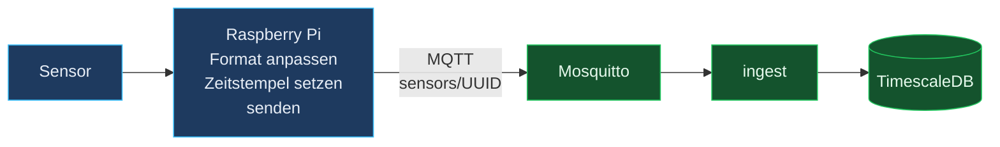

# Feldebene — Raspberry Pi an den Sensoren

> Was auf den Pis laufen muss, damit die verlustfreie Kette am Sensor beginnt und nicht
> erst am Broker.
>
> Der gesamte Weg eines Messwerts über alle Stationen: [Weg-eines-Messwerts.md](Weg-eines-Messwerts.md)
>
> **Stand:** 28.07.2026
>
> ✅ **Eine vollständige Umsetzung liegt vor:** [`edge-agent/`](../edge-agent/README.md).
> Sie erfüllt alle in diesem Dokument beschriebenen Anforderungen — Pufferung,
> QoS 1, persistente Sitzung und die Absicherung der Uhrzeit. Anzupassen ist
> ausschließlich die Datenerfassung in `ohb_edge/sensors.py`.
>
> Die Bestandsaufnahme unten beschreibt den Zustand **vor** dieser Umsetzung und
> bleibt maßgeblich für die Frage, ob die vorhandenen Pi-Skripte abgelöst werden
> müssen oder bereits ausreichen.

---

## 1. Aufbau

An jedem Messpunkt sitzt ein Raspberry Pi. Er liest die angeschlossenen Sensoren,
bringt die Werte in das Nachrichtenformat des Systems, **setzt den Zeitstempel** und
sendet an den MQTT-Broker.



Damit ist der Pi die **Edge-Komponente** des Systems. Ein zusätzlicher Agent muss
also nicht gebaut werden — die Frage ist ausschließlich, ob der vorhandene Code die
beiden Eigenschaften mitbringt, an denen die Verlustfreiheit hängt.

---

## 2. Zwei offene Punkte

### FELD-01 · Die erste Etappe ist vermutlich ungesichert 🔴

Die Referenzumsetzung im Repository sendet so:

```python
client = mqtt.Client(client_id="ohb-simulator")        # ohne clean_session=False
client.publish(topic, json.dumps(payload), qos=0)      # ← QoS 0
```

**QoS 0 heißt: absenden und vergessen.** Der Pi wartet auf keine Bestätigung. Ist der
Broker gerade neu gestartet, das Netzwerk kurz weg oder der Container im Wechsel, ist
die Messung verloren — und niemand bemerkt es.

Alles, was in [Verlustfreiheit.md](Verlustfreiheit.md) nachgewiesen wurde, gilt **ab
dem Broker**:

```
Pi ──QoS 0, ungesichert──▶ Mosquitto ──QoS 1, nachgewiesen verlustfrei──▶ DB
    ▲
    hier fehlt die Zusicherung
```

### FELD-02 · Der Pi hat keine Uhr 🔴

Ein Raspberry Pi besitzt **keine batteriegepufferte Echtzeituhr**. Nach einem
Stromausfall bootet er mit einem willkürlichen Datum und übernimmt die richtige Zeit
erst, wenn NTP durchkommt. Fällt gleichzeitig das Netz aus — der wahrscheinlichste
gemeinsame Fall — misst und stempelt er weiter, mit falscher Zeit.

Das ist hier kein Schönheitsfehler, weil der Zeitstempel an **drei** Stellen tragend ist:

| Wo | Warum eine falsche Zeit schadet |
|---|---|
| **Idempotenz** | Der Zeitstempel ist Teil des Schlüssels `(sensor_uuid, quantity, time)`. Springt die Uhr, kollidiert eine wiederholte Nachricht nicht mehr und landet doppelt |
| **Schwellenwert-Auswahl** | Der Trigger sucht mit `valid_during @> NEW.time`, welche Grenze *damals* galt. Falsche Zeit → falscher oder gar kein Grenzwert → falscher oder fehlender Alarm |
| **Reports** | Die Zeitraum-Auswahl im Audit-Report beruht vollständig darauf |

Ein Pi mit falscher Uhr erzeugt also stillschweigend fehlerhafte Historie — genau die
Sorte Fehler, die im Audit auffällt und nicht im Betrieb.

---

## 3. Zuerst messen, dann ändern

Bevor irgendetwas umgebaut wird, klären zwei Versuche den tatsächlichen Zustand.

### Puffern die Pis?

```powershell
docker compose stop mosquitto
Start-Sleep -Seconds 120
docker compose start mosquitto
```

Anschließend prüfen, ob für diese zwei Minuten Werte fehlen:

```sql
SELECT sensor_uuid,
       count(*) FILTER (WHERE time BETWEEN :von AND :bis) AS werte_im_fenster
FROM sensor_data
WHERE time > now() - interval '30 minutes'
GROUP BY sensor_uuid;
```

- **Werte kommen nach** → die Pis puffern bereits, die Kette ist vollständig, nichts zu tun
- **Werte fehlen** → der Umfang der Lücke ist damit belegt und beziffert

### Gehen die Uhren richtig?

```sql
SELECT sensor_uuid,
       max(time)          AS letzter_wert,
       now() - max(time)  AS abstand
FROM sensor_data
GROUP BY sensor_uuid
ORDER BY abstand;
```

Ein **negativer** Abstand bedeutet eine vorgehende Uhr — immer ein Fehler, denn ein
Messwert aus der Zukunft kann nicht existieren. Ein Abstand deutlich über dem
Sendeintervall bedeutet entweder eine nachgehende Uhr oder einen ausgefallenen Sensor;
beides gehört untersucht.

---

## 4. Anforderungen an den Pi-Code

Falls die Messung eine Lücke zeigt, sind das die Punkte.

### 4.1 Senden mit Zusicherung

| Anforderung | Warum |
|---|---|
| `qos=1` beim `publish` | Ohne Bestätigung gibt es keine Zusicherung |
| `clean_session=False` und **feste** `client_id` je Pi | Sonst verwirft der Broker die Sitzung beim Reconnect |
| Auf `PUBACK` warten, bevor der Messwert lokal verworfen wird | `paho` puffert ausgehende Nachrichten **nur im Arbeitsspeicher** — bei Stromausfall oder Skript-Neustart sind sie weg |

### 4.2 Lokaler Puffer

> Vollständig umgesetzt in [`edge-agent/ohb_edge/buffer.py`](../edge-agent/ohb_edge/buffer.py) —
> SQLite im WAL-Modus, Obergrenze gegen volllaufende Karten, gebündeltes Löschen.

Das Muster ist dasselbe wie im Ingest, nur spiegelbildlich: **erst festhalten, dann
senden, erst nach Bestätigung vergessen.**

```python
client = mqtt.Client(
    client_id=f"ohb-pi-{RAUM}-{GERAET}",   # fest und eindeutig je Pi
    clean_session=False,
)
client.connect(BROKER_HOST, BROKER_PORT, keepalive=60)
client.loop_start()

def sende(payload: dict) -> None:
    # 1. Messwert ZUERST lokal ablegen (SQLite oder Anhängedatei)
    row_id = store.append(payload)

    # 2. Senden und auf die Bestätigung warten
    info = client.publish(TOPIC, json.dumps(payload), qos=1)
    info.wait_for_publish(timeout=10)

    # 3. Erst nach bestätigter Zustellung lokal löschen
    if info.is_published():
        store.delete(row_id)

def sende_rueckstand() -> None:
    """Beim Start: alles nachliefern, was noch im Puffer liegt."""
    for row_id, payload in store.alle():
        info = client.publish(TOPIC, json.dumps(payload), qos=1)
        info.wait_for_publish(timeout=10)
        if info.is_published():
            store.delete(row_id)
```

Damit übersteht die Kette Netzausfall **und** Stromausfall. Die Idempotenz auf
Serverseite sorgt dafür, dass das Nachliefern folgenlos bleibt, selbst wenn eine
Nachricht bereits angekommen war — der Pi muss sich also nicht merken, was schon
bestätigt wurde.

> **SD-Karten-Verschleiß:** Dauerhaftes Schreiben verschleißt die Karte. Ein Puffer, der
> nur bei *fehlgeschlagener* Zustellung schreibt, vermeidet das — im Normalbetrieb wird
> nichts abgelegt.

### 4.3 Zeitstempel absichern

> Umgesetzt in [`edge-agent/ohb_edge/clock.py`](../edge-agent/ohb_edge/clock.py). Der
> Agent geht über die beiden Wege unten hinaus: Er hält zu jeder Messung zusätzlich
> die **monotone** Uhr fest und berichtigt gepufferte Zeitstempel rückwirkend, sobald
> die Wanduhr vertrauenswürdig wird. Nur Messungen aus einem früheren Prozesslauf
> ohne gültige Uhr bleiben unrettbar — die kommen in Quarantäne statt mit falscher
> Zeit auf die Leitung.

Zwei Wege, beide unaufwendig; der zweite ist bei ortsfesten Messstellen der saubere:

**NTP-Synchronität prüfen, bevor gesendet wird**

```python
import subprocess

def uhr_ist_synchron() -> bool:
    ergebnis = subprocess.run(
        ["timedatectl", "show", "-p", "NTPSynchronized", "--value"],
        capture_output=True, text=True,
    )
    return ergebnis.stdout.strip() == "yes"
```

Solange `False`: in den Puffer schreiben statt zu senden. Sobald die Zeit steht, den
Rückstand nachliefern — dann allerdings mit den Zeitstempeln, die zum Messzeitpunkt
gesetzt wurden, und die wären falsch. Deshalb ist der zweite Weg vorzuziehen.

**RTC-Modul nachrüsten** — ein DS3231 kostet wenige Euro, hängt am I²C-Bus und löst das
Problem an der Wurzel. Bei ortsfesten Messstellen mit Auditanspruch ist das die
angemessene Antwort.

---

## 5. Was der Server beitragen kann

Serverseitig lässt sich der Zustand **sichtbar** machen, ohne die Pis anzufassen. Zwei
Ergänzungen im Ingest, rund zwei Stunden Aufwand:

| Maßnahme | Wirkung |
|---|---|
| **Zeitstempel aus der Zukunft ablehnen** — ab etwa 5 min Vorlauf in `ingest_rejects` statt in `sensor_data` | Eine vorgehende Uhr ist immer falsch. Der Fehler wird sichtbar, statt die Historie zu verfälschen |
| **Uhr-Abweichung als Kennzahl** — Differenz `message.timestamp` zu `now()` protokollieren und in `/api/health/deep` aufnehmen | Ein driftender Pi fällt auf, bevor jemand einen Report zieht |

> **Wichtig:** Alte Zeitstempel dürfen **nicht** abgelehnt werden. Die sind nach einem
> Ausfall der Normalfall und genau das, was nachgeliefert werden soll. Nur Werte aus der
> Zukunft sind zweifelsfrei falsch.

*Status: noch nicht umgesetzt.*

---

## 6. Nachrichtenvertrag

Verbindlich für alles, was auf `sensors/<uuid>` sendet. Maßgeblich ist
`node-backend/src/ingest/messageSchema.js`.

```jsonc
{
  "id":           "a1b2c3d4-0001-0001-0001-000000000001",  // Pflicht, Format 8-4-4-4-12
  "gateway_id":   "gw-reinraum-221",                        // optional
  "name":         "Temperatursensor Eingang",               // optional, siehe unten
  "event_driven": 0,                                        // 0 = zyklisch, 1 = event-getrieben
  "timestamp":    "2026-07-27T10:15:00.000Z",               // ISO 8601 MIT Zeitzone
  "measurements": [
    { "quantity": "temperature", "unit": "°C",  "value": 22.4 },
    { "quantity": "pressure",    "unit": "hPa", "value": 1013.2 }
  ]
}
```

| Feld | Regel |
|---|---|
| `id` | 8-4-4-4-12 hexadezimal. **Nicht** zwingend RFC 4122 — strukturierte Kennungen wie `a1b2c3d4-0001-…` sind ausdrücklich zulässig |
| `timestamp` | ISO 8601 **mit** Zeitzonenangabe. Bildet zusammen mit `id` und `quantity` den Schlüssel |
| `measurements` | mindestens 1, höchstens 200 Einträge |
| `value` | Zahl; eine Zeichenkette wird toleriert und umgewandelt |
| `name` | wird nur übernommen, solange im Register noch der UUID-Platzhalter steht — eine Umbenennung im Dashboard bleibt erhalten |

Nachrichten, die dem nicht entsprechen, werden **bestätigt** (sonst entstünde eine
Endlosschleife) und in `ingest_rejects` abgelegt.

---

## 7. Zusammenfassung

| Punkt | Zustand | Nächster Schritt |
|---|---|---|
| Nachrichtenformat | ✅ etabliert | — |
| Zeitstempel wird am Pi gesetzt | ✅ so vereinbart | Uhr absichern (FELD-02) |
| QoS 1 und persistente Session | ❓ auf den Pis ungeprüft | Versuch aus §3; Umsetzung liegt bereit |
| Lokaler Puffer über Strom-/Netzausfall | ❓ auf den Pis ungeprüft | dito |
| NTP oder RTC | ❓ ungeprüft | Abstandsabfrage aus §3 |
| **Fertiger Agent** | ✅ vorhanden | [`edge-agent/`](../edge-agent/README.md) — nur `sensors.py` anpassen |
| Serverseitige Uhr-Prüfung | ❌ offen | §5, rund 2 Stunden |

**Die beiden Versuche in §3 kosten zusammen zehn Minuten und entscheiden, ob überhaupt
Handlungsbedarf besteht.** Erst danach lohnt eine Änderung am Pi-Code.
