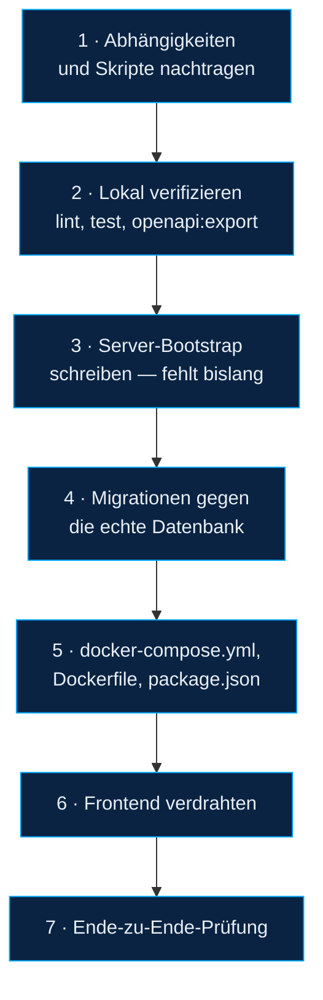

# Integrationsleitfaden — die neue Codebase anschließen

> Schritt für Schritt, wie der in [Neue-Codebase.md](Neue-Codebase.md)
> beschriebene, bislang unbenutzte Backend- und Frontend-Pfad zum tatsächlich
> laufenden System wird. Jeder Schritt ist einzeln überprüfbar, bevor der nächste
> beginnt — an keiner Stelle ist ein Rücksprung ausgeschlossen.
>
> **Stand:** 23.09.2026. Dieser Leitfaden wurde am Code erarbeitet, aber **nicht
> an einem laufenden Stack durchgespielt** — kein Schritt darin wurde tatsächlich
> ausgeführt. Vor jeder Änderung an der echten Datenbank: Sicherung von Hand
> (`docker compose exec -T postgres pg_dump -U postgres ohb_sensordata > sicherung.sql`),
> weil das im Repository vorbereitete Backup-Tooling nicht angeschlossen ist
> (siehe [Technische-Schulden.md](Technische-Schulden.md#3-backup--und-überwachungswerkzeuge-sind-vorbereitet-aber-nicht-angeschlossen)).
>
> Verwandt: [Neue-Codebase.md](Neue-Codebase.md) · [Architektur.md](Architektur.md) ·
> [Technische-Schulden.md](Technische-Schulden.md) · [CI-Pipeline.md](CI-Pipeline.md)

---

## Reihenfolge im Überblick



Schritte 1–3 verändern nur `node-backend/` (Dateien, keine laufende
Infrastruktur) und sind gefahrlos. Schritt 4 fasst zum ersten Mal die echte
Datenbank an. Schritt 5 schaltet den neuen Pfad tatsächlich scharf.

---

## Schritt 1: Abhängigkeiten und Skripte nachtragen

Der neue Pfad wurde ins Repository committet, ohne seine `npm`-Abhängigkeiten in
`package.json` nachzutragen — siehe
[Technische-Schulden.md](Technische-Schulden.md#1-der-wichtigste-befund-zwei-parallele-implementierungen).
Ohne diesen Schritt schlägt jeder folgende fehl.

```powershell
cd node-backend

npm install zod express-async-errors helmet pino pino-http `
  @asteasolutions/zod-to-openapi swagger-ui-express node-pg-migrate yaml

npm install --save-dev vitest @testcontainers/postgresql supertest pino-pretty
```

`pino-pretty` wird nur in der Entwicklung geladen (`config.isProduction` false),
gehört aber trotzdem installiert, sonst bricht der lokale Start ab.

Danach in `node-backend/package.json` unter `"scripts"` ergänzen:

```jsonc
"test": "vitest run",
"openapi:export": "node scripts/exportOpenApi.js",
"migrate:up": "node scripts/migrate.js up",
"migrate:down": "node scripts/migrate.js down"
```

Beide Skript-Dateien (`scripts/exportOpenApi.js`, `scripts/migrate.js`) liegen
bereits vollständig im Repository — nur der Verweis aus `package.json` fehlt.

**Prüfen:** `npm ci` in einem sauberen Klon muss danach ohne Fehler
durchlaufen und `package-lock.json` muss sich dabei nicht mehr verändern.

## Schritt 2: Lokal verifizieren

```powershell
npx eslint .
npm test          # startet über Testcontainers einen eigenen TimescaleDB-Container — Docker muss laufen
npm run openapi:export
git diff --stat docs/openapi.yaml   # zeigt, ob sich die Schnittstelle gegenüber dem eingecheckten Stand geändert hat
npm audit --omit=dev --audit-level=high
```

Alle vier Schritte entsprechen exakt dem, was die CI bei jedem Push versucht
(siehe [CI-Pipeline.md](CI-Pipeline.md)) — nach Schritt 1 sollte die Pipeline
zum ersten Mal tatsächlich grün werden können. Schlägt `npm test` fehl, an
dieser Stelle stoppen und die Ursache klären, bevor an der echten Infrastruktur
etwas geändert wird.

## Schritt 3: Server-Bootstrap schreiben

**Das ist die einzige echte Lücke im neuen Backend-Pfad — nicht nur fehlende
Verdrahtung, sondern fehlender Code.** `src/app.js` liefert bewusst nur
`createApp()` ohne `listen()` (für die Testbarkeit mit `supertest`, siehe
`test/api/contract.test.js`). Nirgends im Repository ruft jemand `createApp()`
auf und startet damit tatsächlich einen Server — anders als beim Ingest, wo
`src/ingest.js` diese Rolle bereits vollständig übernimmt (`main()` am Ende der
Datei). Ein neues `src/index.js` muss dieselbe Rolle für die API übernehmen,
konsistent zu den vorhandenen Bausteinen (`lib/shutdown.js`, `lib/watchdog.js`,
`alerts/index.js`):

```js
// node-backend/src/index.js — Bootstrap des API-Prozesses.
// Analog zu src/ingest.js: baut die Bausteine aus app.js, alerts/ und lib/
// zu einem laufenden Prozess zusammen.

const config = require('./config');
const logger = require('./lib/logger');
const db = require('./lib/db');
const { createApp } = require('./app');
const alerts = require('./alerts');
const { installCrashHandlers } = require('./lib/watchdog');
const { installShutdownHandlers, onShutdown } = require('./lib/shutdown');

async function main() {
  installCrashHandlers({ logger });
  installShutdownHandlers({ logger });

  const app = createApp();
  const server = app.listen(config.http.port, '0.0.0.0', () => {
    logger.info({ port: config.http.port }, 'API bereit');
  });
  onShutdown('http-server', () => new Promise((resolve) => server.close(() => resolve())));

  await alerts.start();
  onShutdown('alerts', () => alerts.stop());

  onShutdown('database', () => db.close());
}

main().catch((err) => {
  logger.fatal({ err }, 'API konnte nicht starten');
  process.exit(1);
});
```

Das ist ein Vorschlag, kein vorhandener, geprüfter Code — vor der Übernahme
gegen die Testsuite und manuell (`node src/index.js` bei laufender lokaler
Postgres/Mosquitto-Instanz, dann `curl localhost:3001/healthz`) prüfen.

## Schritt 4: Migrationen gegen die echte Datenbank

Die laufende Datenbank wurde nie über `node-pg-migrate` verwaltet — ihr Schema
stammt aus `db-init/001_schema.sql`, angewendet beim ersten Start des
`pgdata`-Volumes. `node-pg-migrate` führt Buch in einer eigenen Tabelle
(`pgmigrations`), die auf dieser Datenbank noch nicht existiert.

**Das ist unkritischer, als es klingt:** Migration `0001_init.sql` ist
durchgängig mit `IF NOT EXISTS` / `CREATE OR REPLACE` formuliert und verändert
an einem bereits bestehenden, identischen Schema nichts. `node-pg-migrate` kann
deshalb direkt gegen die echte, bereits befüllte Datenbank laufen — es muss
nichts von Hand als „bereits angewendet“ markiert werden.

```powershell
# Sicherung zuerst — siehe Hinweis am Dateianfang.

# Gegen die laufende Datenbank, mit denselben Zugangsdaten wie docker-compose.yml:
$env:POSTGRES_HOST = "localhost"
$env:POSTGRES_PASSWORD = "<Wert aus .env>"
cd node-backend
npm run migrate:up
```

Erwarteter Ablauf: `0001` läuft durch, ohne etwas zu verändern (alle Objekte
existieren bereits). `0002` entfernt vorhandene Duplikate in `sensor_data` (siehe
Ausgabe: Anzahl gelöschter Zeilen) und ersetzt den Index — **danach ist die
Datenbank idempotent**, Voraussetzung für den neuen Ingest in Schritt 5. `0003`
legt `ingest_rejects` an. `0004`/`0005` ersetzen die Trigger-Funktion. `0006`
legt die Domänenfunktionen und zwei `CHECK`-Constraints an
(`NOT VALID` — bestehende Zeilen werden nicht geprüft, nur neue/geänderte).

**Rückwärtskompatibilität mit dem Ist-Zustand:** Die alten Dateien
(`src/server.js`, `src/mqttBridge.js`, `src/routes/*.js`) funktionieren nach
diesen Migrationen unverändert weiter — sie referenzieren keine Indexnamen und
kein von `0004`/`0005` verändertes NOTIFY-Payload-Feld, das sie vorher gelesen
hätten. Einzige Verhaltensänderung: `POST /api/thresholds` (alte Route) würde
einen Schwellenwert ohne jede Grenze oder mit `min_value > max_value` nach der
Migration mit einem rohen Datenbankfehler ablehnen statt ihn anzulegen — bislang
ungeprüfter, unsinniger Zustand, der jetzt verhindert wird. Ein Rollback auf den
Ist-Zustand (Schritt 5 rückgängig machen) bleibt jederzeit möglich, ohne dass
diese Migration zurückgenommen werden müsste.

## Schritt 5: `docker-compose.yml`, `Dockerfile`, `package.json` umstellen

### 5.1 Migrations-Dienst ergänzen

```yaml
  migrate:
    build: ./node-backend
    command: ["node", "scripts/migrate.js", "up"]
    restart: "no"
    environment:
      <<: *backend-env
    depends_on:
      postgres:
        condition: service_healthy
```

### 5.2 `api` und `ingest` auf den neuen Pfad umstellen

```yaml
  api:
    build: ./node-backend
    command: ["node", "src/index.js"]      # vorher: src/server.js
    <<: *restart
    environment:
      <<: *backend-env
      PORT: 3001
      CORS_ORIGINS: "http://localhost:8080"   # Ursprünge, von denen das Frontend geladen wird
    ports:
      - "3001:3001"
    depends_on:
      postgres:
        condition: service_healthy
      migrate:
        condition: service_completed_successfully
    healthcheck:
      test: ["CMD-SHELL", "wget -qO- http://127.0.0.1:3001/healthz || exit 1"]
      interval: 15s
      timeout: 5s
      retries: 5
      start_period: 10s

  ingest:
    build: ./node-backend
    command: ["node", "src/ingest.js"]     # vorher: src/mqttBridge.js
    <<: *restart
    environment:
      <<: *backend-env
      HEALTH_PORT: 3002
    depends_on:
      postgres:
        condition: service_healthy
      mosquitto:
        condition: service_healthy
      migrate:
        condition: service_completed_successfully
    healthcheck:
      test: ["CMD-SHELL", "wget -qO- http://127.0.0.1:3002/healthz || exit 1"]
      interval: 15s
      timeout: 5s
      retries: 5
      start_period: 10s
```

`CORS_ORIGINS` hat in `config.js` den Vorgabewert `*` (offen für alle Ursprünge,
wie im Ist-Zustand) — die Zeile oben ist optional, aber für den Produktivbetrieb
empfohlen, sobald bekannt ist, von welchem Host aus das Dashboard geladen wird.

`seed` bleibt unverändert (`node src/seed.js`) — es legt weiterhin nur die
Reinräume an und ist von dieser Umstellung nicht betroffen.

### 5.3 `Dockerfile` und `package.json`

Der `CMD`-Vorgabewert im `Dockerfile` (`CMD ["node", "src/server.js"]`) wird nur
greifen, wenn ein Container **ohne** expliziten `command` aus `docker-compose.yml`
gestartet wird — für `api`/`ingest`/`migrate` unerheblich, da alle drei oben einen
eigenen `command` setzen. Trotzdem sinnvoll, den Vorgabewert mitzuziehen:

```diff
- CMD ["node", "src/server.js"]
+ CMD ["node", "src/index.js"]
```

In `node-backend/package.json`:

```diff
- "main": "src/server.js",
+ "main": "src/index.js",
  "scripts": {
-   "dev": "node --watch src/server.js",
-   "start": "node src/server.js",
+   "dev": "node --watch src/index.js",
+   "start": "node src/index.js",
    "lint": "eslint .",
+   "test": "vitest run",
+   "openapi:export": "node scripts/exportOpenApi.js",
+   "migrate:up": "node scripts/migrate.js up",
+   "migrate:down": "node scripts/migrate.js down"
  },
```

### 5.4 Scharf schalten

```powershell
docker compose up -d --build
docker compose ps      # migrate muss "Exited (0)" zeigen, alle anderen "healthy"
docker compose logs api ingest --tail=50
```

## Schritt 6: Frontend verdrahten

### 6.1 Panel-Manifest anschließen — kleinster, unabhängiger Schritt

In `ohb-dashboard/src/api.js` ergänzen:

```js
export const getPanels = (cleanroom_id) =>
  request(`/panels${cleanroom_id ? `?cleanroom_id=${cleanroom_id}` : ''}`);
```

Damit ist `hooks/useSensorPanels.js` sofort nutzbar. In `DashboardGrid.jsx` ersetzt
das den kompletten `useEffect`-Block, der heute `getSensors()` +
`getSensorMetrics()` + `getThresholds()` je Sensor einzeln aufruft:

```diff
- const [panels, setPanels] = useState([]);
- const [loading, setLoading] = useState(true);
- const [error, setError] = useState(null);
- // … der useEffect-Block, der 1 + 2N Anfragen stellt …
+ import { useSensorPanels } from '../hooks/useSensorPanels';
+ const { panels: rawPanels, loading, error, reload } = useSensorPanels({ version: dataVersion });
```

Die Feldnamen aus dem `Panel`-Schema (`id`, `min_value`, `max_value`,
`sensor_uuid`, `quantity`, `cleanroom_name`) passen unmittelbar auf das, was
`SensorPanel` erwartet (`useSensorPanels.js` übernimmt das Mapping bereits).
`RoomView.jsx` kann denselben Hook mit `{ cleanroomId: room.id }` nutzen und
seinen eigenen, fast identischen Ladeblock ersatzlos streichen.

### 6.2 `RegistryContext` einhängen — größerer, optionaler Schritt

```diff
  // App.jsx
+ import { RegistryProvider } from './store/RegistryContext';
  …
- <MqttProvider>
+ <RegistryProvider>
+ <MqttProvider>
    …
+ </MqttProvider>
+ </RegistryProvider>
```

Danach **je Komponente einzeln** von eigenem `getSensors()`/`getCleanrooms()` auf
`useRegistry()` umstellen — `Sidebar.jsx`, `ConfigPanel.jsx`, `HistoryView.jsx`
rufen aktuell alle unabhängig voneinander dieselben Daten ab. Das lässt sich
Komponente für Komponente migrieren, ohne dass die übrigen angefasst werden
müssen — `RegistryProvider` und die bisherigen direkten Aufrufe funktionieren
nebeneinander, solange nicht alle umgestellt sind.

### 6.3 Fehlergrenze je Panel

In `DashboardGrid.jsx` und `RoomView.jsx` um `SensorPanel` legen:

```diff
+ import PanelBoundary from './PanelBoundary';
  …
- <SensorPanel .../>
+ <PanelBoundary label={panel.id}><SensorPanel .../></PanelBoundary>
```

### 6.4 Broker-Adresse relativ ableiten (optional)

Nur sinnvoll, wenn tatsächlich über die nginx-Route `/mqtt` verbunden werden
soll statt über den direkt auf den Host gemappten Port 9001 (beide funktionieren
mit der aktuellen `docker-compose.yml`, siehe [Architektur.md](Architektur.md#3-systemarchitektur)):

```diff
  // store/MqttContext.jsx
+ import { defaultBrokerUrl } from './useMqttContext';
- const [brokerUrl, setBrokerUrl] = useState('ws://localhost:9001');
+ const [brokerUrl, setBrokerUrl] = useState(defaultBrokerUrl());
```

### 6.5 `i18n/de.js` einbinden

Größerer, rein mechanischer Umbau (jede hart codierte Zeichenkette in jeder
`.jsx`-Datei durch einen `i18n`-Zugriff ersetzen) — kein funktionaler Nutzen für
den Betrieb, nur für Konsistenz und eine spätere zweite Sprache. Eigenständig
priorisierbar, unabhängig von 6.1–6.4.

Keine der Änderungen in diesem Schritt erfordert neue npm-Pakete oder
Docker-Änderungen — reine Quelltextänderungen im bereits gebauten
`ohb-dashboard`-Image.

## Schritt 7: Ende-zu-Ende-Prüfung

| Prüfung | Erwartung |
|---|---|
| `docker compose ps` | `migrate` beendet mit Code 0, alle Dauerdienste `healthy` |
| `curl localhost:3001/healthz` | `{"status":"ok",...}` |
| `curl localhost:3001/readyz` | `{"status":"ready"}` |
| `curl localhost:3001/api/health/deep` | `200` mit `status: "ok"` (oder `503` mit nachvollziehbarem `problems`-Eintrag) |
| `http://localhost:3001/api/docs` im Browser | Swagger UI lädt, listet alle Routen aus [Neue-Codebase.md](Neue-Codebase.md#4-backend--rest-api) |
| Simulator laufen lassen, dann `curl 'localhost:3001/api/panels'` | Kanäle erscheinen, sobald Sensoren einem Raum zugeordnet sind |
| Dieselbe MQTT-Nachricht zweimal senden (`node-backend/tools/mqtt-sniffer.js` oder `mosquitto_pub`) | `SELECT count(*) FROM sensor_data` wächst nur beim ersten Mal |
| Schwellenwert absichtlich verletzen | Push-Nachricht zeigt echten Sensor- und Größennamen, **kein** „undefined“ |
| Broker kurz stoppen (`docker compose stop mosquitto`), Simulator weiterlaufen lassen, Broker wieder starten | keine fehlenden Werte in `sensor_data` für den Unterbrechungszeitraum |
| Dashboard im Browser | Panels laden weiterhin, Konfiguration/Historie/Report funktionieren wie zuvor |
| `npm audit --omit=dev --audit-level=high` (node-backend **und** ohb-dashboard) | keine neuen kritischen Funde durch die zusätzlichen Pakete |

Erst wenn diese Liste durchläuft, ist der neue Pfad im Sinne von
[Architektur.md](Architektur.md) der **tatsächliche** Ist-Zustand — an diesem
Punkt sollten `Architektur.md`, `Technische-Schulden.md` und `CI-Pipeline.md`
aktualisiert werden, weil ihr heutiger Inhalt (bewusst) den Stand **vor**
dieser Integration beschreibt.

## Rückwärtsrollen

`docker-compose.yml`, `Dockerfile` und `package.json` auf den vorherigen Commit
zurücksetzen und neu bauen (`docker compose up -d --build`) genügt — die in
Schritt 4 angewendeten Migrationen bleiben wirkungsfrei für den alten Code
(siehe Kompatibilitätshinweis am Ende von Schritt 4) und müssen dafür nicht
zurückgenommen werden.
