# OHB Reinraum Sensor Dashboard — Projektübersicht

> Vollständige Architektur-Dokumentation des Systems: Datenfluss von der Sensorik über MQTT
> und TimescaleDB bis in das React-Dashboard, inklusive Schwellenwert-Engine, Alarmkette
> und PDF-Reporting.
>
> **Stand:** 27.07.2026 · **Branch:** `main` · **Commit:** `4fbcd06`
>
> ⚠️ **Dieses Dokument beschreibt Version 1.0.0 (Stand 03.06.2026).**
> Mit dem Umbau auf 2.0.0 haben sich Backend-Struktur, Ingest-Pfad und Betriebsmodell
> geändert. Was noch gilt: Datenmodell, Zeitraum-Versionierung, Trigger-Logik und die
> fachlichen Abläufe. Was nicht mehr gilt: die Dateistruktur des Backends
> (§16), die Prozesslandschaft (§4) und die Altlastenliste (§18).
>
> Aktueller Stand: [CHANGELOG.md](../CHANGELOG.md) ·
> [Betriebshandbuch.md](Betriebshandbuch.md) ·
> [openapi.yaml](openapi.yaml) · [Zielarchitektur.md](Zielarchitektur.md) ·
> [Engineering-Standards.md](Engineering-Standards.md)

---

## Inhaltsverzeichnis

1. [Zweck & Systemüberblick](#1-zweck--systemüberblick)
2. [Technologie-Stack](#2-technologie-stack)
3. [Systemarchitektur](#3-systemarchitektur)
4. [Laufzeit-Topologie & Ports](#4-laufzeit-topologie--ports)
5. [Datenfluss — die zwei Pfade](#5-datenfluss--die-zwei-pfade)
6. [MQTT-Vertrag & Auto-Registrierung](#6-mqtt-vertrag--auto-registrierung)
7. [Datenmodell](#7-datenmodell)
8. [Zeitliche Gültigkeit (`tstzrange`)](#8-zeitliche-gültigkeit-tstzrange)
9. [Schwellenwert-Engine](#9-schwellenwert-engine)
10. [Alarmkette: NOTIFY → SSE → Push](#10-alarmkette-notify--sse--push)
11. [REST-API-Referenz](#11-rest-api-referenz)
12. [Frontend-Architektur](#12-frontend-architektur)
13. [Performance-Strategie](#13-performance-strategie)
14. [PDF-Report-Pipeline](#14-pdf-report-pipeline)
15. [Design-System](#15-design-system)
16. [Verzeichnisstruktur](#16-verzeichnisstruktur)
17. [Betrieb & Konfiguration](#17-betrieb--konfiguration)
18. [Bekannte Altlasten & offene Punkte](#18-bekannte-altlasten--offene-punkte)

---

## 1. Zweck & Systemüberblick

Das System überwacht **Reinraum-Umgebungsparameter** (Temperatur, Druck, eCO₂, TVOC,
Luftströmung, Partikel) in Echtzeit und dokumentiert sie **audit-sicher**. Drei fachliche
Kernanforderungen prägen die Architektur:

| Anforderung | Architektur-Konsequenz |
|---|---|
| **Echtzeit-Sicht** — Werte müssen ohne merkliche Latenz im Dashboard erscheinen | Browser abonniert MQTT **direkt** per WebSocket, nicht über das Backend |
| **Lückenlose Historie** — jede Messung muss dauerhaft nachvollziehbar sein | TimescaleDB-Hypertable + parallele Persistenz-Bridge |
| **Nachvollziehbarkeit über die Zeit** — „welcher Grenzwert galt am 12.03. in Raum 221?" | Alle Stammdaten sind **zeitraum-versioniert** (`tstzrange`), nichts wird überschrieben |

Daraus folgt das zentrale Architekturprinzip: **Live-Pfad und Persistenz-Pfad sind
entkoppelt.** Der Broker ist der einzige gemeinsame Punkt. Fällt das Backend aus, laufen
die Live-Charts weiter; fällt der Browser aus, wird trotzdem lückenlos persistiert.

---

## 2. Technologie-Stack

| Schicht | Technologie | Version | Ort |
|---|---|---|---|
| **Feldebene** | Python + `paho-mqtt` (Simulator) | 3.10+ | `MQTT_Publish_Test/` |
| **Messaging** | Eclipse Mosquitto | 2.x | Docker |
| **Datenhaltung** | PostgreSQL + TimescaleDB | PG 17 | Docker |
| **Backend** | Node.js, Express, `pg`, `mqtt`, PDFKit | Node ≥ 22 · Express 4.21 | Host-Prozess |
| **Frontend** | React, Vite, Plotly.js, MQTT.js | React 19.2 · Vite 7.3 | Host-Prozess / Browser |
| **Push** | ntfy.sh (HTTP) | — | extern |

**Bewusst gewählte Nicht-Entscheidungen:** kein State-Management-Framework (Redux/Zustand) —
React Context genügt; kein ORM — reines parametrisiertes SQL; keine Container für Node/React —
nur die Infrastruktur läuft in Docker, die Anwendungsprozesse laufen auf dem Host.

---

## 3. Systemarchitektur

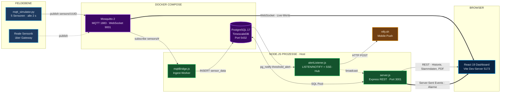

**Legende der Kantenstärken:** `===` fette Linien = Echtzeit-Kanäle (Push),
`-->` normale Linien = Request/Response oder Batch, `-.->` gestrichelt = optional/intern.

---

## 4. Laufzeit-Topologie & Ports

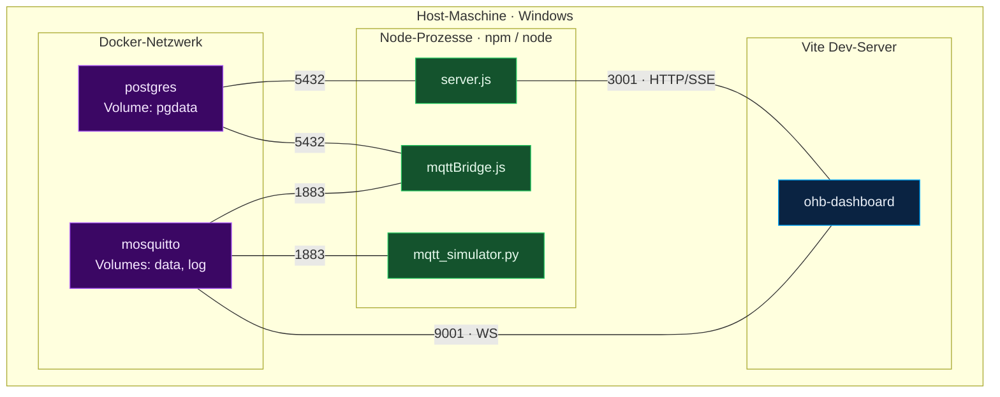

| Port | Dienst | Protokoll | Konsument |
|---|---|---|---|
| `5432` | PostgreSQL/TimescaleDB | TCP/SQL | `server.js`, `mqttBridge.js`, `seed.js` |
| `1883` | Mosquitto | MQTT | `mqttBridge.js`, Simulator, reale Gateways |
| `9001` | Mosquitto | MQTT over WebSocket | **Browser** (`useMqtt`) |
| `3001` | Express | HTTP + SSE | Browser (`api.js`, `AlertPanel`) |
| `5173` | Vite | HTTP | Entwickler-Browser |

> `vite --host` und `app.listen(PORT, '0.0.0.0')` binden bewusst auf allen Interfaces —
> das Dashboard ist damit im LAN erreichbar. `api.js` leitet die Backend-Adresse aus
> `window.location.hostname` ab, funktioniert also ohne Umkonfiguration von jedem Gerät aus.

**Startsequenz** (`start.ps1`):

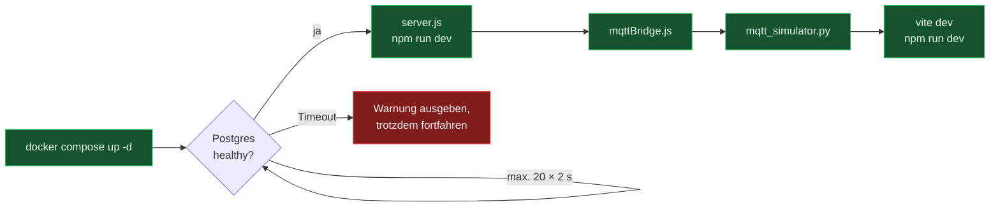

---

## 5. Datenfluss — die zwei Pfade

Der wichtigste Punkt der gesamten Architektur: **Ein Messwert nimmt zwei unabhängige Wege.**

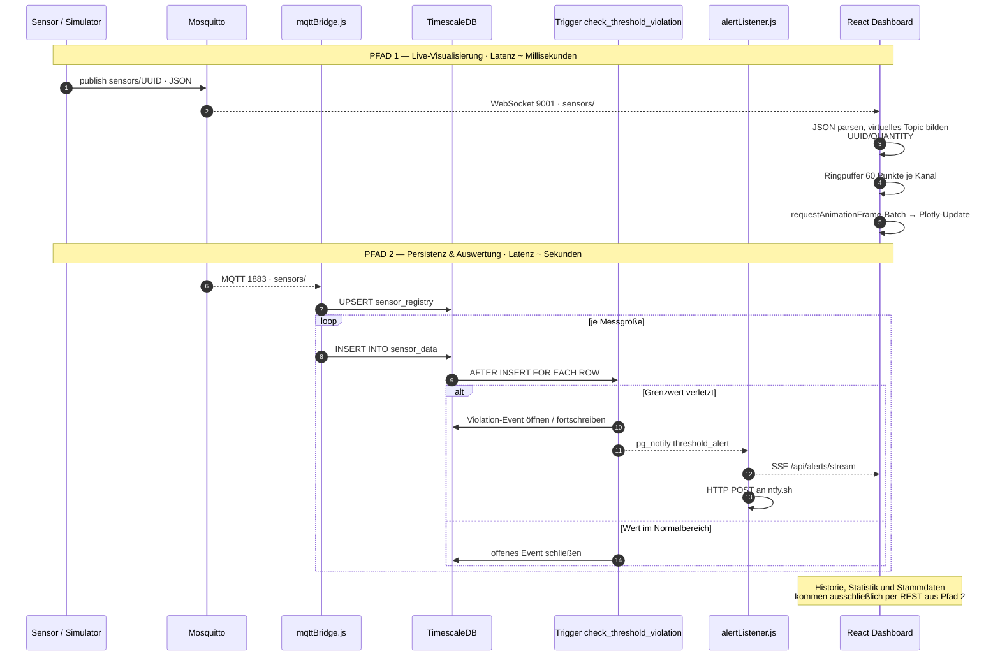

### Konsequenzen dieser Trennung

| Szenario | Auswirkung |
|---|---|
| Backend/Bridge offline | Live-Charts laufen weiter, **keine** Persistenz, **keine** Alarme |
| Browser geschlossen | Persistenz und Alarme laufen unverändert weiter |
| Broker offline | Beide Pfade stehen; MQTT.js reconnectet automatisch alle 3 s |
| Datenbank offline | Bridge-Insert schlägt fehl (Nachricht verworfen), Live-Sicht unbeeinträchtigt |

---

## 6. MQTT-Vertrag & Auto-Registrierung

### Topic-Schema

```
sensors/<sensor-uuid>          ← Publisher schreibt hierhin
sensors/#                      ← Bridge und Browser abonnieren komplett
```

### Nachrichtenformat

```jsonc
{
  "id":           "a1b2c3d4-0001-0001-0001-000000000001",  // UUID, Pflicht
  "gateway_id":   "gw-reinraum-221",                        // optional
  "name":         "Temperatursensor Eingang",               // optional
  "event_driven": 0,                                        // 0 = zyklisch, 1 = event-getrieben
  "timestamp":    "2026-07-27T10:15:00.000Z",               // ISO-8601
  "measurements": [
    { "quantity": "temperature", "unit": "°C",  "value": 22.4 },
    { "quantity": "pressure",    "unit": "hPa", "value": 1013.2 }
  ]
}
```

Ein Sensor kann **mehrere Messgrößen** in einer Nachricht liefern. Jede Messgröße wird zu
einer eigenen Zeile in `sensor_data` und im Frontend zu einem eigenen Panel
(„Kanal" = `sensor_uuid` + `quantity`).

### Zero-Config-Onboarding

Sensoren müssen **nicht** vorab angelegt werden — sie registrieren sich selbst:

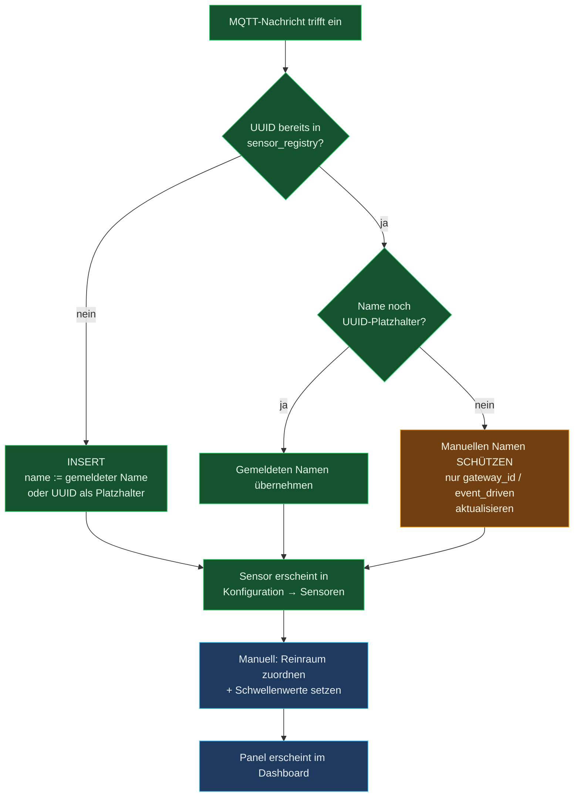

> **Wichtiges Detail** in `mqttBridge.js`: Die `ON CONFLICT DO UPDATE`-Klausel besitzt ein
> nachgestelltes `WHERE`, das den Schreibvorgang komplett überspringt, wenn sich nichts
> geändert hat. Bei 5 Sensoren × alle 2 s spart das dauerhaftes Table-Bloat auf
> `sensor_registry`. Ein manuell vergebener Name wird nie von einem MQTT-Payload überschrieben.

**Nur zugeordnete Sensoren erscheinen im Dashboard.** `DashboardGrid` filtert auf
`s.cleanroom_id != null` — ein neu registrierter, aber noch nicht zugeordneter Sensor bleibt
zunächst unsichtbar. Das ist gewollt: es verhindert, dass fremde MQTT-Teilnehmer das
Dashboard fluten.

---

## 7. Datenmodell

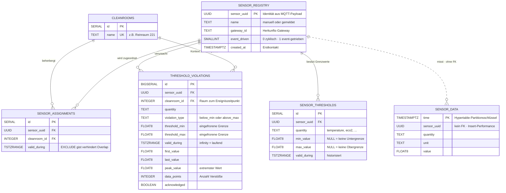

### Tabellen im Detail

| Tabelle | Rolle | Besonderheit |
|---|---|---|
| `sensor_registry` | Identitäts-Register aller je gesehenen Sensoren | wird von der Bridge selbstständig befüllt |
| `cleanrooms` | Räume/Bereiche | `name` ist `UNIQUE`; Seed legt „Reinraum 221" und „Infoboard" an |
| `sensor_assignments` | *welcher Sensor war wann in welchem Raum* | `EXCLUDE USING gist` schließt überlappende Zuordnungen physisch aus |
| `sensor_thresholds` | *welche Grenze galt wann* | dito, zusätzlich nach `quantity` getrennt |
| `sensor_data` | Messreihe | **TimescaleDB-Hypertable**, automatische Zeit-Chunks |
| `threshold_violations` | Verletzungs­**ereignisse**, nicht Einzelmesswerte | ein Event fasst beliebig viele Verstöße zusammen |

### Index-Strategie

| Index | Typ | Zweck |
|---|---|---|
| `idx_sensor_data_lookup (sensor_uuid, quantity, time DESC)` | B-Tree | trägt jede Chart-Abfrage |
| `idx_violations_range` | **GiST** | Range-Overlap `&&` für Zeitraum-Filter |
| `idx_violations_active … WHERE upper(valid_during) = 'infinity'` | Partial | findet laufende Alarme ohne Full Scan |
| `idx_violations_ack … WHERE NOT acknowledged` | Partial | Badge „offene Alarme" |
| `EXCLUDE USING gist` auf assignments/thresholds | GiST Constraint | Datenintegrität statt Applikationslogik |

> Die GiST-Constraints sind der Grund für `CREATE EXTENSION btree_gist` — sie kombinieren
> Gleichheitsvergleich (`sensor_uuid WITH =`) mit Range-Overlap (`valid_during WITH &&`)
> in einem einzigen Index.

---

## 8. Zeitliche Gültigkeit (`tstzrange`)

Drei Tabellen sind **zeitraum-versioniert**. Nichts wird überschrieben oder gelöscht —
ein „Update" schließt den alten Zeitraum und öffnet einen neuen.

```sql
-- Muster für JEDE Stammdatenänderung (Assignments, Thresholds)
UPDATE …  SET valid_during = tstzrange(lower(valid_during), now())
          WHERE … AND valid_during @> now();          -- alten Satz schließen
INSERT … VALUES (…, tstzrange(now(), 'infinity'));    -- neuen Satz öffnen
```

Beides läuft in **einer Transaktion** (`BEGIN … COMMIT`), damit nie eine Lücke oder eine
Überlappung entsteht — Letzteres würde die `EXCLUDE`-Constraint ohnehin abweisen.

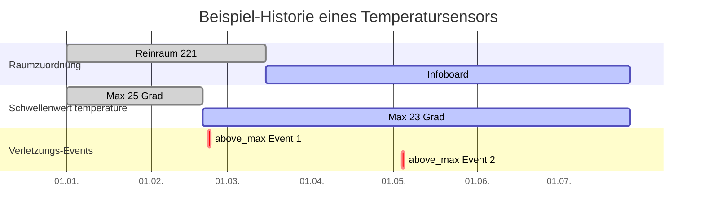

**Was das ermöglicht:** Der PDF-Report für den 22.02. weiß, dass damals Grenzwert
„Max 23" galt und der Sensor in „Reinraum 221" hing — obwohl beides inzwischen anders ist.
Genau das macht den Report audit-tauglich.

**Soft-Delete:** `DELETE /api/thresholds/:id` löscht nicht, sondern setzt
`upper(valid_during) = now()`. Die Zeile bleibt als historischer Beleg erhalten.

---

## 9. Schwellenwert-Engine

Die Auswertung läuft **vollständig in der Datenbank** — als `AFTER INSERT … FOR EACH ROW`-
Trigger auf `sensor_data`. Kein Node-Prozess pollt Werte; die Logik kann nicht umgangen
werden, egal welcher Client schreibt.

### Entscheidungsbaum der Trigger-Funktion

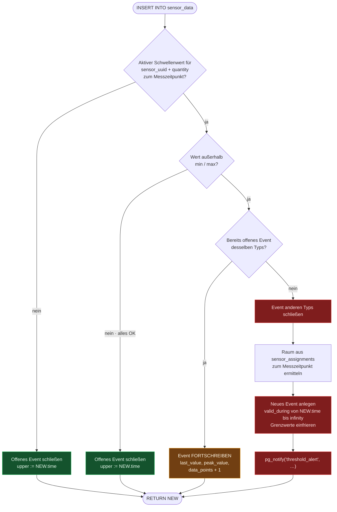

### Warum Events statt Einzelverstößen?

Bei 2-Sekunden-Takt erzeugt eine 10-minütige Grenzwertüberschreitung **300 Messwerte** —
aber nur **einen** Alarm. Das Event aggregiert:

- `first_value` — Wert beim Auslösen
- `peak_value` — Extremwert (`GREATEST` bei `above_max`, `LEAST` bei `below_min`)
- `last_value` — letzter Wert vor Beendigung
- `data_points` — Anzahl der betroffenen Messungen
- `duration_sec` — berechnet aus dem `tstzrange`

`pg_notify` feuert **nur beim Öffnen** eines Events, nicht bei jedem Verstoß —
das verhindert Alarm-Spam auf Handy und SSE-Kanal.

### Lebenszyklus eines Verletzungs-Events

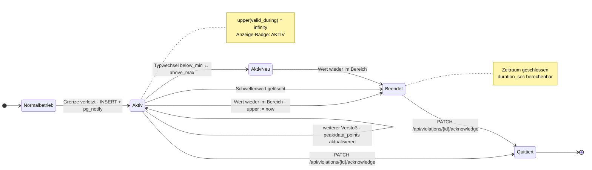

---

## 10. Alarmkette: NOTIFY → SSE → Push

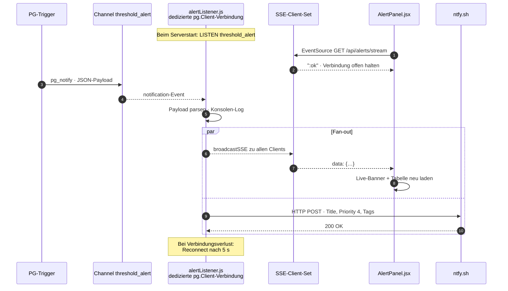

**Warum eine eigene `pg.Client`-Verbindung?** `LISTEN` benötigt eine **persistente**
Verbindung. Ein Pool würde die Verbindung nach jedem Query zurückgeben und die
Registrierung verlieren — deshalb betreibt `alertListener.js` bewusst eine Verbindung
außerhalb des Pools aus `db.js`.

**SSE statt WebSocket:** Alarme fließen nur in eine Richtung (Server → Browser).
`EventSource` bringt Auto-Reconnect ohne Zusatzcode mit. Das `AlertPanel` öffnet den Stream
**beim Mount**, nicht beim Öffnen des Dialogs — Alarme werden also auch empfangen, während
das Panel geschlossen ist.

---

## 11. REST-API-Referenz

Basis-URL: `http://<host>:3001/api` · CORS offen für alle Origins · JSON-Body

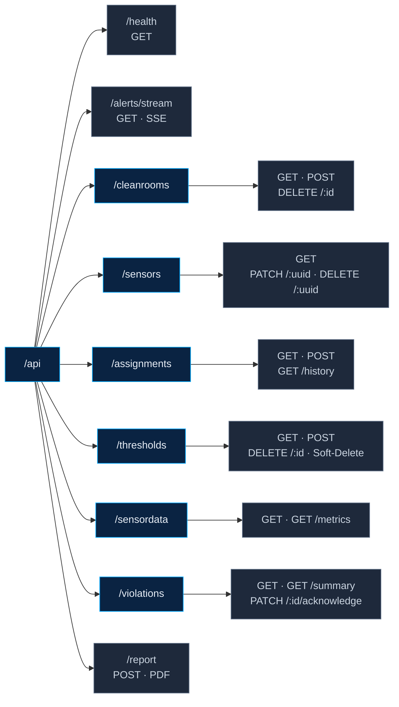

| Methode | Pfad | Parameter | Zweck |
|---|---|---|---|
| `GET` | `/health` | — | Liveness-Probe |
| `GET` | `/alerts/stream` | — | **SSE**-Kanal für Live-Alarme |
| `GET` | `/cleanrooms` | — | alle Räume |
| `POST` | `/cleanrooms` | `{name}` | Raum anlegen · `409` bei Duplikat |
| `DELETE` | `/cleanrooms/:id` | — | Raum löschen, Zuordnungen aufräumen, Violations entkoppeln |
| `GET` | `/sensors` | — | Registry **+ aktueller Raum + gemessene Größen** (3 JOINs) |
| `PATCH` | `/sensors/:uuid` | `{name}` | umbenennen |
| `DELETE` | `/sensors/:uuid` | — | kaskadiert über Violations → Thresholds → Assignments → Registry |
| `GET` | `/assignments` | — | aktuell gültige Zuordnungen |
| `GET` | `/assignments/history` | `sensor_uuid` | vollständige Raum-Historie |
| `POST` | `/assignments` | `{sensor_uuid, cleanroom_id}` | umziehen · transaktional |
| `GET` | `/thresholds` | `sensor_uuid?` | aktuell gültige Grenzwerte |
| `POST` | `/thresholds` | `{sensor_uuid, quantity, min_value, max_value}` | neue Version setzen |
| `DELETE` | `/thresholds/:id` | — | **Soft-Delete** über Zeitraum-Schließung |
| `GET` | `/sensordata` | `sensor_uuid`, `quantity`, `from`, `to`, `limit` | Zeitreihe · Default 24 h / 500 Punkte · Cap 5000 |
| `GET` | `/sensordata/metrics` | `sensor_uuid` | verfügbare Messgrößen (`DISTINCT quantity`) |
| `GET` | `/violations` | `cleanroom_id`, `sensor_uuid`, `quantity`, `from`, `to`, `active`, `acknowledged`, `limit` | Alarm-Liste mit berechneter Dauer |
| `GET` | `/violations/summary` | `from`, `to` | Aggregat je Raum × Größe × Typ |
| `PATCH` | `/violations/:id/acknowledge` | — | quittieren |
| `POST` | `/report` | `{cleanroom_id, from, to}` | **PDF-Binary** |

---

## 12. Frontend-Architektur

### Komponentenbaum

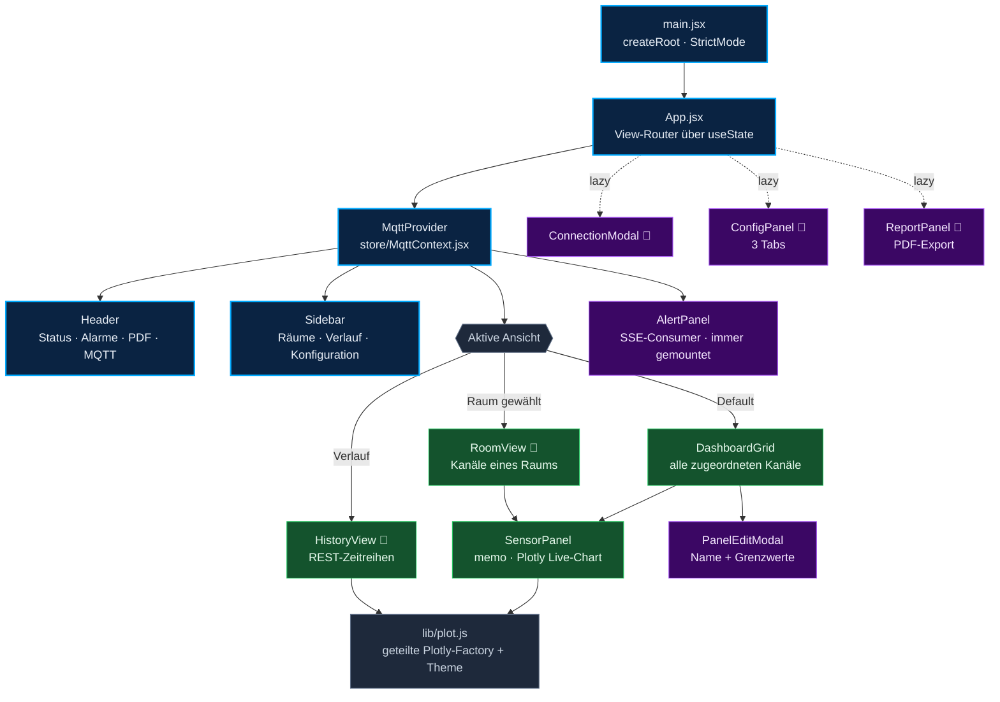

> 🔸 = per `React.lazy()` code-gesplittet, wird erst beim ersten Aufruf geladen.

### Wer holt woher seine Daten?

Das ist die zentrale Orientierungshilfe im Frontend:

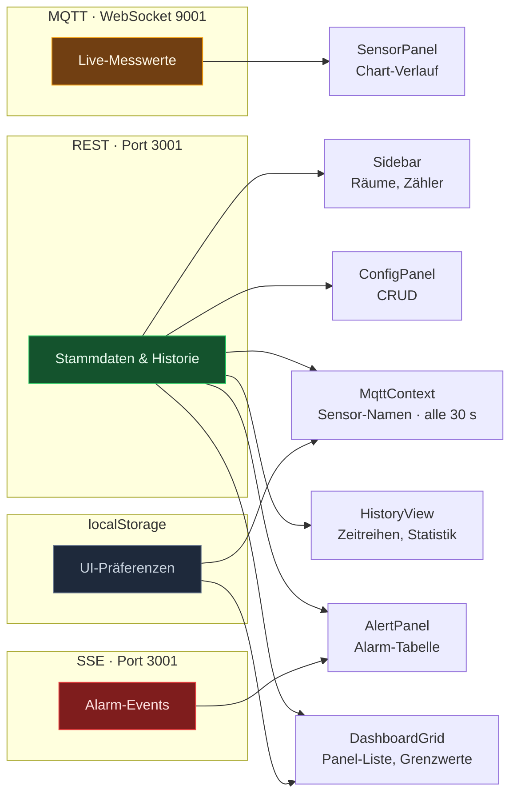

### State-Management

| Ebene | Mechanismus | Inhalt |
|---|---|---|
| **Global** | `MqttContext` (React Context) | MQTT-Verbindung, Broker-URL, Sensor-Namen, Topic-Listener |
| **View-Routing** | `useState` in `App.jsx` | aktive Ansicht, offene Modals, `dataVersion`-Zähler |
| **Panel-Layout** | `useDashboardLayout` → `localStorage` | Reihenfolge + ausgeblendete Panels |
| **Komponenten-lokal** | `useState` / `useRef` | Formulare, Ladezustände, Drag & Drop |

**`dataVersion` als Invalidierungs-Signal:** Beim Schließen des `ConfigPanel` erhöht `App.jsx`
einen Zähler. `DashboardGrid` und `Sidebar` haben ihn in der Dependency-Liste ihres
`useEffect` und laden dadurch sofort neu — ein leichtgewichtiger Ersatz für einen
Query-Cache, ohne zusätzliche Bibliothek.

### Custom Hooks

| Hook | Aufgabe | Status |
|---|---|---|
| `useMqtt(brokerUrl, enabled)` | Broker-Verbindung, Ringpuffer, Listener-Registry, rAF-Batching, Topic-Discovery | aktiv |
| `useDashboardLayout()` | Panel-Reihenfolge & Sichtbarkeit persistieren | aktiv |
| `useSensorPoller(uuid, quantity)` | REST-Polling einer Zeitreihe alle 20 s | **derzeit nirgends importiert** — Reserve für einen MQTT-freien Betriebsmodus |

### Browser-Persistenz

| `localStorage`-Key | Inhalt | Schreiber |
|---|---|---|
| `ohb-sensor-names` | UUID → Anzeigename (Offline-Fallback) | `MqttContext` |
| `ohb-dashboard-layout` | `{ order: [], hidden: [] }` | `useDashboardLayout` |

---

## 13. Performance-Strategie

Bei 5 Sensoren × ~2 Messgrößen × alle 2 s laufen dauerhaft ~5 Nachrichten/s durch den
Browser — jede könnte mehrere Plotly-Charts neu zeichnen. Vier Maßnahmen verhindern das:

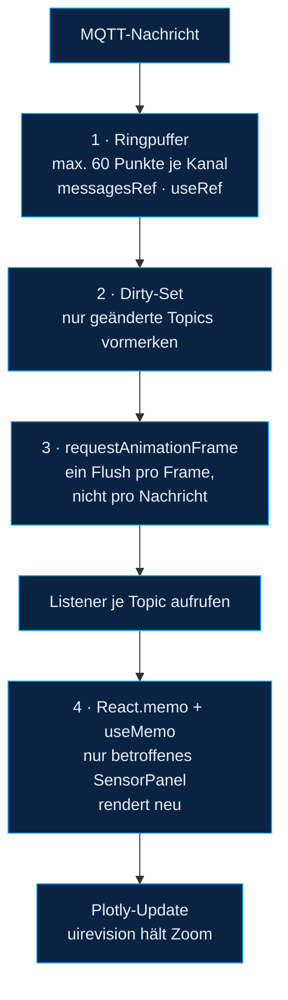

**Weitere Maßnahmen:**

| Maßnahme | Ort | Wirkung |
|---|---|---|
| Eine geteilte Plotly-Factory | `lib/plot.js` | Plotly wird **einmal** instanziiert statt je Komponente |
| `manualChunks` für `plotly` und `mqtt` | `vite.config.js` | kleinerer Initial-Bundle, besseres Browser-Caching |
| `React.lazy` für Sekundär-Views | `App.jsx` | Verlauf/Config/Report laden erst bei Bedarf |
| Eingefrorene Config-Objekte (`Object.freeze`) | `SensorPanel`, `HistoryView` | stabile Props → keine unnötigen Plotly-Rerenders |
| `uirevision` konstant je Topic | `SensorPanel` | manueller Zoom überlebt Datenaktualisierungen |
| Datengetriebener Y-Zoom (`yRange`) | `lib/plot.js` | Kurve füllt die Fläche, Grenzwertlinien bleiben im Bild |
| Server-seitiges `LIMIT` (Cap 5000) | `routes/sensordata.js` | schützt vor Abfragen über Monatszeiträume |

---

## 14. PDF-Report-Pipeline

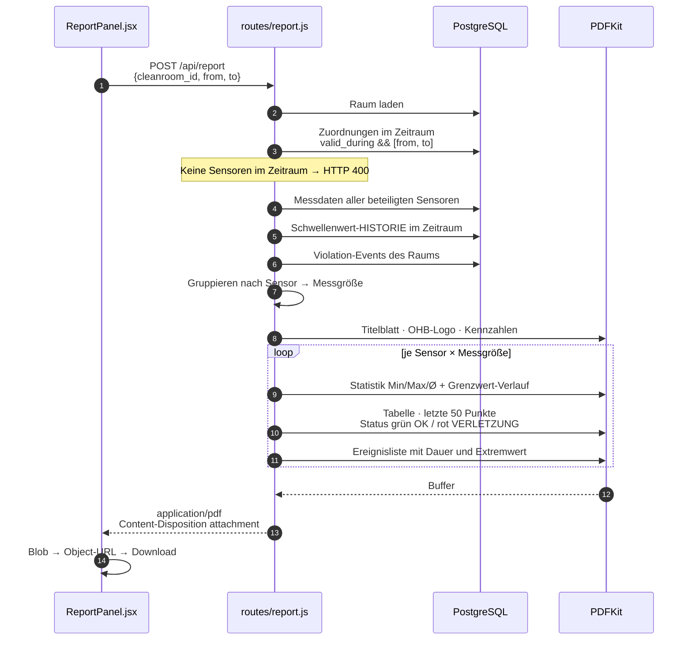

**Audit-Qualität:** Der Report zieht die Sensorliste aus den **historischen** Zuordnungen
(`valid_during && tstzrange(from, to)`), nicht aus dem aktuellen Zustand. Ein Sensor, der
inzwischen umgezogen ist, taucht trotzdem korrekt auf — mit dem Grenzwert, der damals galt.
Die Statuskennzeichnung je Messzeile stammt aus `isInViolation()`, das jeden Zeitstempel
gegen die Event-Zeiträume prüft.

---

## 15. Design-System

Definiert in `ohb-dashboard/src/index.css` als CSS Custom Properties — Dark Theme mit
Glassmorphism (`.glass-card`), abgestimmt auf die OHB-Markenfarbe.

| Token-Gruppe | Beispiele |
|---|---|
| **Flächen** | `--bg #090d14` · `--bg-elev rgba(17,28,48,.66)` · `--bg-panel` |
| **Marke** | `--navy #0a2342` · `--accent #00aaff` · `--accent-glow` |
| **Semantik** | `--success #22c55e` · `--warn #f59e0b` · `--danger #ef4444` |
| **Text** | `--text #e8eef6` · `--text-sub #93a3b8` · `--text-faint` |
| **Form** | `--radius-lg 18px` · `--radius 13px` · `--radius-pill` |
| **Raster** | `--space-1 … --space-6` (4 – 32 px) |
| **Tiefe** | `--shadow-sm` · `--shadow` · `--shadow-lg` · `--ring` |

Die Chart-Farben in `lib/plot.js` (`CHART`, `SERIES_COLORS`) spiegeln dieselbe Palette —
Grenzwertlinien nutzen `--danger` für Max und `--warn` für Min, konsistent zu den Badges
in den Panel-Headern. Typografie durchgängig **Inter** (Google Fonts, per `@import`).

---

## 16. Verzeichnisstruktur

```
OHB_Project/
├── docker-compose.yml           # Postgres + Mosquitto
├── start.ps1                    # Ein-Klick-Start aller 5 Prozesse
├── README.md                    # Setup-Anleitung (teilweise veraltet, s. §18)
│
├── db-init/                     # läuft NUR bei leerem pgdata-Volume
│   ├── 001_schema.sql           # Tabellen, Hypertable, Indizes, Trigger  ← Referenz
│   └── 002_seed.sql             # Reinräume
│
├── mosquitto/
│   └── mosquitto.conf           # Listener 1883 (MQTT) + 9001 (WebSocket)
│
├── MQTT_Publish_Test/
│   └── mqtt_simulator.py        # 5 Sensoren, Sinus + Rauschen, alle 2 s
│
├── node-backend/
│   ├── .env                     # Zugangsdaten (nicht im Repo)
│   └── src/
│       ├── server.js            # Express-Bootstrap, Routen-Mount, SSE
│       ├── db.js                # pg.Pool + ensureSchema()
│       ├── mqttBridge.js        # MQTT → SQL Ingest
│       ├── alertListener.js     # LISTEN/NOTIFY + SSE-Hub + ntfy
│       ├── seed.js              # Reinräume nachträglich anlegen
│       ├── migrate.js           # Runner für migrations/*.sql
│       ├── test.js              # MQTT-Sniffer (Debug-Werkzeug)
│       ├── ohb-logo.png         # Logo für PDF-Kopf
│       ├── migrations/
│       │   └── 001_threshold_violations.sql   # VERALTET, s. §18
│       └── routes/              # ein Router je Ressource
│           ├── cleanrooms.js  assignments.js  sensors.js
│           ├── thresholds.js  sensordata.js   violations.js
│           └── report.js
│
└── ohb-dashboard/
    ├── vite.config.js           # React-Plugin + manualChunks
    └── src/
        ├── main.jsx  App.jsx  api.js  sensorLabel.js  index.css
        ├── lib/plot.js          # geteilte Plotly-Factory + Theme + yRange
        ├── store/MqttContext.jsx
        ├── hooks/               # useMqtt · useDashboardLayout · useSensorPoller
        └── components/          # je Komponente .jsx + .css
```

---

## 17. Betrieb & Konfiguration

### Start / Stopp

```powershell
.\start.ps1                  # alles starten (Docker + 4 Prozessfenster)

docker compose up -d         # nur Infrastruktur
docker compose down          # stoppen, Daten bleiben erhalten
docker compose down -v       # stoppen UND alle Daten löschen
docker compose ps            # Health-Status prüfen
```

### Umgebungsvariablen (`node-backend/.env`)

| Variable | Default | Bedeutung |
|---|---|---|
| `POSTGRES_HOST` | `localhost` | bei IPv6-Problemen auf `127.0.0.1` setzen |
| `POSTGRES_PORT` | `5432` | |
| `POSTGRES_DB` | `ohb_sensordata` | |
| `POSTGRES_USER` / `POSTGRES_PASSWORD` | `postgres` / — | muss zu `docker-compose.yml` passen |
| `MQTT_BROKER_URL` | `mqtt://localhost:1883` | Broker der Bridge |
| `PORT` | `3001` | Express-Port |
| `NTFY_TOPIC` | `ohb-cleanroom-alerts` | ntfy-Topic für Push |
| `NTFY_SERVER` | `https://ntfy.sh` | ggf. eigene ntfy-Instanz |

### Datenbank-Initialisierung


> **Wichtig:** `db-init/` läuft ausschließlich beim **allerersten** Start eines leeren
> Volumes. Schema-Änderungen an bestehenden Installationen gehören deshalb in
> `ensureSchema()` in `db.js` — die Funktion ist idempotent und läuft bei jedem Prozessstart.

### Inbetriebnahme eines neuen Sensors

1. Sensor publiziert auf `sensors/<uuid>` → erscheint automatisch in `sensor_registry`
2. **Konfiguration → Sensoren** → umbenennen (optional) → **Reinraum zuordnen**
3. **Konfiguration → Schwellenwerte** → Sensor + Messgröße wählen → Min/Max setzen
4. Panel erscheint in der Übersicht; ab jetzt greift die Alarm-Engine

---

## 18. Bekannte Altlasten & offene Punkte

> **Stand 28.07.2026: Die Punkte 1 bis 6 sind mit Version 2.0.0 behoben**, Punkt 8
> ebenfalls (zentrale Fehlerbehandlung, REL-01). Offen bleibt Punkt 7 — die
> Zugangsbeschränkung; siehe AUD-01 in [Engineering-Standards.md](Engineering-Standards.md)
> und Abschnitt 6 des [Betriebshandbuchs](Betriebshandbuch.md).
> Die folgende Liste bleibt als Beleg des Ausgangszustands erhalten.

Beim Durchgang durch die Codebasis sind folgende Inkonsistenzen aufgefallen:

| # | Fund | Ort | Auswirkung |
|---|---|---|---|
| 1 | **ntfy-Push zeigt „undefined"**: `sendNtfy()` liest `data.metric` und `data.sensor_id`, der Trigger sendet aber `quantity` und `sensor_uuid` | `alertListener.js:47-50` | Push-Titel und Sensorzeile bleiben leer; SSE und UI sind korrekt |
| 2 | **Migration ist veraltet**: `001_threshold_violations.sql` referenziert die alte Struktur (`sensors.sensor_id`, `metric`) | `node-backend/src/migrations/` | `node src/migrate.js` würde gegen das aktuelle Schema fehlschlagen. Referenz ist `db-init/001_schema.sql` |
| 3 | **README beschreibt altes Topic-Schema** (`reinraum1/lps22/#`) und einen Seed, der Assignments anlegt | `README.md` | Anleitung führt in die Irre; tatsächlich gilt `sensors/#` und Seed legt nur Räume an |
| 4 | **Toter Code im Simulator**: `build_payload()` referenziert undefiniertes `GATEWAY_ID` und `sensor["name"]` | `mqtt_simulator.py:125` | Funktion wird von `main()` nicht aufgerufen, Simulator läuft; Aufruf würde `NameError` werfen |
| 5 | **`useSensorPoller` nirgends importiert** | `hooks/useSensorPoller.js` | funktionsfähig, aber ungenutzt — brauchbar für einen MQTT-freien Modus |
| 6 | **Bridge schreibt ohne Batching**: ein `INSERT` je Messgröße, kein `COPY`, keine Transaktion | `mqttBridge.js:90-98` | bei aktueller Last unkritisch; bei vielen Sensoren der erste Skalierungspunkt |
| 7 | **Kein Authentifizierungs-Layer**: CORS offen, MQTT `allow_anonymous true`, keine API-Keys | `server.js`, `mosquitto.conf` | für den geschlossenen Laborbetrieb ok, für Produktivbetrieb zu schließen |
| 8 | **Fehlerbehandlung in async-Routen** teils ohne `try/catch` (z. B. `cleanrooms` POST, `sensordata`) | diverse Routen | unbehandelte Rejections in Express 4 führen zu hängenden Requests statt `500` |

### Naheliegende Ausbaustufen

- **TimescaleDB ausreizen:** Continuous Aggregates für Stunden-/Tagesmittel, Retention-Policy,
  Kompression älterer Chunks — die Hypertable liegt bereits vor, die Features sind ungenutzt.
- **Bridge-Robustheit:** Batch-Insert plus Pufferung bei DB-Ausfall statt Nachrichtenverlust.
- **Reverse Proxy:** Nginx vor Vite-Build, Backend und Mosquitto-WS → ein Port, TLS, Auth.
- **Alarm-Historie im Frontend** aus `/violations/summary` visualisieren (bislang nur API).

---

*Erstellt aus der Analyse der vollständigen Codebasis · `docs/Projektübersicht.md`*
