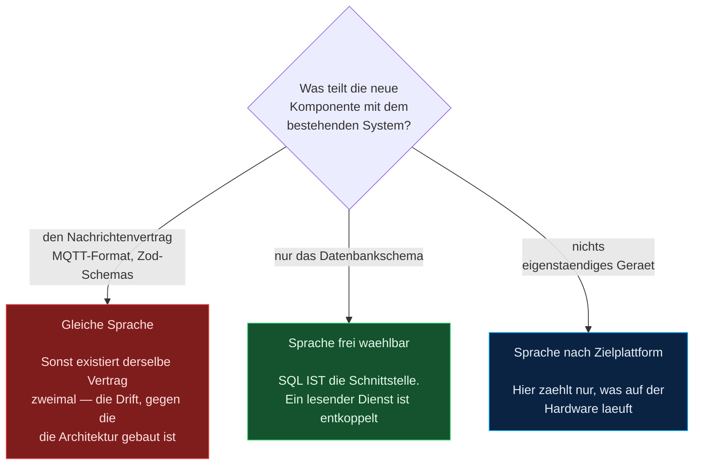
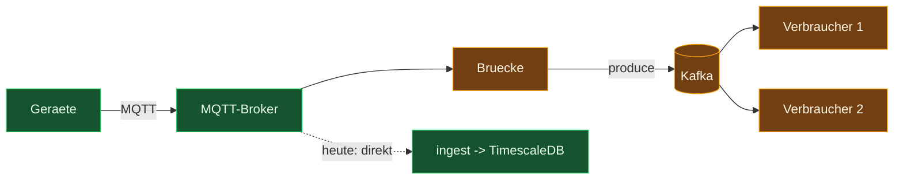

# Technologieentscheidungen

> Warum bestimmte Technologien **nicht** eingesetzt werden — und unter welchen
> Bedingungen die Entscheidung neu zu treffen wäre.
>
> **Stand:** 28.07.2026 · Alle Zahlen sind am laufenden System gemessen, nicht geschätzt.
>
> ⚠️ **Hinweis zur Einordnung:** TE-001 vergleicht den Ingest-Worker mit einer
> Go-Neuimplementierung anhand von Eigenschaften (Watchdog, Backoff-Retry,
> dokumentierte Manual-Ack-API), die im tatsächlich laufenden `mqttBridge.js`
> nicht existieren — sie gehören zum unbenutzten Ingest-Pfad `src/ingest.js`, siehe
> [Technische-Schulden.md](Technische-Schulden.md#1-der-wichtigste-befund-zwei-parallele-implementierungen).
> Die grundsätzliche Argumentation (JS teilt den Nachrichtenvertrag, eine zweite
> Sprache würde ihn duplizieren) bleibt unabhängig davon gültig. Die Architektur
> und Betriebsdetails in diesem Dokument beziehen sich auf [Architektur.md](Architektur.md).

Der Zweck dieses Dokuments ist nicht, Technologien schlechtzureden. Er ist, die
immer wiederkehrenden Fragen („sollten wir nicht besser…") einmal sauber zu beantworten,
damit sie nicht alle sechs Monate neu diskutiert werden — und damit erkennbar bleibt,
**woran sich die Antwort ändern würde.**

---

## Inhaltsverzeichnis

1. [Die Entscheidungsregel](#1-die-entscheidungsregel)
2. [TE-001 · Ingest bleibt in JavaScript, nicht Go](#te-001--ingest-bleibt-in-javascript-nicht-go)
3. [TE-002 · MQTT bleibt, kein Kafka](#te-002--mqtt-bleibt-kein-kafka)
4. [TE-003 · Wo eine zweite Sprache sich lohnt](#te-003--wo-eine-zweite-sprache-sich-lohnt)
5. [TE-004 · Die Datenbank ist die Domänenschicht](#te-004--die-datenbank-ist-die-domänenschicht)
6. [Messwerte als Grundlage](#4-messwerte-als-grundlage)

---

## 1. Die Entscheidungsregel

Die nützliche Frage ist nicht „welche Sprache ist besser", sondern:
**Was teilt die Komponente mit dem Rest des Systems?** Daran entscheidet sich, ob eine
zweite Sprache Kosten verursacht oder nicht.

Diese Regel erklärt, warum ein Go-Ingest teuer wäre (er teilt den Vertrag), ein
Python-Auswertungsdienst dagegen praktisch kostenlos (er teilt nur das Schema).

---

## TE-001 · Ingest bleibt in JavaScript, nicht Go

**Frage:** Lohnt es sich, den Ingest-Worker in Go neu zu schreiben?

**Entscheidung:** Nein — beim aktuellen Lastprofil und Zuschnitt.

### Ausgangslage, gemessen

| Kennzahl | Wert |
|---|---|
| Speicherverbrauch `ingest` | **36 MB** von 15,6 GB verfügbar |
| CPU-Last | **0,59 %** |
| Verarbeitete Nachrichten seit Start | 1 653, davon 0 Duplikate, 0 Ablehnungen |
| Aktuelle Last | ~2,5 Nachrichten/s |

Hochgerechnet läge die Sättigung eines Kerns bei ungefähr 400 Nachrichten/s — dem
160-Fachen der aktuellen Last. Und selbst das ist theoretisch: Der begrenzende Faktor
ist die Datenbank-Rundreise samt `fsync`, nicht das Parsen von JSON. **Go macht
`COMMIT` nicht schneller.**

### Was Go tatsächlich brächte

Ehrlich benannt, nicht kleingeredet:

- ~15 MB statt 36 MB Speicher, ~20 MB Abbild statt 324 MB
- Start in Millisekunden statt ~300 ms
- `paho.mqtt.golang` bietet mit `SetManualAckMode(true)` und `msg.Ack()` eine
  **dokumentierte API** für genau das, was in mqtt.js nur durch Überschreiben von
  `handleMessage` erreichbar ist. Das ist sauberer

Der Speichergewinn entspricht 0,13 % des verfügbaren Arbeitsspeichers. Die schnellere
Startzeit ist folgenlos, weil der Broker während eines Neustarts ohnehin puffert — genau
das gilt für den unbenutzten Ingest-Pfad — siehe
[Technische-Schulden.md](Technische-Schulden.md#1-der-wichtigste-befund-zwei-parallele-implementierungen).

### Was dagegen spricht

1. **Der Nachrichtenvertrag würde verdoppelt.** Das Zod-Schema in
   `src/domain/schemas/` speist heute Eingabeprüfung, OpenAPI-Dokument und
   Typinformation aus **einer** Definition. Ein Go-Ingest bräuchte eigene Structs —
   derselbe Vertrag in zwei Sprachen, zwei Wahrheiten. Das ist als TYP-01 in
   [Technische-Schulden.md](Technische-Schulden.md) ohnehin schon als Risiko geführt.

2. **Geteilter Querschnittscode entfiele.** `lib/db.js`, `lib/logger.js`,
   `lib/watchdog.js`, `lib/shutdown.js` und die Migrationen werden von API und Ingest
   gemeinsam genutzt. In Go müsste das alles ein zweites Mal entstehen.

3. **Gos Hauptvorteil ist hier nicht nutzbar.** Goroutinen erlaubten parallele
   Verarbeitung — aber das Design serialisiert bewusst: Bestätigung erst nach dem
   Commit, eine Nachricht zur Zeit. Parallelität würde genau die Reihenfolge- und
   Ack-Semantik aufbrechen, die die Verlustfreiheit trägt.

4. **Der Nachweis ginge verloren.** Der Ingest ist durch 45 Tests und einen
   Ende-zu-Ende-Versuch über einen echten Datenbankausfall abgesichert. Eine
   Neuimplementierung setzt das auf null zurück — und die drei subtilen Fehler, die
   dabei gefunden wurden (Zeitbereich bei Nachzüglern, UUID-Format, Serialisierung
   durch unbestätigte Nachrichten), sind **nicht sprachspezifisch**. Sie warten in Go
   genauso.

### Wann neu bewerten

| Bedingung | Stand heute |
|---|---|
| Dauerlast über ~2 000 Nachrichten/s | 2,5/s |
| Ingest läuft auf Hardware mit < 256 MB RAM | Server mit 15,6 GB |
| Viele Außenstandorte, wo Abbildgröße × Standorte zählt | ein Standort |
| Das Team schreibt ohnehin Go | Frontend und Backend sind JavaScript |

Trifft eine davon zu, ändert sich die Rechnung. Der Ingest umfasst rund 250 Zeilen
Fachlogik — eine Portierung kostete dann ein bis zwei Tage, weil die Schnittstellen
nach außen (MQTT-Vertrag, SQL, Health-Endpunkt) unverändert bleiben.

### Günstigerer Hebel, falls der Ressourcenverbrauch stört

Das 324-MB-Abbild trägt zu großen Teilen Abhängigkeiten, die der **Ingest gar nicht
braucht**: `express`, `swagger-ui-express`, `pdfkit`, `helmet`, `cors`. Er benutzt nur
`mqtt`, `pg`, `zod`, `pino` und `dotenv`.

Ein eigenes Abbild mit reduziertem Abhängigkeitssatz drückt das auf grob ein Drittel —
bei etwa einer halben Stunde Aufwand, ohne zweite Sprache und ohne den Vertrag zu
duplizieren.

---

## TE-002 · MQTT bleibt, kein Kafka

**Frage:** Lohnt sich Kafka anstelle des MQTT-Brokers?

**Entscheidung:** Nein — und der entscheidende Punkt wird meist übersehen:
**Kafka würde den Broker nicht ersetzen, es käme dahinter.**

### Es sind unterschiedliche Kategorien

| | MQTT | Kafka |
|---|---|---|
| Entworfen für | Geräte mit wenig Speicher, unzuverlässige Netze, wechselnde Verbindungen | Durchsatz zwischen Servern im Rechenzentrum |
| Client-Aufwand | wenige Kilobyte, läuft auf Mikrocontrollern | ausgewachsene Bibliothek, dauerhafte Verbindung, Consumer-Group-Koordination |
| Wer spricht es | Sensoren, Gateways, SPS | Anwendungen |

Feldgeräte sprechen kein Kafka — es gibt keine ernstzunehmenden Clients für
Industrie-Gateways oder Mikrocontroller. Die übliche Architektur lautet deshalb:

Mosquitto bliebe also bestehen, Kafka käme **zusätzlich**. Und die Brücke dazwischen
ist genau das, was `ingest` heute schon tut — nur schreibt er nach TimescaleDB statt
nach Kafka.

### Was Kafka wirklich brächte

1. **Replay** — der Log bleibt liegen, ein neuer Verbraucher kann bei Offset 0 beginnen
2. **Fan-out mit unabhängigen Positionen** — mehrere Verbraucher, jeder mit eigenem Fortschritt
3. **Replizierte Haltbarkeit** — mehrere Broker, kein Einzelpunkt. Mosquitto kann kein Clustering

Punkt 3 ist real. Punkt 1 und 2 sind hier deutlich weniger wert, als sie klingen:

**Zu Replay:** Der Ingest transformiert praktisch nichts — er validiert und schreibt.
Die Rohdaten *sind* der Inhalt von `sensor_data`. Die abgeleiteten Daten, die
Verletzungs-Ereignisse, lassen sich vollständig aus `sensor_data` plus der
Schwellenwert-Historie rekonstruieren, weil beide zeitraum-versioniert vorliegen. Der
klassische Replay-Fall — „ein Fehler in der Verarbeitung, jetzt alles neu rechnen" —
ist hier **per SQL abgedeckt**. Das ist ein direkter Ertrag der `tstzrange`-Modellierung.

**Zu Fan-out:** Das geht heute schon. Ein zweiter Verbraucher verbindet sich mit eigener
ClientId und `clean: false`; Mosquitto führt für ihn eine **eigene Warteschlange** mit
eigenem Fortschritt. Was fehlt, ist ausschließlich das Nachlesen bereits bestätigter
Nachrichten.

### Was es kostet

| | Speicherverbrauch |
|---|---|
| **Mosquitto (gemessen)** | **4,2 MB** |
| Kafka (KRaft, ohne ZooKeeper) | ~1–2 GB, JVM mit Heap-Abstimmung |
| Redpanda (Kafka-kompatibel, ohne JVM) | ~1 GB |

Grob der Faktor 250 — für ein System mit 2,5 Nachrichten pro Sekunde. Dazu
Partitionierung, Aufbewahrungsplanung, Plattenverwaltung, ein zweites Protokoll im
Betriebshandbuch und eine erneut abzusichernde Verlustfreiheit über einen zusätzlichen
Sprung.

### Günstigere Wege, je nach Motiv

| Motiv | Der günstigere Weg |
|---|---|
| Mehrere Verbraucher des Rohstroms | Zweite persistente MQTT-Session — kostet nichts, funktioniert heute |
| Broker soll ausfallsicher werden | Wechsel auf **EMQX** oder VerneMQ: MQTT mit echtem Clustering |
| Lastverteilung auf mehrere Ingest-Instanzen | MQTT-5-Shared-Subscriptions (`$share/gruppe/sensors/#`); die dafür nötige Idempotenz steht bereits |
| Daten für Auswertung bereitstellen | SQL — die Daten liegen dort bereits historisiert und indiziert |

### Wann neu bewerten

- **Mehrere Standorte** speisen ein zentrales System
- **Drei oder mehr unabhängige Verbraucher** des Rohstroms mit unterschiedlichem Tempo
- Durchsatz jenseits von etwa **10 000 Nachrichten/s**
- **OHB betreibt Kafka bereits zentral** — die wichtigste Bedingung. Als *Nutzer*
  vorhandener Infrastruktur entfällt der Betriebsaufwand, und eine Brücke wäre ein
  zusätzlicher Verbraucher neben dem bestehenden Ingest, kein Ersatz

---

## TE-003 · Wo eine zweite Sprache sich lohnt

Nach der Regel aus Abschnitt 1 durchgespielt:

### Lohnt sich klar: Edge-Agent — Go oder Python

Die Feldebene ist die einzige verbliebene Lücke der Verlustfreiheit. Da an den Sensoren
**bereits Raspberry Pis** stehen, existiert der Agent — die Frage ist nicht mehr, ob
einer gebaut wird, sondern ob der vorhandene puffert und mit QoS 1 sendet.

Damit ist Go hier **nicht** mehr die naheliegende Antwort: Ein Pi läuft unter Linux und
hat eine Laufzeitumgebung; vorhandenen Python-Code um Pufferung zu ergänzen ist
ungleich billiger als eine Neuimplementierung. Go wäre erst dann im Vorteil, wenn auf
Zielhardware **ohne** Laufzeitumgebung ausgeliefert werden müsste.

Einzelheiten zum tatsächlichen Stand der Feldebene: [Architektur.md](Architektur.md#13-feldebene).

### Lohnt sich klar: Auswertung — Python

Anderes Fachgebiet, andere Werkzeuge. Realistisch gebraucht wird:

- **Statistische Prozesslenkung**: Cp/Cpk, Regelkarten, Trendtests — Standardanforderung
  bei einer Qualifizierung
- **Anomalieerkennung** jenseits fester Grenzwerte (ein langsam driftender Sensor
  verletzt nie einen Schwellenwert)
- **Korrelationen** zwischen Sensoren und Räumen

Das in JavaScript zu schreiben wäre Selbstkasteiung; `pandas`, `scipy` und `statsmodels`
sind die richtigen Werkzeuge. Und es kostet architektonisch **nichts**: Der Dienst liest
per SQL, schreibt Ergebnisse in eigene Tabellen und kennt den MQTT-Vertrag gar nicht.
Python ist über den Simulator ohnehin schon im Projekt etabliert.

### Lohnt sich am meisten pro Aufwand: Typprüfung

Streng genommen keine andere Sprache, aber die Änderung mit dem besten Verhältnis.
TYP-01 ist weiterhin offen: Die Datenform „Sensor" liegt implizit in acht
Frontend-Dateien.

Der billige Zwischenschritt: **`checkJs` plus die vorhandenen Zod-Schemas.** `z.infer`
liefert die Typen bereits — sie werden im Backend nur nicht konsequent genutzt und im
Frontend gar nicht. Ein halber Tag ohne Build-Umstellung, deckt den Großteil der
Fehlerklasse ab. Erst danach lohnt die Frage nach echtem TypeScript.

### Mehr SQL statt mehr Anwendungscode

Die unterschätzte „andere Sprache" ist die bereits eingesetzte. Die Schwellenwert-Logik
steht als Trigger in der Datenbank — richtig, weil sie kein Client umgehen kann.
Derselbe Gedanke trägt weiter:

- **Continuous Aggregates** für Stunden- und Tagesmittel: eine Zeile TimescaleDB statt
  einer Aggregationsschleife im Backend
- **Kompression und Aufbewahrungsregel** (DATA-03): je eine Zeile, gleichzeitig
  implementiert *und* auditierbar dokumentiert
- **Plausibilitätsgrenzen** als `CHECK`-Constraint statt als Prüfung in drei Anwendungen

Das ist mehr Ertrag als jede Portierung — und es entfernt Code, statt welchen
hinzuzufügen.

### Lohnt sich nicht: Rust

In diesem System heute ohne Platz. Der einzige denkbare Fall wäre ein Agent auf einem
Mikrocontroller ohne Betriebssystem — auf den Raspberry Pis läuft Linux. Rust wäre hier
eine Vorliebe, keine Anforderung.

### Reihenfolge, wenn priorisiert werden muss

1. **`checkJs` + Zod-Typen konsequent nutzen** — halber Tag, schließt eine Fehlerklasse
2. **Continuous Aggregates, Kompression, Retention in SQL** — zwei Stunden
3. **Pufferung und Uhrzeit auf den Pis** — zuerst messen, dann entscheiden
   ([Architektur.md](Architektur.md#13-feldebene))
4. **Auswertungsdienst in Python** — sobald die fachliche Frage gestellt wird

---

## TE-004 · Die Datenbank ist die Domänenschicht

**Frage:** Wo gehören die fachlichen Invarianten hin — in die Services oder in die
Datenbank?

**Entscheidung:** In die Datenbank. Umgesetzt mit Migration `0006_domain_functions`.

### Ausgangslage

Die Invarianten lagen auf zwei Ebenen:

| Invariante | Vorher |
|---|---|
| „Ein Wert außerhalb der Grenzen erzeugt ein Ereignis" | PL/pgSQL-Trigger |
| „Ein Kanal hat je Zeitpunkt einen Wert" | Unique-Index |
| „Ein Sensor ist zu einem Zeitpunkt in genau einem Raum" | `EXCLUDE`-Bedingung **plus** JS-Transaktion |
| „Ein Grenzwert wird nie überschrieben, nur abgelöst" | **nur** JS-Transaktion |

Die `EXCLUDE`-Bedingung verhinderte **Überschneidungen**, nicht **Lücken**. Wer mit
psql, einem Importskript oder einem Wartungseingriff daran vorbeischrieb, konnte einen
Sensor zeitweise nirgends zugeordnet lassen — ohne dass irgendetwas es bemerkt hätte.

### Begründung

Ein System, dessen Wert die Nachvollziehbarkeit ist, darf seine Nachvollziehbarkeit
nicht von der Disziplin des Aufrufers abhängig machen. Die Schwellenwert-Prüfung liegt
aus genau diesem Grund seit jeher als Trigger in der Datenbank — die zeitliche
Versionierung folgt derselben Logik.

### Was sich geändert hat

Fünf Funktionen halten die Invarianten:

| Funktion | Stellt sicher |
|---|---|
| `assign_sensor` | Schließen und Öffnen mit **demselben** Zeitpunkt, Sperre gegen gleichzeitige Zuordnung |
| `set_threshold` | dito für Grenzwerte |
| `retire_threshold` | Soft-Delete: Zeitraum schließen statt Zeile löschen |
| `delete_cleanroom` | Zuordnungen abschließen, Verletzungen lösen, Raum entfernen |
| `delete_sensor` | Abhängigkeiten in der richtigen Reihenfolge, Messdaten behalten |

Dazu zwei CHECK-Bedingungen auf `sensor_thresholds`: mindestens eine Grenze gesetzt,
und `min <= max`.

Die Services enthalten danach **kein SQL mehr, das eine Invariante herstellt** — nur
noch Abfragen und die Übersetzung „keine Zeile" → `NotFoundError`.

### Wo die Prüfung dann doppelt vorkommt — und warum das in Ordnung ist

Die Grenzenprüfung existiert an zwei Stellen, mit unterschiedlicher Aufgabe:

- **Zod an der HTTP-Grenze** liefert die verständliche Meldung
  („min_value darf nicht größer als max_value sein")
- **Die CHECK-Bedingung** liefert die Zusicherung — auch für Schreibzugriffe, die
  nicht durch diese Anwendung laufen

Das ist keine doppelte Regel, sondern eine Regel und eine Wortwahl. Damit die Meldung
auch dann brauchbar ist, wenn die Datenbank abweist, bildet `lib/errors.js` bekannte
Bedingungsnamen auf denselben Text ab.

### Noch offen

Solange die Anwendung als Superuser verbindet, sind die Funktionen der **bequeme**,
nicht der **einzige** Weg. Vollständig wird die Entscheidung erst mit einem eigenen
Anwendungsbenutzer ohne direktes `INSERT`/`UPDATE` auf `sensor_assignments` und
`sensor_thresholds` — das gehört zu AUD-01.

### Nachgewiesen

`test/domain/domainFunctions.test.js`, 17 Fälle — alle **direkt gegen die Datenbank**,
ohne Service, ohne Express, ohne Zod. Also so, wie ein Importskript schreiben würde.
Darunter: lückenlose Anschlussprüfung (`bis` der einen ist exakt `von` der nächsten),
nie zwei offene Zuordnungen, und drei Fälle, in denen ein direkter `INSERT` an der
Anwendung vorbei abgewiesen wird.

---

## 4. Messwerte als Grundlage

Erhoben am 28.07.2026 am laufenden Stack, damit die Entscheidungen überprüfbar bleiben.

| Container | CPU | Speicher | Abbild |
|---|---|---|---|
| `postgres` | 1,40 % | 36,5 MB | 1,6 GB |
| `api` | 0,12 % | 46,3 MB | 324 MB |
| `ingest` | 0,59 % | 36,2 MB | 324 MB (geteilt) |
| `web` | 0,05 % | 11,1 MB | 80,9 MB |
| `mosquitto` | 0,13 % | **4,2 MB** | ~10 MB |
| `uptime-kuma` | 0,48 % | 109,1 MB | ~400 MB |

Gesamter Arbeitsspeicher der Maschine: 15,59 GB. Die Summe aller sechs Dienste liegt
bei rund 244 MB — **1,5 % der verfügbaren Kapazität.**

> Diese Tabelle ist der Grund, warum sämtliche Antworten in diesem Dokument „nein"
> lauten. Kein Dienst steht unter Druck, und keine der erwogenen Technologien behebt
> ein Problem, das tatsächlich vorliegt. Ändert sich das Lastprofil, sind die
> Bedingungen je Entscheidung oben benannt.
