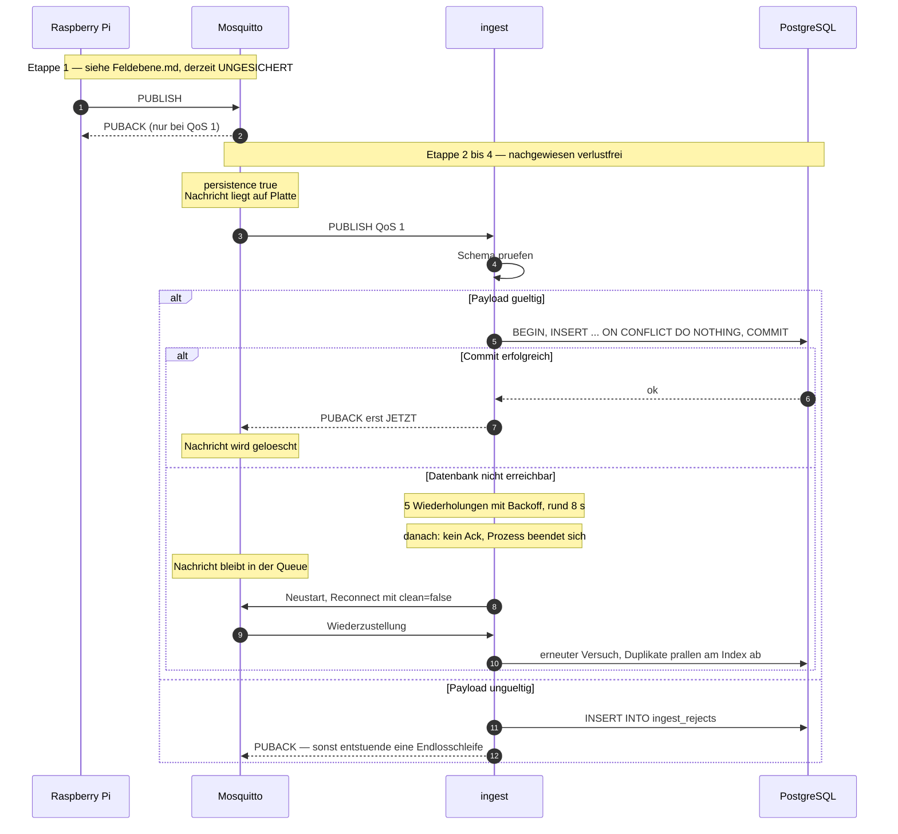
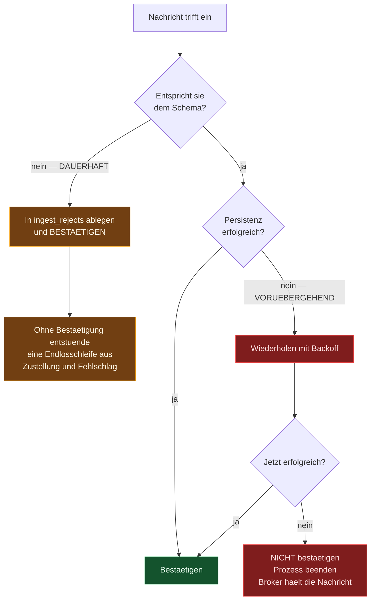

# Verlustfreiheit — wie die Kette funktioniert

> Die zentrale Eigenschaft des Systems, Etappe für Etappe: welcher Mechanismus an
> welcher Übergabe greift, warum er greift, und womit das belegt ist.
>
> **Stand:** 28.07.2026 · Beschreibt den umgesetzten Zustand, nicht einen Entwurf.

Wer zuerst einen Überblick sucht, welche Station wie heißt: [Weg-eines-Messwerts.md](Weg-eines-Messwerts.md).

Der Entwurf steht in [Zielarchitektur.md](Zielarchitektur.md). Dieses Dokument
beschreibt, was daraus tatsächlich gebaut wurde — inklusive der Stellen, an denen die
Umsetzung vom Entwurf abweichen musste.

---

## Inhaltsverzeichnis

1. [Die Kette im Überblick](#1-die-kette-im-überblick)
2. [Idempotenz — die Grundlage](#2-idempotenz--die-grundlage)
3. [Bestätigung nach dem Commit](#3-bestätigung-nach-dem-commit)
4. [Wiederholen, dann beenden](#4-wiederholen-dann-beenden)
5. [Die zwei Fehlerarten](#5-die-zwei-fehlerarten)
6. [Nachweise](#6-nachweise)
7. [Die verbleibende Lücke](#7-die-verbleibende-lücke)

---

## 1. Die Kette im Überblick



### Die Zusicherung je Übergabe

| Übergabe | Mechanismus | Verlust möglich? |
|---|---|---|
| Sensor → Pi | lokal, keine Netzstrecke | nein |
| **Pi → Broker** | **derzeit QoS 0 in der Referenzumsetzung** | ⚠️ **ja** — siehe §7 |
| Broker → Platte | `persistence true`, `autosave_interval 30` | max. 30 s bei hartem Stromausfall |
| Broker → ingest | QoS 1, `clean: false`, Queue 500 000 | nein |
| ingest → PostgreSQL | Bestätigung nach dem Commit, Transaktion, Wiederholung | nein |
| PostgreSQL → Platte | `synchronous_commit = on` (Vorgabe), WAL | nein |
| PostgreSQL → Archiv | `archive_command`, `archive_timeout 300` | max. 5 min bei Totalverlust der Hardware |

---

## 2. Idempotenz — die Grundlage

Idempotenz allein rettet keine Daten. Sie ist die **Erlaubnis**, alles Weitere zu bauen:

```
at-least-once  (der Broker liefert notfalls mehrfach)
    +  idempotentes Schreiben  (Mehrfaches bleibt folgenlos)
    =  effectively-once
```

Erst weil eine doppelte Zustellung nichts beschädigt, darf der Ingest eine Nachricht
unbestätigt lassen und sich beenden, um sie nach dem Neustart erneut zu bekommen.

### Der natürliche Schlüssel

```sql
CREATE UNIQUE INDEX idx_sensor_data_uniq ON sensor_data (sensor_uuid, quantity, "time");
```

Dahinter steht eine Aussage über die Wirklichkeit: **Ein Kanal kann zu einem Zeitpunkt
genau einen Wert haben.** Derselbe Sensor kann nicht zur selben Mikrosekunde zwei
verschiedene Temperaturen gemessen haben. Weil das physikalisch gilt, darf die Datenbank
es erzwingen — und genau dadurch wird eine Wiederholung erkennbar.

Der Unterschied zu einer künstlichen Nachrichten-ID ist erheblich: keine zusätzliche
Tabelle mit gesehenen IDs, keine Verwaltung, kein Verfallsdatum. Der Schlüssel steckt
bereits in der Messung.

> Der Index **ersetzt** den früheren Lookup-Index `(sensor_uuid, quantity, time DESC)`.
> Dieselben Spalten in derselben Reihenfolge bedienen die vorhandenen Abfragen weiterhin
> — `ORDER BY time DESC` nutzt einen Rückwärts-Scan. Die Idempotenz kostet damit **keine
> zusätzliche Schreiblast.**

### Warum der Zeitstempel aus der Nachricht kommen muss

```js
const result = await client.query(INSERT_MEASUREMENTS_SQL, [
  message.timestamp,   // ← aus dem Payload des Geräts, NICHT now()
  sensorUuid,
  quantities, units, values,
]);
```

Das ist die stillste und wichtigste Zeile des Ingest. Stünde dort `now()`, bekäme eine
wiederholt zugestellte Nachricht einen **neuen** Zeitstempel, würde mit nichts
kollidieren und als zusätzliche Zeile landen. Die gesamte Idempotenz hinge in der Luft.

**Die Nachricht muss ihre eigene Identität mitbringen.** Alle drei Schlüsselbestandteile
— `sensor_uuid`, `quantity`, `timestamp` — stammen aus dem Payload. Deshalb ist eine
zweimal gesendete Nachricht auch beim zweiten Mal noch dieselbe Nachricht.

> Daraus folgt unmittelbar, dass die **Uhr auf dem Raspberry Pi** eine tragende Rolle
> spielt — siehe [Feldebene.md](Feldebene.md), Abschnitt „Zeitstempel".

### Das Einfügen

```sql
INSERT INTO sensor_data (time, sensor_uuid, quantity, unit, value)
SELECT $1::timestamptz, $2::uuid, q, u, v
FROM unnest($3::text[], $4::text[], $5::double precision[]) AS m(q, u, v)
ON CONFLICT DO NOTHING
```

Zwei Eigenschaften:

- **`ON CONFLICT DO NOTHING`** — eine vorhandene Zeile wird stillschweigend übergangen.
  Kein Fehler, kein Abbruch der Transaktion.
- **`unnest`** — alle Messgrößen einer Nachricht gehen in *einem* Statement und *einer*
  Transaktion in die Datenbank. Eine Nachricht ist damit atomar: entweder alle Werte
  oder keiner. Zuvor lief pro Messgröße ein eigenes `INSERT` ohne Klammer.

Die Erkennung fällt nebenbei ab, weil PostgreSQL nur tatsächlich geschriebene Zeilen
zählt:

```js
const inserted = result.rowCount ?? 0;
return { inserted, duplicates: message.measurements.length - inserted };
```

Das ist die Zahl, die unter `duplicates` im Health-Endpunkt des Ingest steht — sie zeigt,
wie oft der Broker tatsächlich nachgeliefert hat.

### Ein Nebeneffekt, der leicht übersehen wird

Der `AFTER INSERT`-Trigger feuert **nur für tatsächlich eingefügte Zeilen**. Wird ein
Duplikat durch `ON CONFLICT` unterdrückt, läuft die Schwellenwert-Prüfung dafür gar
nicht erst an.

Damit ist die **Alarmkette kostenlos ebenfalls idempotent**: kein zweites
Verletzungs-Ereignis, kein zweites `pg_notify`, keine zweite Push-Nachricht. Ohne diese
Eigenschaft hätte jede Wiederzustellung nach einem Datenbankausfall eine Alarmwelle
ausgelöst.

### Auch das Register ist idempotent

```sql
ON CONFLICT (sensor_uuid) DO UPDATE SET ...
WHERE sensor_registry.name         = sensor_registry.sensor_uuid::text
   OR sensor_registry.gateway_id   IS DISTINCT FROM EXCLUDED.gateway_id
   OR sensor_registry.event_driven IS DISTINCT FROM EXCLUDED.event_driven
```

Das nachgestellte `WHERE` überspringt den Schreibvorgang vollständig, wenn sich nichts
geändert hat — bei mehreren Nachrichten pro Sekunde spart das dauerhaftes Aufblähen der
Tabelle. Zugleich schützt es einen von Hand vergebenen Namen davor, von einem
Gerätenamen überschrieben zu werden.

### Die Grenze

Sendet ein Gerät zum **selben** Zeitpunkt für denselben Kanal einen **anderen** Wert,
gewinnt der zuerst geschriebene; der zweite verschwindet lautlos. Bei Zeitreihendaten
ist das die richtige Auslegung — der Zeitstempel identifiziert die Messung — aber es ist
eine bewusste Festlegung. Ein Gerät mit grob gestellter Uhr, das mehrere Werte auf
dieselbe Sekunde stempelt, verliert die zusätzlichen.

---

## 3. Bestätigung nach dem Commit

```js
client.handleMessage = (packet, done) => {
  onMessage(packet, done);   // done() löst die MQTT-Bestätigung aus
};
```

mqtt.js sendet das `PUBACK` erst, wenn der übergebene Callback aufgerufen wird. Genau
das nutzt der Ingest: `done()` läuft **nach** dem `COMMIT`, nie davor.

Ergänzend auf der Verbindungsebene:

```js
mqtt.connect(brokerUrl, {
  clientId: config.mqtt.clientId,   // fest — ohne sie findet der Broker die Session nicht wieder
  clean: false,                      // persistente Session: der Broker puffert für uns
  resubscribe: false,                // Subscription lebt in der Session weiter
});
```

Beim Verbinden wird nur dann neu abonniert, wenn der Broker keine Sitzung mehr hat:

```js
client.on('connect', (connack) => {
  if (connack.sessionPresent) return;             // unbestätigte Nachrichten folgen von selbst
  client.subscribe(config.mqtt.topic, { qos: 1 });
});
```

---

## 4. Wiederholen, dann beenden

Hier weicht die Umsetzung vom ursprünglichen Entwurf ab — und zwar aufgrund eines
Fundes aus dem Ende-zu-Ende-Versuch.

### Was der Entwurf vorsah

Der Watchdog sollte den Prozess beenden, sobald **zehn Datenbankfehler in Folge**
aufgetreten sind.

### Warum das nicht funktionierte

**mqtt.js liefert keine weitere QoS-1-Nachricht aus, solange die vorherige nicht
bestätigt ist.** Eine ausbleibende Bestätigung hält also die gesamte Verarbeitung an.
Der Zähler konnte nie über 1 hinauskommen, der Watchdog schlug nie an, und der Ingest
stand still — bis die 15-Minuten-Regel für „keine Nachricht trotz Verbindung" gegriffen
hätte.

Der erste Testlauf verlor auf diese Weise 12 von 17 Nachrichten. Der Fehler war im
Entwurf nicht sichtbar; erst der Versuch am laufenden System hat ihn gezeigt.

### Was stattdessen gebaut wurde

```js
const RETRY_DELAYS_MS = [250, 500, 1_000, 2_000, 4_000];   // zusammen rund 8 s

for (let attempt = 0; attempt <= RETRY_DELAYS_MS.length; attempt += 1) {
  try {
    await ingestService.persist(message);
    done();                       // ← ab hier darf der Broker die Nachricht vergessen
    return;
  } catch (err) {
    if (attempt < RETRY_DELAYS_MS.length) {
      await sleep(RETRY_DELAYS_MS[attempt]);
      continue;
    }
    // Endgültig: keine Bestätigung, Prozess beendet sich.
    fatalExit('Datenbank über alle Wiederholungen nicht erreichbar', { logger });
    return;
  }
}
```

Kurze Aussetzer — ein Verbindungswechsel, kurzzeitige Überlast — überbrücken die
Wiederholungen, ohne dass jemand etwas merkt. Ein echter Ausfall führt nach rund acht
Sekunden zum geordneten Ende, und der Neustart stellt die Session wieder her.

**Der Absturz ist hier der Reparaturmechanismus, nicht der Fehlerfall.**

### Warum kein Autoheal-Container

Docker startet einen Container mit `restart: unless-stopped` neu, wenn der Prozess
**endet** — nicht, wenn ein Healthcheck auf `unhealthy` geht. Ein hängender Prozess
bliebe also hängen. Statt dafür einen zusätzlichen Dienst zu betreiben, erkennt die
Anwendung ihren eigenen Defekt und beendet sich. Das kostet rund 15 Zeilen
(`lib/watchdog.js`) und keinen weiteren Container.

---

## 5. Die zwei Fehlerarten

Die Unterscheidung ist zwingend — ohne sie blockiert eine einzige kaputte Nachricht den
gesamten Ingest dauerhaft.



Verworfene Nachrichten verschwinden nicht spurlos — in einem Auditsystem muss
nachweisbar sein, was nicht verarbeitet wurde:

```sql
SELECT received_at, topic, reason, left(payload, 120)
FROM ingest_rejects ORDER BY received_at DESC LIMIT 20;
```

---

## 6. Nachweise

### Automatisiert

| Test | Zusicherung |
|---|---|
| `test/ingest/idempotency.test.js` | dieselbe Nachricht zweimal → `{inserted: 2, duplicates: 0}`, dann `{inserted: 0, duplicates: 2}`, insgesamt 2 Zeilen |
| dito | Teilüberschneidung → `{inserted: 1, duplicates: 1}` |
| dito | Registereintrag überschreibt einen von Hand vergebenen Namen nicht |
| `test/trigger/thresholdTrigger.test.js` | 15 Fälle des Zustandsautomaten, inklusive Nachzügler-Zeitstempel |
| `test/trigger/notifyPayload.test.js` | Benachrichtigung nur beim Öffnen eines Ereignisses, nicht bei jedem Verstoß |
| `test/api/contract.test.js` | ungültige Eingabe → 400 statt Prozessende |

45 Tests im Backend, jeder Lauf gegen eine frische TimescaleDB über Testcontainers.

### Am laufenden Stack

Durchgeführt am 28.07.2026:

| Schritt | Ergebnis |
|---|---|
| 5 Nachrichten bei laufender Datenbank | 5 Zeilen |
| **Datenbank gestoppt**, 12 weitere Nachrichten gesendet | Ingest wiederholte, beendete sich, wurde neu gestartet, nahm die Session wieder auf |
| Datenbank gestartet | **17 Zeilen, lückenlos Wert 0 bis 16, keine Duplikate** |
| Dieselbe Nachricht erneut gesendet | weiterhin 17 Zeilen |
| Ungültiges JSON gesendet | 1 Eintrag in `ingest_rejects`, Verarbeitung lief weiter |

### Empirischer Beleg aus dem Altbestand

Beim Anlegen des eindeutigen Index wurden **330 Duplikate** entfernt
(17 445 → 17 115 Zeilen). Das ist der Nachweis, dass ohne Idempotenz tatsächlich doppelt
geschrieben wurde — nicht bloß theoretisch möglich war.

---

## 7. Die verbleibende Lücke

**Etappe 1 der Kette — Raspberry Pi → Broker — ist derzeit ungesichert.**

Die Referenzumsetzung in diesem Repository (`MQTT_Publish_Test/mqtt_simulator.py`), an
der sich die Pi-Skripte sehr wahrscheinlich orientieren, sendet mit `qos=0` und ohne
persistente Session. Alles ab dem Broker ist nachgewiesen verlustfrei; davor gibt es
keine Zusicherung.

Was zu prüfen und gegebenenfalls zu ändern ist, steht in [Feldebene.md](Feldebene.md) —
zusammen mit dem zweiten Punkt, der sich aus §2 ergibt: Ein Raspberry Pi hat keine
batteriegepufferte Uhr, und der Zeitstempel aus seinem Payload trägt die Idempotenz,
die Schwellenwert-Auswahl und die Reports.
