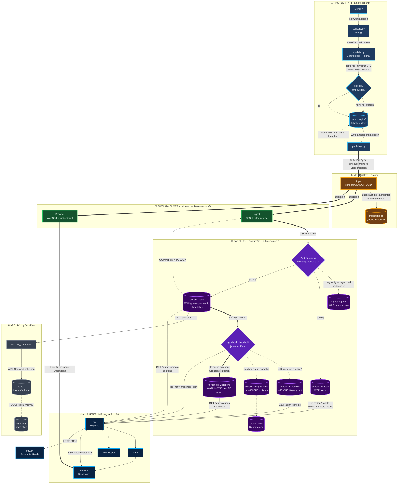
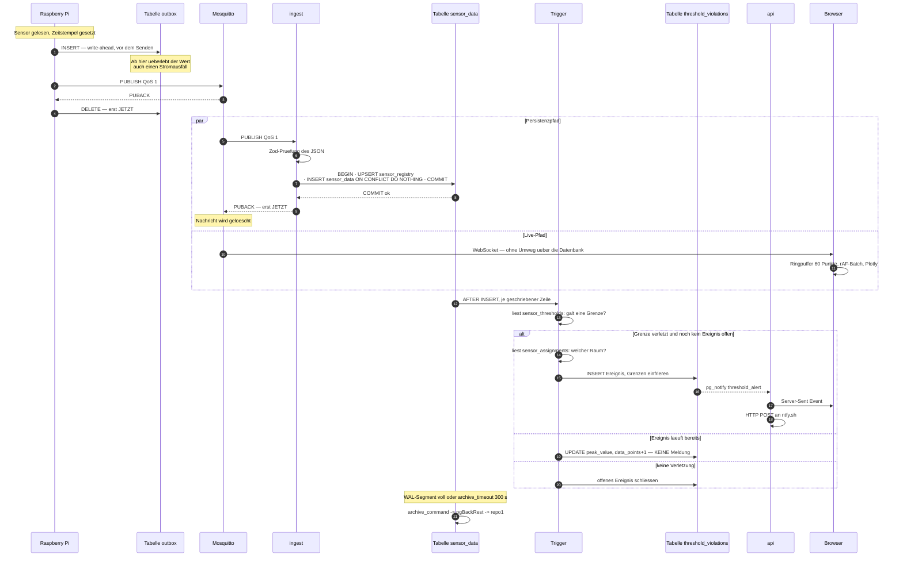
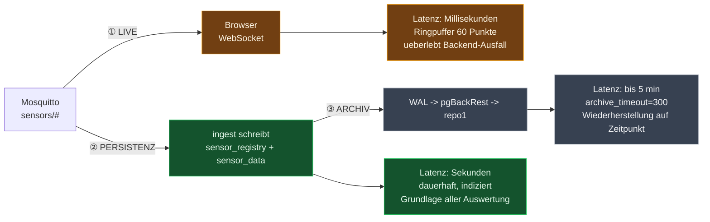
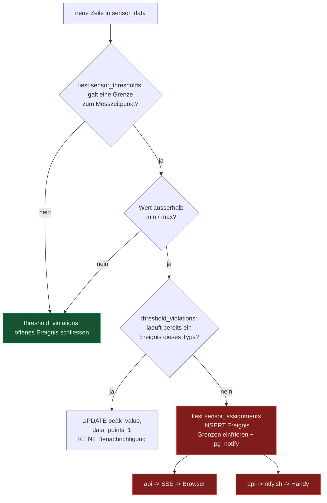
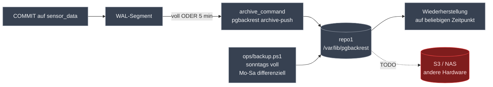
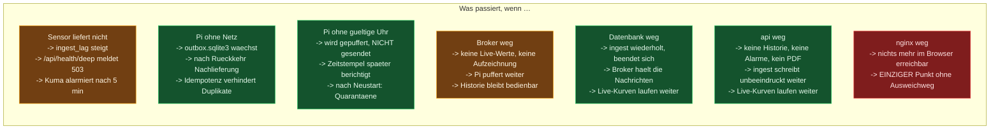

# Der Weg eines Messwerts

> Ein einzelner Temperaturwert, von der Sensorleitung bis in den PDF-Report — mit allen
> Zwischenstationen, den echten Bezeichnern und der Zusicherung, die an jeder Übergabe gilt.
>
> **Stand:** 28.07.2026 · Beschreibt den umgesetzten Zustand.

Verwandt: [Verlustfreiheit.md](Verlustfreiheit.md) (warum nichts verloren geht) ·
[Feldebene.md](Feldebene.md) (der Pi) · [openapi.yaml](openapi.yaml) (die Schnittstelle)

---

## Inhaltsverzeichnis

1. [Gesamtbild](#1-gesamtbild)
2. [Was der Messwert an jeder Station *ist*](#2-was-der-messwert-an-jeder-station-ist)
3. [Die Bezeichner im Überblick](#3-die-bezeichner-im-überblick)
4. [Zeitlicher Ablauf mit Bestätigungen](#4-zeitlicher-ablauf-mit-bestätigungen)
5. [Die drei Abzweigungen im Detail](#5-die-drei-abzweigungen-im-detail)
6. [Wo es hakt, wenn etwas ausfällt](#6-wo-es-hakt-wenn-etwas-ausfällt)

---

## 1. Gesamtbild



**So liest sich das Diagramm**

| Form | Bedeutung |
|---|---|
| `[( Zylinder )]` | Tabelle oder Datei — hier liegen Daten |
| `{ Raute }` | Prüfung oder Trigger — hier wird entschieden |
| `[ Kasten ]` | Programmteil — hier wird gearbeitet |
| `═══▶` fett | Der Messwert selbst wandert hier entlang |
| `───▶` normal | Abgeleitete Daten, Abfragen, Schreibvorgänge |
| `╌╌╌▶` gestrichelt | Lesezugriff, Bestätigung oder noch nicht umgesetzt |

**Die vier Tabellen, in die geschrieben wird**

| Tabelle | Bekommt | Von wem |
|---|---|---|
| `sensor_registry` | Kennung, Name, Gateway — **wer** misst | ingest, bei jeder Nachricht (nur bei Änderung) |
| `sensor_data` | Zeit, Messgröße, Einheit, Wert — **was** gemessen wurde | ingest, eine Zeile je Messgröße |
| `threshold_violations` | Beginn, Dauer, Extremwert — **wann** verletzt wurde | Trigger, nur beim Öffnen eines Ereignisses |
| `ingest_rejects` | Topic, Grund, Rohtext — **was** nicht lesbar war | ingest, bei ungültiger Nachricht |

**Die drei Tabellen, die nur gelesen werden**

| Tabelle | Beantwortet | Wer fragt |
|---|---|---|
| `sensor_thresholds` | Welche Grenze galt zum Messzeitpunkt? | Trigger, bei jeder neuen Zeile |
| `sensor_assignments` | In welchem Reinraum hing der Sensor damals? | Trigger, beim Anlegen eines Ereignisses |
| `cleanrooms` | Wie heißt der Raum? | Trigger und API |

> Beide Nachschlagetabellen werden **mit dem Messzeitpunkt** befragt, nicht mit `now()`.
> Deshalb bewertet der Report von vor drei Monaten mit dem Grenzwert, der damals galt.

---

## 2. Was der Messwert an jeder Station *ist*

Derselbe Wert — 22,4 °C — in seinen sechs Erscheinungsformen:

| # | Station | Gestalt |
|---|---|---|
| 1 | **Pi, im Speicher** | `Measurement(quantity="temperature", unit="°C", value=22.4)` |
| 2 | **Pi, im Puffer** | Zeile in `outbox`: `captured_at`, `monotonic_s`, `clock_trusted`, `measurements` (JSON) |
| 3 | **Auf der Leitung** | MQTT-Nachricht auf `sensors/a1b2…0001`, QoS 1 |
| 4 | **In der Datenbank** | Zeile in `sensor_data`: `time`, `sensor_uuid`, `quantity`, `unit`, `value` |
| 5 | **In der Antwort der API** | `{ "time": "…", "quantity": "temperature", "unit": "°C", "value": 22.4 }` |
| 6 | **Im PDF-Report** | Tabellenzeile mit Zeitpunkt, Wert und Status `OK` / `VERLETZUNG` |

### Die Nachricht auf der Leitung

```jsonc
// Topic: sensors/a1b2c3d4-0001-0001-0001-000000000001
{
  "id":           "a1b2c3d4-0001-0001-0001-000000000001",
  "gateway_id":   "gw-reinraum-221",
  "name":         "Temperatursensor Eingang",
  "event_driven": 0,
  "timestamp":    "2026-07-28T10:15:00.123Z",   // ← vom Pi gesetzt, TRAGEND
  "measurements": [
    { "quantity": "temperature", "unit": "°C",  "value": 22.4 },
    { "quantity": "pressure",    "unit": "hPa", "value": 1013.2 }
  ]
}
```

**Eine Nachricht wird zu N Zeilen.** Die zwei Messgrößen oben ergeben zwei Zeilen in
`sensor_data` — geschrieben in *einer* Transaktion mit *einem* Statement, damit eine
Nachricht niemals halb ankommt.

---

## 3. Die Bezeichner im Überblick

Alles, was man beim Suchen braucht:

| Station | Bezeichner |
|---|---|
| Pi sendet auf | `sensors/<sensor_uuid>` |
| Pi-Puffer | `/var/lib/ohb-edge/outbox.sqlite3`, Tabelle `outbox` |
| Pi-Kennung | `OHB_CLIENT_ID`, Vorgabe `ohb-edge-<8 Stellen der UUID>` |
| Broker-Ports | `1883` MQTT (Feld) · `9001` WebSocket (nur intern, über nginx) |
| Broker-Persistenz | `/mosquitto/data/mosquitto.db` |
| Ingest abonniert | `sensors/#`, QoS 1, `clean=false`, ClientId `ohb-ingest-1` |
| Prüfung der Nachricht | `src/ingest/messageSchema.js` (Zod) |
| Verworfene Nachrichten | Tabelle `ingest_rejects` |
| Messdaten | Hypertable `sensor_data` |
| Eindeutigkeit | `idx_sensor_data_uniq (sensor_uuid, quantity, time)` |
| Schwellenwert-Prüfung | Trigger `trg_check_threshold` → `check_threshold_violation()` |
| Alarm-Ereignisse | Tabelle `threshold_violations` |
| Alarm-Kanal | `pg_notify('threshold_alert', …)` |
| Zeitreihe abrufen | `GET /api/sensordata?sensor_uuid=…&quantity=…` |
| Dashboard-Kanäle | `GET /api/panels` |
| Live-Alarme | `GET /api/alerts/stream` (Server-Sent Events) |
| Report | `POST /api/report` |
| Browser erreicht MQTT über | `ws://<host>/mqtt` → nginx → `mosquitto:9001` |
| WAL-Archiv | `archive_command = pgbackrest --stanza=ohb archive-push %p` |
| Archivablage | `/var/lib/pgbackrest` — **S3 oder NAS noch offen** |

---

## 4. Zeitlicher Ablauf mit Bestätigungen

Der Unterschied zwischen „abgeschickt" und „angekommen":



**Die zwei Bestätigungen sind der Kern:** Der Pi löscht erst nach dem `PUBACK` des
Brokers, der Ingest bestätigt erst nach dem `COMMIT` der Datenbank. Dazwischen liegt an
keiner Stelle ein Moment, in dem der Wert nur an einer Stelle existiert.

---

## 5. Die drei Abzweigungen im Detail

Ab dem Broker teilt sich der Weg dreifach.



### ① Live-Pfad — der Browser hört direkt mit

Der Browser abonniert `sensors/#` **selbst**, per WebSocket über nginx. Die Werte im
Chart kommen also nicht aus der Datenbank, sondern direkt vom Broker.

Warum: Fällt `api` oder `postgres` aus, laufen die Live-Kurven weiter. Der Ausfall wird
sichtbar (Historie und Alarme fehlen), aber der Reinraum bleibt beobachtbar.

Der Ringpuffer hält 60 Punkte je Kanal; die Aktualisierung läuft gebündelt über
`requestAnimationFrame`, damit fünf Nachrichten pro Sekunde nicht fünf Neuzeichnungen
je Chart auslösen.

### ② Persistenzpfad — die eigentliche Aufzeichnung

Hier entsteht alles, was später auswertbar ist: Historie, Statistik, Alarme, Reports.
Der Pfad ist der einzige, der Zusicherungen gibt — siehe
[Verlustfreiheit.md](Verlustfreiheit.md).

**Innerhalb dieses Pfads zweigt der Alarm ab.** Der Trigger läuft `AFTER INSERT FOR EACH
ROW` — also für jede geschriebene Zeile, in derselben Transaktion:



Entscheidend: `pg_notify` feuert **nur beim Öffnen** eines Ereignisses. Eine
zehnminütige Überschreitung im Zwei-Sekunden-Takt erzeugt 300 Messwerte, aber genau
**einen** Alarm.

### ③ Archivpfad — von der Datenbank in die Sicherung

Der Messwert liegt nach dem `COMMIT` im Write-Ahead-Log. PostgreSQL ruft
`archive_command` auf, sobald ein WAL-Segment voll ist — spätestens aber nach
`archive_timeout = 300` Sekunden.



> ⚠️ **Basissicherung und WAL-Archiv gehören zusammen.** Aus WAL-Segmenten allein
> lässt sich nichts wiederherstellen — sie sind Ergänzungen zu einer Basis. Ohne
> mindestens eine Vollsicherung meldet `pgbackrest info` folgerichtig
> `status: error (no valid backups)`.

**Der Archivpfad liegt derzeit auf derselben Hardware wie die Datenbank.** Das schützt
gegen Fehlbedienung und logische Fehler, nicht gegen Plattendefekt. Die Umstellung auf
S3 oder ein NAS ist eine Konfigurationszeile in `docker/postgres/pgbackrest.conf` —
siehe [Betriebshandbuch §6](Betriebshandbuch.md).

---

## 6. Wo es hakt, wenn etwas ausfällt

Dieselbe Reise, mit Störungen an jeder Station:



| Station | Datenverlust? | Wer merkt es? |
|---|---|---|
| Sensor defekt | ja — es entsteht nichts | `worst_lag_sec` in `/api/health/deep` |
| Pi ohne Netz | **nein** — Puffer bis rund 2,3 Tage | Kuma-Heartbeat des Pi bleibt aus |
| Pi ohne Uhr | **nein**, aber verzögert | `uhr_vertrauenswuerdig` in der Statusdatei |
| Broker aus | ⚠️ nur wenn der Pi nicht puffert | Kuma-MQTT-Monitor |
| Datenbank aus | **nein** — Broker puffert 500 000 Nachrichten | Kuma-Postgres-Monitor |
| `api` aus | nein | Kuma-HTTP-Monitor |
| Archiv scheitert | nein, aber keine Wiederherstellung möglich | `wal_archive_failing` |

Die vollständige Ausfallmatrix mit den ersten Schritten steht im
[Betriebshandbuch §3](Betriebshandbuch.md).
