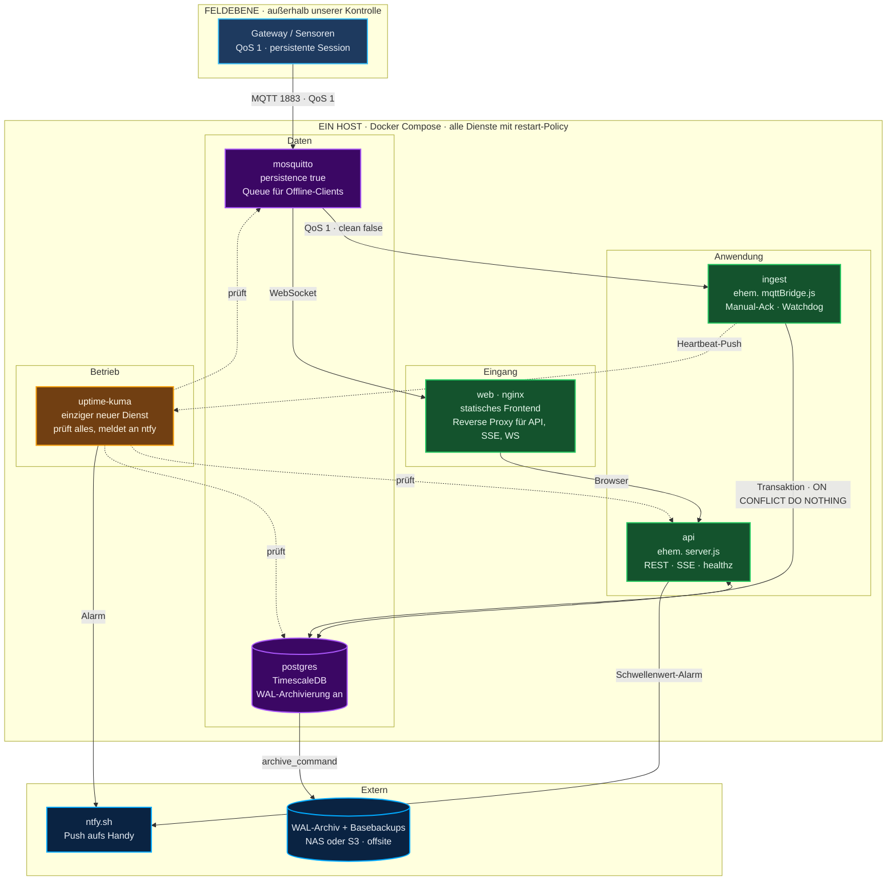
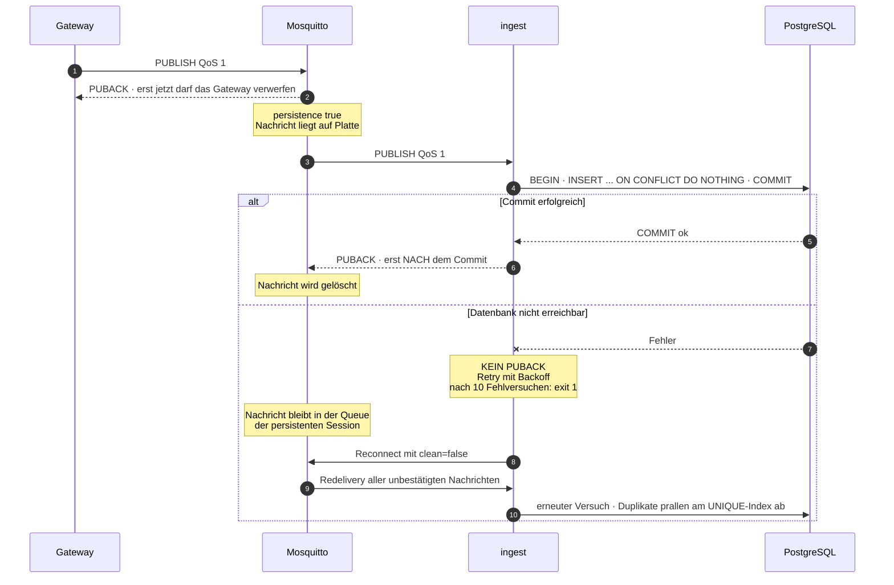
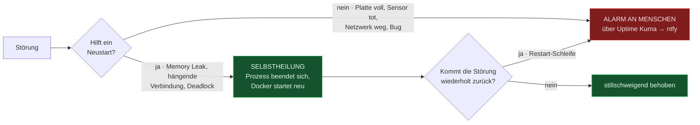
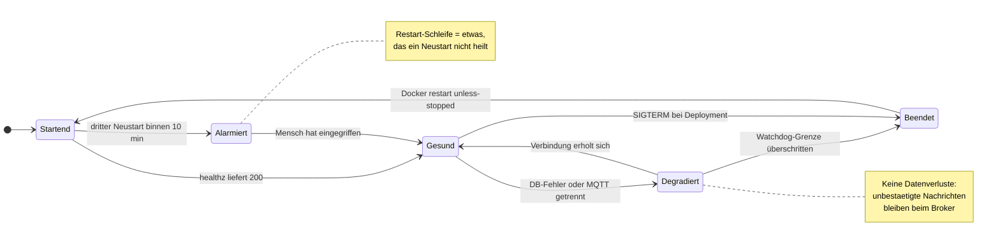
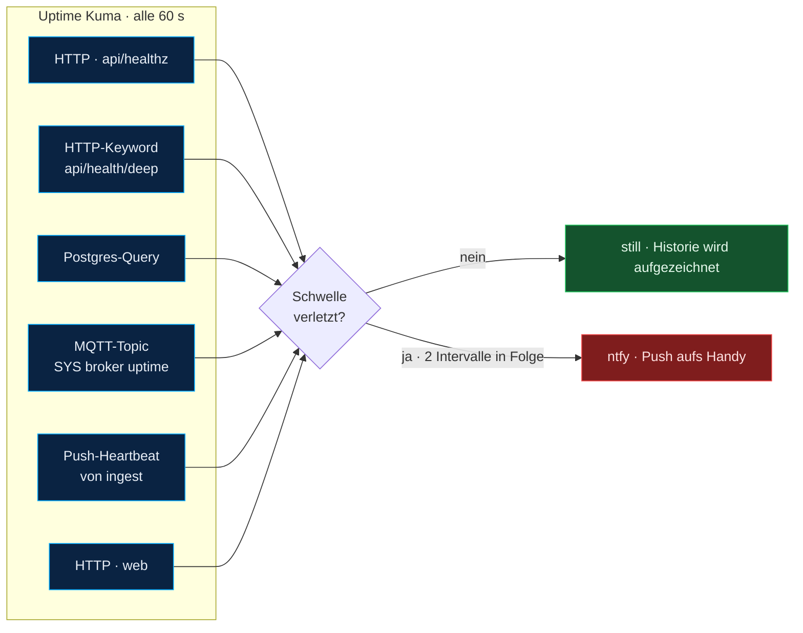
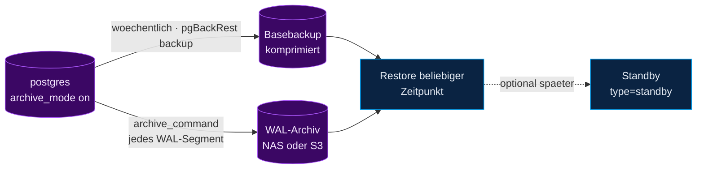
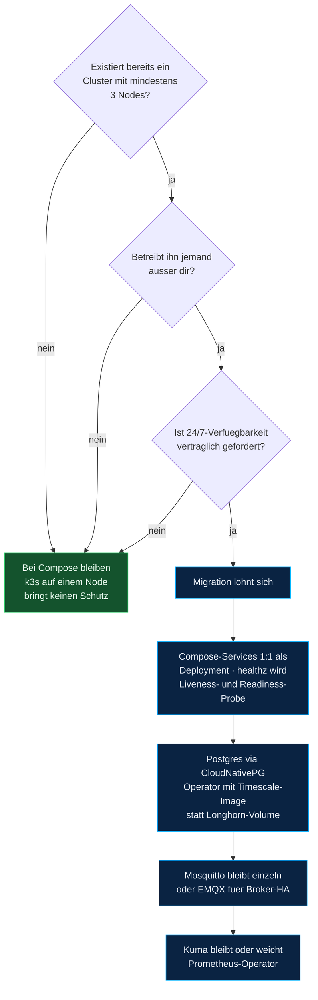

# Zielarchitektur — Überwachbar · Selbstheilend · Verlustfrei

> Entwurf einer Betriebsarchitektur für das OHB Reinraum Sensor Dashboard.
> Drei harte Ziele, ein hartes Nicht-Ziel.
>
> **Stand:** 27.07.2026 · Ergänzung zu [Projektübersicht.md](Projekt%C3%BCbersicht.md)
>
> ✅ **Umgesetzt mit Version 2.0.0.** Was daraus tatsächlich gebaut wurde — inklusive
> der Stellen, an denen die Umsetzung abweichen musste — steht in
> [Verlustfreiheit.md](Verlustfreiheit.md).
>
> Dieses Dokument behandelt **Betrieb und Resilienz**. Code- und Prozessqualität —
> Tests, Fehlerbehandlung, Audit-Trail — stehen in
> [Engineering-Standards.md](Engineering-Standards.md); beide Stränge sind unabhängig
> voneinander umsetzbar.

---

## Inhaltsverzeichnis

1. [Ziele und Nicht-Ziele](#1-ziele-und-nicht-ziele)
2. [Plattformentscheidung: Compose statt k3s](#2-plattformentscheidung-compose-statt-k3s)
3. [Zielarchitektur im Überblick](#3-zielarchitektur-im-überblick)
4. [Säule 1 — Keine Datenverluste](#4-säule-1--keine-datenverluste)
5. [Säule 2 — Selbstheilung](#5-säule-2--selbstheilung)
6. [Säule 3 — Überwachung](#6-säule-3--überwachung)
7. [Backup und Point-in-Time-Recovery](#7-backup-und-point-in-time-recovery)
8. [Ausfallszenarien mit RPO/RTO](#8-ausfallszenarien-mit-rporto)
9. [Vollständige `docker-compose.yml`](#9-vollständige-docker-composeyml)
10. [Migrationspfad zu k3s](#10-migrationspfad-zu-k3s)
11. [Umsetzungsplan](#11-umsetzungsplan)
12. [Bewusst weggelassen](#12-bewusst-weggelassen)

---

## 1. Ziele und Nicht-Ziele

| Ziel | Messbare Definition |
|---|---|
| **Verlustfrei** | Jede vom Gateway abgesendete Messung landet genau einmal in `sensor_data` — auch wenn Bridge, Datenbank oder Broker zwischenzeitlich ausfallen |
| **Selbstheilend** | Jeder Software-Ausfall wird ohne menschlichen Eingriff innerhalb von 60 s behoben |
| **Überwachbar** | Jeder Ausfall, den die Selbstheilung *nicht* beheben kann, erzeugt binnen 2 min eine Push-Benachrichtigung |

**Das Nicht-Ziel — und es ist gleichrangig:** Die Architektur darf nicht mehr Betriebsaufwand
erzeugen, als eine Person nebenbei tragen kann. Jede Komponente muss sich rechtfertigen.
Die Zielarchitektur fügt deshalb genau **zwei** neue Container hinzu und containerisiert drei
bereits existierende Prozesse.

### Leitsatz

> **Verfügbarkeit ist billig. Vollständigkeit ist teuer. Priorität hat Vollständigkeit.**

Ein Reinraum-Auditsystem darf zehn Minuten kein Dashboard zeigen. Es darf keine zehn Minuten
Messdaten verlieren. Alle Entscheidungen unten folgen dieser Rangfolge.

---

## 2. Plattformentscheidung: Compose statt k3s

k3s war ausdrücklich zu prüfen. Die Prüfung, ehrlich durchgerechnet:

| Kriterium | k3s Single-Node | k3s 3-Node HA | Docker Compose |
|---|---|---|---|
| Selbstheilung von Containern | ✅ Liveness Probe | ✅ | ✅ Restart-Policy + Self-Exit (§5) |
| Überlebt Node-Ausfall | ❌ **derselbe SPOF** | ✅ | ❌ |
| Postgres-Storage | lokal, wie Compose | Longhorn/Ceph nötig → für DBs ein bekannter Fallstrick | lokales Volume |
| Zusätzliche Konzepte | Manifeste, PVC, Ingress, Secrets, StorageClass | + CNI, Replikation, etcd-Quorum | keine |
| Betriebsaufwand dauerhaft | mittel | hoch | niedrig |
| Zusätzlicher **Datenschutz**-Gewinn | **keiner** | keiner | — |

Die entscheidende Zeile ist die letzte. **k3s schützt keine einzige Messung.** Alle drei
Ziele — Verlustfreiheit, Selbstheilung, Überwachung — werden durch Protokoll- und
Anwendungsdesign erreicht, nicht durch den Orchestrator. Ein Single-Node-k3s hätte exakt
dieselben Ausfallszenarien wie Compose, bei deutlich größerer Angriffsfläche für
Bedienfehler.

**Entscheidung:** Docker Compose auf einem Host. Alle Dienste werden so gebaut
(Container, `/healthz`, Config über Umgebungsvariablen, zustandslos außer den Volumes),
dass ein späterer Umzug nach k3s eine reine Übersetzungsarbeit ist — siehe §10.
Es geht nichts verloren, wenn die Bedingungen später doch eintreten.

---

## 3. Zielarchitektur im Überblick



### Dienste-Inventar

| Dienst | Status | Zweck | Neu? |
|---|---|---|---|
| `postgres` | vorhanden | TimescaleDB + WAL-Archivierung | nein, nur Konfiguration |
| `mosquitto` | vorhanden | Broker **mit Persistenz** | nein, nur Konfiguration |
| `ingest` | **containerisiert** | `mqttBridge.js` — läuft heute ungemanagt auf dem Host | Container neu |
| `api` | **containerisiert** | `server.js` — läuft heute ungemanagt auf dem Host | Container neu |
| `web` | **neu** | nginx: Frontend-Build + ein einziger Einstiegsport | ✅ ersetzt Vite-Dev-Server |
| `uptime-kuma` | **neu** | Überwachung + Alarmierung | ✅ der einzige echte Zusatz |

Von 2 verwalteten Containern + 3 unbeaufsichtigten Host-Prozessen auf **6 verwaltete
Container**. Der Zuwachs an Betriebsaufwand ist eine `docker-compose.yml`.

### Warum nginx als eigener Dienst

Drei Probleme verschwinden mit einer Komponente:

1. Der **Vite-Dev-Server läuft heute im Dauerbetrieb** — er ist explizit nicht dafür gedacht.
2. `api.js` errät die Backend-Adresse über `window.location.hostname` und einen fest
   verdrahteten Port 3001. Hinter nginx wird daraus `/api` — relativ, portfrei, TLS-fähig.
3. Ein einziger offener Port statt drei. Für ein Gerät im Reinraumnetz ein echter Vorteil.

**Erforderliche Code-Anpassung** (klein, aber notwendig):

```js
// ohb-dashboard/src/api.js
const API_BASE = '/api';                       // statt http://host:3001/api

// ohb-dashboard/src/store/MqttContext.jsx
const proto = location.protocol === 'https:' ? 'wss:' : 'ws:';
const [brokerUrl, setBrokerUrl] = useState(`${proto}//${location.host}/mqtt`);
```

---

## 4. Säule 1 — Keine Datenverluste

Eine Messung durchläuft fünf Übergaben. Verlustfreiheit heißt: **an jeder Übergabe gilt
at-least-once, und die Datenbank macht daraus effectively-once.**



### 4.1 Die Idempotenz-Grundlage

Ohne sie ist jede Wiederzustellung ein Datenfehler. **Das ist die wichtigste einzelne
Änderung des gesamten Entwurfs.**

```sql
-- 1. Bestehende Duplikate entfernen (falls vorhanden)
DELETE FROM sensor_data a USING sensor_data b
WHERE a.ctid > b.ctid
  AND a.sensor_uuid = b.sensor_uuid
  AND a.quantity    = b.quantity
  AND a.time        = b.time;

-- 2. Alten Lookup-Index durch einen UNIQUE-Index ersetzen.
--    Er bedient dieselben Abfragen (Rückwärts-Scan für ORDER BY time DESC)
--    und kostet deshalb KEINE zusätzliche Schreiblast.
DROP INDEX IF EXISTS idx_sensor_data_lookup;
CREATE UNIQUE INDEX idx_sensor_data_uniq
    ON sensor_data (sensor_uuid, quantity, time);
```

> Zulässig, weil der Partitionierungsschlüssel `time` Teil des Index ist — das ist die
> Bedingung, die TimescaleDB an Unique-Indizes auf Hypertables stellt.

Damit wird der Insert idempotent:

```sql
INSERT INTO sensor_data (time, sensor_uuid, quantity, unit, value)
SELECT * FROM unnest($1::timestamptz[], $2::uuid[], $3::text[], $4::text[], $5::float8[])
ON CONFLICT DO NOTHING;
```

Alle Messgrößen einer MQTT-Nachricht gehen in **einem** Statement und **einer** Transaktion
in die DB — statt heute einem `INSERT` pro Messgröße ohne Transaktionsklammer. Eine
Nachricht ist damit atomar: entweder alle Werte oder keiner.

### 4.2 Broker-Konfiguration

```conf
# mosquitto/mosquitto.conf

persistence true
persistence_location /mosquitto/data/
autosave_interval 30

# Queue für die persistente Session des ingest-Clients.
# Default ist 1000 — das reicht bei 2,5 Nachrichten/s für 400 Sekunden.
# 500.000 entspricht ~2 Tagen Puffer bei aktueller Last.
max_queued_messages 500000
queue_qos0_messages false

# Verwaiste Sessions nicht ewig behalten (sonst läuft die Platte voll).
persistent_client_expiration 14d

listener 1883
protocol mqtt

listener 9001
protocol websockets

# Härtung: 15 Minuten Aufwand, dringend empfohlen
allow_anonymous false
password_file /mosquitto/config/passwd
```

`max_queued_messages` ist der stille Killer: Mit dem Default hätte die gesamte Kette
formal QoS 1, würde aber nach sieben Minuten Bridge-Ausfall trotzdem Daten wegwerfen.

### 4.3 Ingest-Client

```js
// Feste ClientId — ohne sie findet der Broker die Session beim Reconnect nicht wieder.
const client = mqtt.connect(BROKER_URL, {
  clientId:        'ohb-ingest-1',
  clean:           false,      // persistente Session: Broker puffert für uns
  reconnectPeriod: 2000,
  resubscribe:     false,      // Subscription lebt in der Session weiter
});

client.on('connect', (ack) => {
  // Nur bei fehlender Session neu abonnieren
  if (!ack.sessionPresent) client.subscribe('sensors/#', { qos: 1 });
});

// KERNSTÜCK: PUBACK erst nach erfolgreichem COMMIT.
// mqtt.js sendet die Bestätigung, wenn done() aufgerufen wird.
client.handleMessage = async (packet, done) => {
  try {
    await persistMessage(JSON.parse(packet.payload.toString()));  // BEGIN..COMMIT
    dbFailures = 0;
    done();                       // ← ab hier darf der Broker die Nachricht vergessen
  } catch (err) {
    dbFailures++;
    log.error({ err }, 'Persistenz fehlgeschlagen — kein Ack');
    // KEIN done(): Nachricht bleibt unbestätigt und wird nach Reconnect erneut geliefert
  }
};
```

Wenn `done()` ausbleibt, liefert der Broker die Nachricht erst nach einem Reconnect erneut.
Deshalb greift hier der Watchdog aus §5: nach zehn aufeinanderfolgenden DB-Fehlern beendet
sich der Prozess, Docker startet ihn neu, die Session wird wiederhergestellt, die
unbestätigten Nachrichten kommen zurück. **Absturz ist der Reparaturmechanismus, nicht der
Fehlerfall.**

### 4.4 Die Kette in einer Tabelle

| Übergabe | Mechanismus | Verlust möglich? |
|---|---|---|
| Sensor → Broker | QoS 1 + persistente Session **im Gateway** | ⚠️ nur wenn die Firmware nicht puffert — außerhalb unserer Kontrolle |
| Broker → Platte | `persistence true`, `autosave_interval 30` | max. 30 s bei hartem Stromausfall |
| Broker → ingest | QoS 1, `clean: false`, Queue 500 k | nein |
| ingest → Postgres | Ack nach Commit, Transaktion, Retry | nein |
| Postgres → Platte | `synchronous_commit = on` (Default), WAL | nein |
| Postgres → Archiv | `archive_command`, kontinuierlich | max. wenige Sekunden bei Totalverlust des Hosts |

Die einzige verbleibende Lücke sitzt bei der Feldhardware. Das ist eine
**Beschaffungsanforderung**, keine Serverarchitektur: *„Gateway muss MQTT QoS 1 mit
persistenter Session und lokalem Puffer für mindestens 24 h unterstützen."*

---

## 5. Säule 2 — Selbstheilung

### Was Selbstheilung leisten kann — und was nicht



Diese Trennung ist der Kern: Ein Neustart heilt Zustandsfehler. Er heilt keine vollen
Platten und keine toten Sensoren. Wer beides über denselben Mechanismus behandelt,
bekommt entweder Restart-Schleifen oder Alarm-Müdigkeit.

### 5.1 Warum die Anwendung sich selbst beendet

**Wichtiges Detail:** Docker Compose startet Container mit `restart: unless-stopped` neu,
wenn der Prozess **beendet** wird — aber **nicht**, wenn ein Healthcheck auf `unhealthy`
geht. Ein hängender Prozess, der noch läuft, würde ewig hängen bleiben.

Zwei Auswege: ein zusätzlicher Autoheal-Container, der auf `unhealthy` lauscht — oder die
Anwendung erkennt ihren eigenen Defekt und beendet sich. Letzteres kostet 15 Zeilen und
keinen zusätzlichen Dienst:

```js
// watchdog.js — identisch in ingest und api verwendbar
const LIMITS = { mqttDisconnectedMs: 120_000, dbFailures: 10 };

function fatal(reason) {
  log.error({ reason }, 'Watchdog: Selbstabschaltung für Neustart');
  setTimeout(() => process.exit(1), 500);     // Log noch rausschreiben lassen
}

setInterval(() => {
  if (!client.connected && Date.now() - lastConnectedAt > LIMITS.mqttDisconnectedMs)
    fatal('MQTT seit 120 s getrennt');
  if (dbFailures >= LIMITS.dbFailures)
    fatal(`${dbFailures} DB-Fehler in Folge`);
}, 10_000);

process.on('unhandledRejection', (err) => fatal(`unhandledRejection: ${err?.message}`));
process.on('uncaughtException',  (err) => fatal(`uncaughtException: ${err?.message}`));
```

Dazu ein sauberes `SIGTERM`-Handling, damit ein geplanter Neustart nichts abschneidet:
laufende Transaktion zu Ende führen, kein neues `done()`, dann `client.end()`.

### 5.2 Zustandsmodell eines Dienstes



### 5.3 Healthchecks je Dienst

| Dienst | Healthcheck | Bedeutung |
|---|---|---|
| `postgres` | `pg_isready -U postgres -d ohb_sensordata` | akzeptiert Verbindungen |
| `mosquitto` | `mosquitto_sub -t '$SYS/#' -C 1 -W 3` | Broker antwortet |
| `ingest` | `wget -qO- localhost:3002/healthz` | MQTT verbunden **und** letzte Nachricht < 120 s |
| `api` | `wget -qO- localhost:3001/healthz` | DB-Pool liefert `SELECT 1` |
| `web` | `wget -qO- localhost/` | nginx liefert aus |

Zusätzlich `depends_on` mit `condition: service_healthy`, damit die Startreihenfolge nach
einem Host-Neustart stimmt — die Anwendungen tolerieren zwar eine fehlende DB, aber ein
sauberer Start spart die erste Restart-Runde.

---

## 6. Säule 3 — Überwachung

### Werkzeugwahl

| Option | Container | Kann | Urteil |
|---|---|---|---|
| Prometheus + Grafana + 3 Exporter | 5 | Metriken, Trends, Dashboards | Schnickschnack **für den Anfang** — und Grafana dupliziert das vorhandene Dashboard |
| Eigenes Skript + ntfy | 0 | genau das, was man selbst schreibt | wird nie gepflegt, keine Historie, kein UI |
| **Uptime Kuma** | **1** | HTTP, TCP, Postgres-Query, **MQTT-Topic**, Push-Heartbeat, JSON-Keyword, Statusseite, ntfy-Anbindung | ✅ **Empfehlung** |

Uptime Kuma deckt mit einem einzigen Container alles ab, was hier gebraucht wird —
inklusive MQTT- und Postgres-Prüfungen, die sonst je einen Exporter erfordern würden.
Speicher ist SQLite in einem Volume, Konfiguration erfolgt im Browser.

### Überwachungsfluss



### Der wichtigste Messwert: Ingest-Lag

Ein Dashboard, das eine drei Stunden alte Kurve zeigt, sieht aus wie ein Dashboard.
**Nur der Ingest-Lag entlarvt das.** Er wird deshalb zum Kernstück des Deep-Health-Endpoints:

```js
// GET /api/health/deep  → Kuma prüft per Keyword auf "ok"
app.get('/api/health/deep', async (_req, res) => {
  const { rows: [m] } = await pool.query(`
    SELECT
      (SELECT max(extract(epoch FROM now() - t)) FROM (
         SELECT max(time) AS t FROM sensor_data GROUP BY sensor_uuid
       ) s)                                                      AS worst_lag_sec,
      (SELECT count(*) FROM threshold_violations
         WHERE NOT acknowledged AND upper(valid_during) = 'infinity') AS open_alerts,
      (SELECT last_failed_time FROM pg_stat_archiver)            AS archive_last_failed,
      (SELECT count(*) FROM pg_ls_dir('pg_wal/archive_status'))  AS archive_backlog,
      pg_database_size(current_database())                       AS db_bytes
  `);

  const problems = [];
  if (m.worst_lag_sec > 300)      problems.push('ingest_lag');
  if (m.archive_backlog > 200)    problems.push('wal_archive_backlog');
  if (m.archive_last_failed)      problems.push('wal_archive_failing');

  res.status(problems.length ? 503 : 200)
     .json({ status: problems.length ? 'degraded' : 'ok', problems, ...m });
});
```

`archive_backlog` und `pg_stat_archiver.last_failed_time` fangen die häufigste
Postgres-Störung überhaupt ab: Das Archivkommando scheitert still, WAL-Segmente stapeln
sich, die Platte läuft voll, die Datenbank stoppt. Mit dieser Prüfung wird daraus eine
Push-Nachricht Tage vorher.

### Alarm-Katalog

| Prüfung | Schwelle | Was der Alarm bedeutet | Reaktion |
|---|---|---|---|
| `api/healthz` | 2 × 60 s rot | API oder DB unerreichbar | sofort |
| `worst_lag_sec` | > 300 s | Ein Sensor liefert nicht mehr, oder ingest hängt | sofort |
| `wal_archive_failing` | einmalig | Backup läuft ins Leere | heute noch |
| `archive_backlog` | > 200 Dateien | Platte läuft in Kürze voll | heute noch |
| Kuma-MQTT-Monitor | 2 × rot | Broker down | sofort |
| ingest-Heartbeat | 3 × 30 s fehlend | ingest tot oder in Restart-Schleife | sofort |
| Restart-Zähler | 3 in 10 min | Selbstheilung greift nicht | untersuchen |
| Backup-Job | fehlender Push nach 26 h | Sicherung ausgefallen | heute noch |

> **Grenze der Selbstüberwachung:** Stirbt der Host komplett, stirbt Kuma mit. Dagegen hilft
> nur ein *externer* Beobachter. Minimalvariante ohne neue Infrastruktur: Kuma sendet
> täglich einen „alles ok"-Push; bleibt er aus, ist etwas grundsätzlich kaputt.
> Ein Dead-Man-Switch für Arme, aber er kostet nichts.

---

## 7. Backup und Point-in-Time-Recovery

Beides zusammen, wie in der Diskussion festgehalten: dieselbe WAL-Quelle bedient Archiv und
(späteren) Standby.



### Konfiguration

```conf
# postgresql.conf im postgres-Container
wal_level = replica
archive_mode = on
archive_command = 'pgbackrest --stanza=ohb archive-push %p'
archive_timeout = 300          # spätestens alle 5 min ein Segment → RPO-Obergrenze
max_slot_wal_keep_size = 32GB  # schützt vor Disk-Full durch hängenden Slot
```

pgBackRest muss **im** Postgres-Container liegen, weil `archive_command` dort ausgeführt
wird. Vier Zeilen Dockerfile:

```dockerfile
FROM timescale/timescaledb:latest-pg17
RUN apk add --no-cache pgbackrest || (apt-get update && apt-get install -y pgbackrest)
COPY pgbackrest.conf /etc/pgbackrest/pgbackrest.conf
```

Zeitplan über den Host (Windows-Aufgabenplanung oder systemd-Timer) — **kein zusätzlicher
Container, kein gemounteter Docker-Socket**:

```powershell
# wöchentlich
docker compose exec -T postgres pgbackrest --stanza=ohb --type=full backup
# täglich
docker compose exec -T postgres pgbackrest --stanza=ohb --type=diff backup
# danach Erfolg an Kuma melden (Push-Monitor) → fehlender Push = Alarm
```

### Warum pgBackRest und nicht `pg_dump`

**TimescaleDB-Falle:** Ein `pg_restore` eines Hypertable-Dumps benötigt zwingend die Klammer
`timescaledb_pre_restore()` / `timescaledb_post_restore()`. Wer das vergisst, bekommt eine
Datenbank mit zerstörten Hypertable-Metadaten — und merkt es erst im Ernstfall.
Physische Backups berühren die Timescale-Metadaten überhaupt nicht und umgehen das Problem
vollständig.

### Restore-Übung

Ein ungetestetes Backup ist kein Backup. **Einmal pro Quartal, 20 Minuten:**

```bash
pgbackrest --stanza=ohb --type=time \
  --target="2026-07-27 09:00:00+02" --target-action=promote restore
```

Danach prüfen: `SELECT count(*), max(time) FROM sensor_data;` — und das Ergebnis mit Datum
im Betriebshandbuch notieren. Das ist der Nachweis, den ein Audit sehen will.

### 3-2-1

Ein Archiv auf derselben Platte wie `pgdata` schützt gegen nichts. Mindestens: **Archiv auf
anderer Hardware** (NAS), idealerweise zusätzlich eine Offsite-Kopie. Das ist die einzige
Stelle dieses Entwurfs, an der Hardware nötig ist.

---

## 8. Ausfallszenarien mit RPO/RTO

Der Prüfstein für jede Resilienz-Architektur — was passiert *tatsächlich*?

| # | Szenario | Verhalten | RPO | RTO |
|---|---|---|---|---|
| 1 | `ingest` stürzt ab | Docker startet neu, Broker liefert unbestätigte Nachrichten erneut | **0** | ~10 s |
| 2 | `ingest` hängt (Deadlock) | Watchdog beendet Prozess, danach wie 1 | **0** | ~2 min |
| 3 | Postgres 30 min weg | ingest bestätigt nicht, Broker queued (500 k Puffer ≈ 2 Tage), nach Rückkehr Redelivery | **0** | ~30 min bis Vollständigkeit |
| 4 | Mosquitto stürzt ab | Restart, Persistenz stellt Queues wieder her; ingest reconnected mit `clean=false` | **0** *(sofern Gateway puffert)* | ~15 s |
| 5 | `api` stürzt ab | Restart. Ingest läuft weiter — **kein** Datenverlust, nur Dashboard kurz leer | 0 | ~10 s |
| 6 | Host-Neustart / Stromausfall | Alle Container starten geordnet über `depends_on` | ≤ 30 s Broker-Autosave | ~2 min |
| 7 | Platte defekt / Host total | Restore aus Basebackup + WAL auf Ersatzhardware | ≤ 5 min (`archive_timeout`) | 1–3 h · mit Standby: Minuten |
| 8 | Versehentliches `DROP TABLE` | PITR auf den Zeitpunkt davor | 0 | ~1 h |
| 9 | Sensor liefert nicht mehr | Keine Selbstheilung möglich — `worst_lag_sec` schlägt nach 5 min Alarm | — | menschlich |
| 10 | WAL-Archiv scheitert still | `pg_stat_archiver` + Backlog-Prüfung alarmieren Tage vor der vollen Platte | — | menschlich |

Zeile 3 ist das Ergebnis, um das es geht: **Eine halbe Stunde Datenbankausfall kostet null
Messwerte.** Nicht wegen Replikation — wegen QoS 1, persistenter Session und Idempotenz.
Genau deshalb steht der Ingest-Pfad vor der Datenbank-Hochverfügbarkeit.

---

## 9. Vollständige `docker-compose.yml`

```yaml
# =============================================================
# OHB Cleanroom Dashboard — Betriebs-Stack
# Start:  docker compose up -d
# =============================================================

x-restart: &restart
  restart: unless-stopped

services:

  postgres:
    build: ./docker/postgres          # timescale + pgbackrest
    <<: *restart
    environment:
      POSTGRES_DB: ohb_sensordata
      POSTGRES_USER: postgres
      POSTGRES_PASSWORD: ${POSTGRES_PASSWORD:?bitte in .env setzen}
    command: >
      postgres
      -c wal_level=replica
      -c archive_mode=on
      -c archive_command='pgbackrest --stanza=ohb archive-push %p'
      -c archive_timeout=300
      -c max_slot_wal_keep_size=32GB
    volumes:
      - pgdata:/var/lib/postgresql/data
      - ./db-init:/docker-entrypoint-initdb.d:ro
      - backup:/var/lib/pgbackrest          # besser: NAS-Mount
    healthcheck:
      test: ["CMD-SHELL", "pg_isready -U postgres -d ohb_sensordata"]
      interval: 10s
      timeout: 3s
      retries: 5

  mosquitto:
    image: eclipse-mosquitto:2
    <<: *restart
    volumes:
      - ./mosquitto/mosquitto.conf:/mosquitto/config/mosquitto.conf:ro
      - ./mosquitto/passwd:/mosquitto/config/passwd:ro
      - mosquitto_data:/mosquitto/data
    ports:
      - "1883:1883"                          # Feldebene braucht direkten Zugang
    healthcheck:
      test: ["CMD-SHELL", "mosquitto_sub -t '$$SYS/#' -C 1 -W 3 || exit 1"]
      interval: 15s
      timeout: 5s
      retries: 3

  ingest:
    build: ./node-backend
    command: node src/mqttBridge.js
    <<: *restart
    env_file: ./node-backend/.env
    environment:
      HEALTH_PORT: 3002
      KUMA_PUSH_URL: ${KUMA_PUSH_URL}
    depends_on:
      postgres:  { condition: service_healthy }
      mosquitto: { condition: service_healthy }
    healthcheck:
      test: ["CMD-SHELL", "wget -qO- http://localhost:3002/healthz || exit 1"]
      interval: 30s
      timeout: 5s
      retries: 3
      start_period: 20s

  api:
    build: ./node-backend
    command: node src/server.js
    <<: *restart
    env_file: ./node-backend/.env
    depends_on:
      postgres: { condition: service_healthy }
    healthcheck:
      test: ["CMD-SHELL", "wget -qO- http://localhost:3001/healthz || exit 1"]
      interval: 30s
      timeout: 5s
      retries: 3

  web:
    build: ./ohb-dashboard                   # multi-stage: vite build → nginx
    <<: *restart
    ports:
      - "80:80"
    depends_on:
      api: { condition: service_started }

  uptime-kuma:
    image: louislam/uptime-kuma:1
    <<: *restart
    ports:
      - "3003:3001"
    volumes:
      - kuma:/app/data

volumes:
  pgdata:
  mosquitto_data:
  backup:
  kuma:
```

### nginx — die drei Stellen, an denen es sonst hakt

```nginx
server {
  listen 80;
  root /usr/share/nginx/html;

  location / { try_files $uri /index.html; }

  location /api/ {
    proxy_pass http://api:3001/api/;
    proxy_http_version 1.1;
  }

  # 1) SSE: Pufferung MUSS aus, sonst kommen Alarme verzögert oder gar nicht an
  location /api/alerts/stream {
    proxy_pass http://api:3001/api/alerts/stream;
    proxy_buffering off;
    proxy_cache off;
    proxy_read_timeout 24h;
  }

  # 2) MQTT über WebSocket: Upgrade-Header + langer Timeout
  location /mqtt {
    proxy_pass http://mosquitto:9001;
    proxy_http_version 1.1;
    proxy_set_header Upgrade $http_upgrade;
    proxy_set_header Connection "upgrade";
    proxy_read_timeout 24h;
  }

  # 3) Plotly-Chunks sind groß — Kompression lohnt sich sichtbar
  gzip on;
  gzip_types application/javascript text/css application/json;
}
```

---

## 10. Migrationspfad zu k3s

Nichts an diesem Entwurf ist verloren, falls die Anforderungen später steigen. Die
Bedingungen, unter denen der Wechsel sinnvoll wird:



Was die Migration dann mechanisch macht: Alle Dienste sind bereits containerisiert,
konfigurationsfrei über Umgebungsvariablen parametriert und besitzen Health-Endpunkte —
aus `healthcheck` wird `livenessProbe`, aus `depends_on` werden `initContainers`, aus
Volumes werden PVCs. Der Aufwand liegt bei ein bis zwei Tagen, **nicht** bei einer
Neuentwicklung.

**Zwei Dinge bleiben auch dann schwierig** und sollten die Entscheidung dämpfen:
Postgres auf repliziertem Netzwerk-Storage ist ein bekannter Performance- und
Komplexitätsfallstrick (deshalb CloudNativePG mit lokalem Storage und eigener Replikation),
und **Mosquitto kann kein Clustering** — Broker-HA erzwingt einen Produktwechsel zu EMQX
oder VerneMQ.

---

## 11. Umsetzungsplan

Nach Wirkung pro Aufwand sortiert. Jede Stufe ist für sich nutzbar.

| Stufe | Maßnahme | Aufwand | Wirkung |
|---|---|---|---|
| **1** ✅ | UNIQUE-Index + `ON CONFLICT DO NOTHING` + Batch-Insert in Transaktion | 2 h | Fundament — ohne das ist alles Weitere unsicher |
| **1** ✅ | QoS 1, `clean: false`, feste ClientId, Ack nach Commit | 3 h | Verlustfreiheit Broker → DB |
| **1** ✅ | `persistence true` + `max_queued_messages` in Mosquitto | 30 min | Verlustfreiheit über Neustarts |
| **2** ✅ | `ingest` + `api` dockerisieren, Restart-Policies, `/healthz` | 4 h | Ende der unbeaufsichtigten Host-Prozesse |
| **2** ✅ | Watchdog + Self-Exit + SIGTERM-Handling | 2 h | Selbstheilung |
| **2** ✅ | Doppelten Reconnect in `alertListener` fixen, Reconciliation-Poll für Alarme | 2 h | Keine stillen Alarm-Verluste |
| **3** ✅ | `web`-Container (nginx + Build), `api.js` auf `/api` umstellen | 3 h | Ein Port, kein Dev-Server im Dauerbetrieb |
| **3** ⚠️ | Uptime Kuma (Container läuft, **Monitore noch anzulegen** — Kuma kennt keine Konfiguration als Datei) + ntfy-Anbindung | 3 h | Überwachung |
| **3** ✅ | `/api/health/deep` mit Ingest-Lag und Archiver-Prüfung | 2 h | Frühwarnung statt Ausfallmeldung |
| **4** | pgBackRest, WAL-Archiv, Zeitplan, **Restore-Test** ✅ *erledigt 28.07.2026 — Archivziel noch lokal* | 1 Tag | Katastrophenschutz |
| **5** | *Optional:* Hot Standby auf zweiter Hardware | 0,5 Tag + Hardware | RTO von Stunden auf Minuten |

**Stufe 1–3 zusammen: etwa drei Arbeitstage.** Danach sind alle drei Ziele erreicht.
Stufe 4 ist die Versicherung gegen den Totalverlust, Stufe 5 reine Komfortverbesserung
der Wiederanlaufzeit.

---

## 12. Bewusst weggelassen

Zur Dokumentation der *Nicht*-Entscheidungen — jede davon wurde erwogen und verworfen:

| Nicht verwendet | Grund |
|---|---|
| **Kubernetes / k3s** | Schützt keine Messung; Single-Node hat denselben SPOF. §10 nennt die Bedingungen für später |
| **Microservices-Zerlegung** | Die Grenze Ingest ↔ API existiert bereits und ist die einzige, die zählt. Feiner schneiden zerstört die Transaktionen der Zeitraum-Versionierung |
| **Kafka / RabbitMQ** | MQTT mit QoS 1 und persistenter Session **ist** hier die haltbare Queue. Ein zweites Messaging-System wäre reine Duplizierung |
| **Prometheus + Grafana + Exporter** | 5 Container für Trends, die niemand liest. Uptime Kuma liefert Up/Down und Alarm mit einem. Nachrüstbar, wenn Kapazitätsplanung nötig wird |
| **ELK / Loki** | `docker compose logs` mit Rotation reicht bei 6 Containern |
| **Service Mesh, Vault, GitOps** | Ein Host, ein Team, eine `.env` |
| **Synchrone Replikation** | Mit einem einzigen Standby senkt sie die Verfügbarkeit. Und die Broker-Queue erledigt den RPO bereits |
| **Autoheal-Container** | Überflüssig, da die Anwendungen sich selbst beenden (§5.1) |
| **EMQX-Cluster** | Erst relevant, wenn Broker-HA gefordert ist — dann ist es der richtige Weg, heute unnötiger Produktwechsel |

---

*Zielarchitektur · `docs/Zielarchitektur.md` · ergänzt [Projektübersicht.md](Projekt%C3%BCbersicht.md)*
